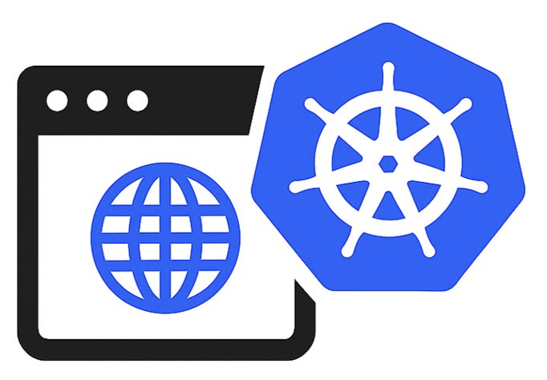

<p align="center">
  
</p>

# kube-dump

> **Warning:** This project was heavily built with AI assistance (Claude). Effort was made to properly test it, but use your own judgment, especially in production. Review the code before you do.

<!-- SECURITY-DASHBOARD-START -->

## Code Quality

**ShellCheck:** ✅ PASSED | **Issues:** 0 | **Last updated:** 2026-04-05

📄 [View Code Quality Report](docs/code-quality.md)

<!-- SECURITY-DASHBOARD-END -->


A powerful Kubernetes debugging tool that enables network capture, command execution, and file operations across multiple pods and nodes simultaneously through privileged debug pods.

## Quick Start

```bash
# Clone and setup
git clone <repository-url> && cd kube-dump && chmod +x kube-dump.sh

# Basic usage - capture network traffic from pods labeled "dumpme=yes"
./kube-dump.sh

# Target specific pods and download files
./kube-dump.sh -l app=nginx -o /tmp/debug -s "find /tmp -name '*.log'"

# Mixed mode: pods + nodes with kill switch protection
./kube-dump.sh -l app=web -L node-type=worker --kill-switch-abs 1GB
```

## Use Cases

| Scenario | Command | Description |
|----------|---------|-------------|
| **Network Debugging** | `./kube-dump.sh -l app=nginx` | Capture network traffic from all nginx pods |
| **Log Collection** | `./kube-dump.sh -l app=web -o /tmp -s "find /var/log -name '*.log'"` | Collect logs from multiple pods |
| **Node Analysis** | `./kube-dump.sh -L node-type=worker -E "ss -tuln"` | Analyze network connections on worker nodes |
| **Disk Space Check** | `./kube-dump.sh -l tier=database -e "df -h"` | Check disk usage across database pods |
| **Security Audit** | `./kube-dump.sh -L role=master -E "systemctl status kubelet"` | Audit kubelet status on master nodes |
| **Script Import** | `./kube-dump.sh -l app=web -f ./script.sh -e "bash %f"` | Run local scripts on remote pods |

## Key Features

- 🎯 **Multi-target execution** - Run commands on multiple pods/nodes simultaneously
- 🔀 **Flexible modes** - Pod-based, node-based, or mixed operations
- 📦 **File operations** - Generate and download files from debug sessions
- 🛡️ **Kill switch protection** - Auto-detect kubelet eviction thresholds or set custom limits
- 🏷️ **Label targeting** - Use Kubernetes labels for precise resource selection
- ⚙️ **Runtime support** - Works with containerd, crio, and docker
- 📊 **Verbose logging** - Optional detailed logging with per-pod operation logs
- 🔇 **Clean output** - PodSecurity warnings suppressed, saved to process logs

## Documentation

📖 **[Complete Documentation](docs/)** | 🏗️ **[Architecture](docs/architecture.md)**

### Quick Navigation
- [Installation Guide](docs/installation.md) - Setup and prerequisites
- [Command Reference](docs/command-reference.md) - Complete CLI options
- [Usage Examples](docs/examples.md) - Real-world scenarios
- [Troubleshooting](docs/README.md#troubleshooting) - Common issues and solutions

## Support

- 📖 [Documentation](docs/) - Complete guides and references
- 🐛 [Issues](https://github.com/your-org/kube-dump/issues) - Bug reports and feature requests
- 💡 [Discussions](https://github.com/your-org/kube-dump/discussions) - Questions and community

---

**Quick tip**: Use `./kube-dump.sh -h` to see all available options and examples.