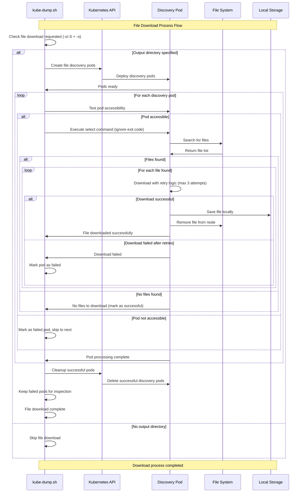
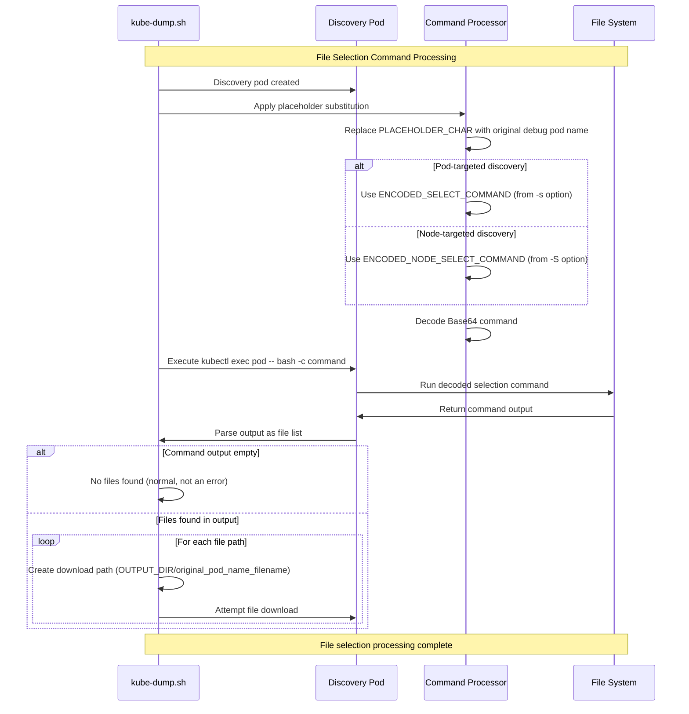
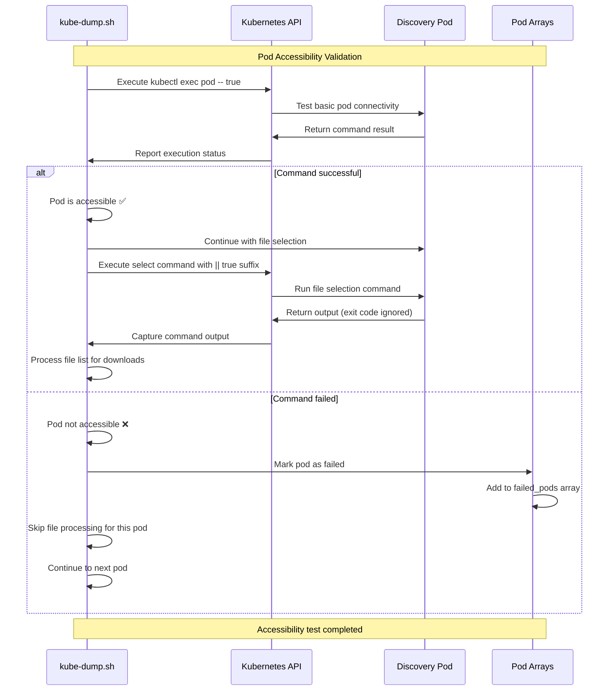
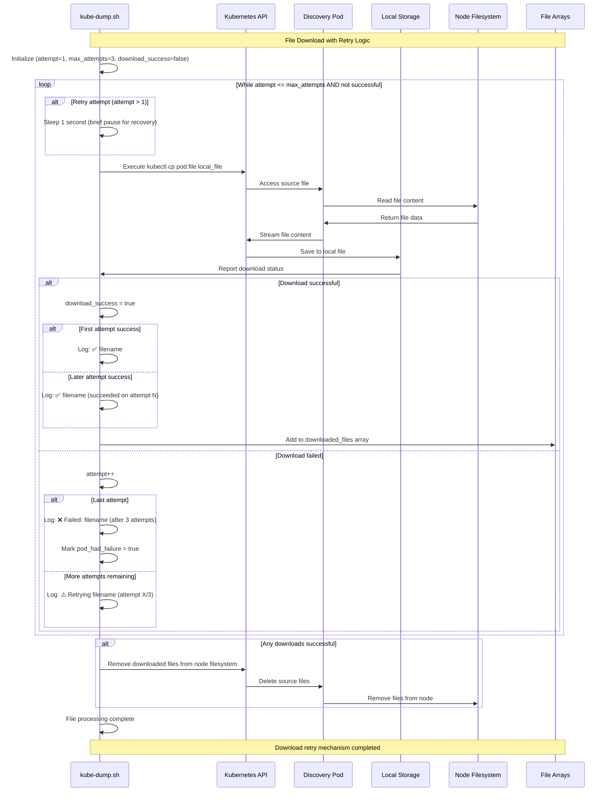
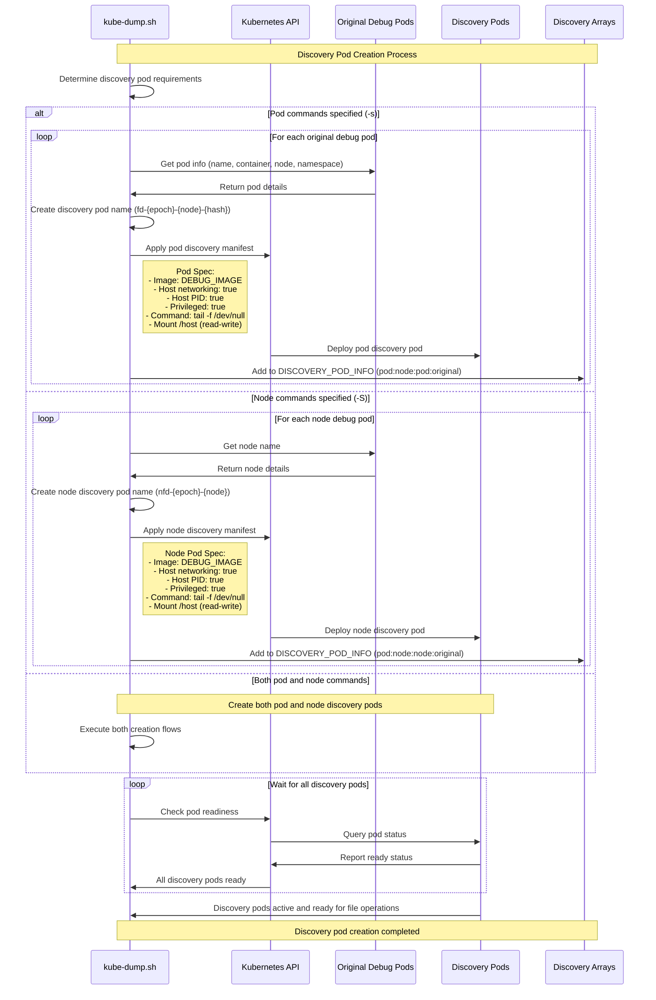
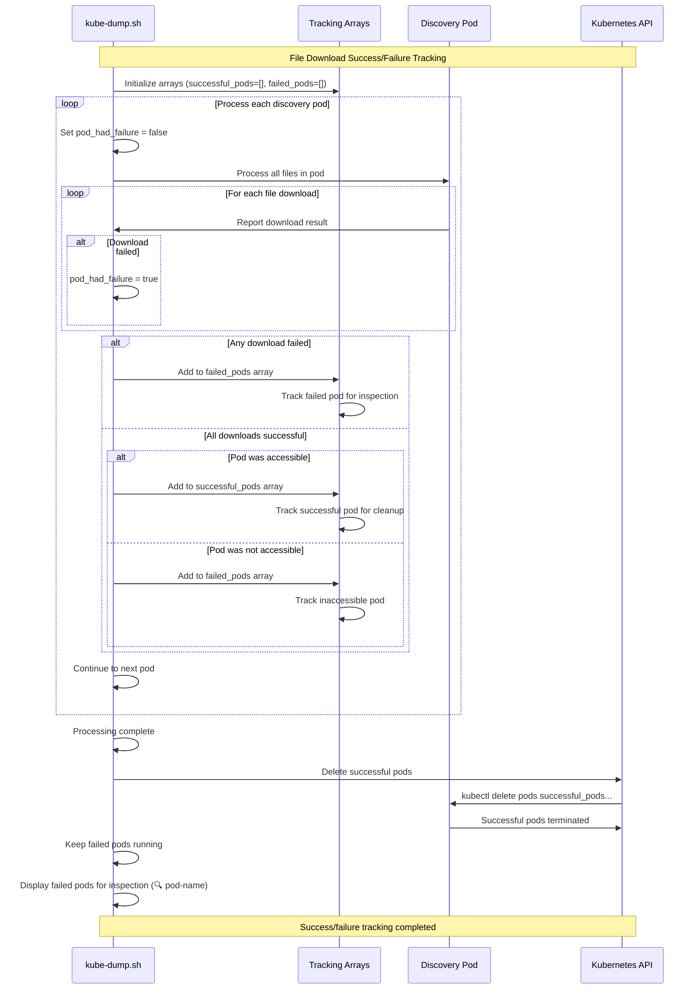

# File Download Decision Flow

## File Download Process Overview

This sequence diagram illustrates the comprehensive file download process in kube-dump. It shows how the system creates discovery pods, tests their accessibility, executes file selection commands, downloads files with retry logic, and manages pod cleanup based on success or failure.

## File Selection Command Processing

This sequence diagram shows how kube-dump processes file selection commands within discovery pods. It demonstrates placeholder substitution, command decoding, execution, and the parsing of output to generate file lists for download operations.

## Pod Accessibility Test Logic

This sequence diagram demonstrates the pod accessibility testing mechanism used before attempting file operations. It shows how kube-dump validates pod connectivity and handles both successful and failed accessibility tests.

## File Download Retry Mechanism

This sequence diagram illustrates the robust retry mechanism used for file downloads. It shows how kube-dump handles download failures with exponential backoff, tracks attempt counts, and manages both successful and failed download scenarios.

## Discovery Pod Creation Process

This sequence diagram shows how kube-dump creates specialized discovery pods for file operations. It illustrates the decision process between pod-targeted and node-targeted discovery, the manifest creation process, and the initialization of discovery pod arrays.

## File Download Success/Failure Tracking

This sequence diagram illustrates how kube-dump tracks the success and failure of file download operations across all discovery pods. It shows the categorization process, cleanup decisions, and the final reporting of failed pods for manual inspection.

