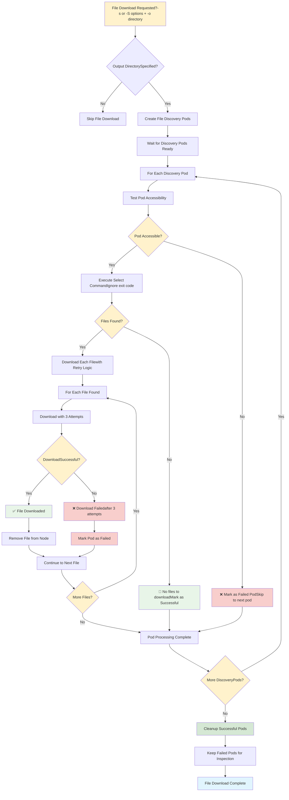
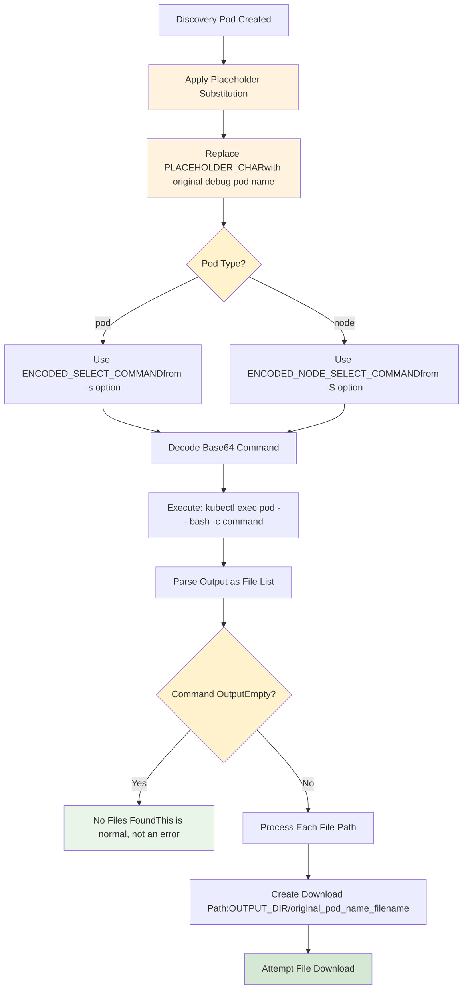

# File Download Decision Flow

## File Download Process Overview

This diagram illustrates the comprehensive file download decision tree and execution flow in kube-dump. The process determines whether file downloads should occur based on user options and systematically handles file discovery, accessibility testing, download operations, and cleanup strategies.

The file download workflow is triggered when users specify selection commands (-s for pod files, -S for node files) combined with an output directory (-o). The system creates specialized discovery pods, tests their accessibility, executes file selection commands, and performs robust multi-attempt downloads with automatic retry logic. Failed operations are preserved for troubleshooting while successful operations are cleaned up automatically, ensuring efficient resource utilization and comprehensive error handling.



## File Selection Command Processing

This diagram details how kube-dump processes file selection commands within discovery pods. The system handles placeholder substitution, command decoding, execution, and output parsing to identify files for download.

The file selection process begins with applying placeholder character substitution to restore original debug pod names in the selection commands. Commands are base64-decoded and executed within the discovery pod environment using kubectl exec. The system gracefully handles empty outputs (no files found) as normal operations, while non-empty outputs trigger file path processing and download preparation. This approach ensures that file selection commands can reference specific debug pod contexts while maintaining security through encoded command transmission.



## Pod Accessibility Test Logic

This diagram shows the pod accessibility validation process that ensures discovery pods are ready for file operations before attempting downloads. The test prevents wasted effort on inaccessible pods and provides early failure detection.

The accessibility test executes a simple `kubectl exec pod -- true` command to verify basic connectivity and command execution capability. Successful tests indicate the pod is ready for file selection commands, while failures result in immediate pod marking for cleanup without attempting file operations. This pre-validation step improves overall efficiency by identifying problematic pods early in the download process, allowing the system to focus resources on accessible pods that can successfully complete file transfer operations.

```mermaid
graph TD
    A[Start Pod Accessibility Test] --> B[Execute: kubectl exec pod -- true]
    B --> C{CommandSuccessful?}
    
    C -->|Yes| D[✅ Pod is Accessible]
    C -->|No| E[❌ Pod Not Accessible]
    
    D --> F[Continue with File Selection]
    E --> G[Mark Pod as Failed]
    G --> H[Add to failed_pods array]
    H --> I[Skip File Processing]
    I --> J[Continue to Next Pod]
    
    F --> K[Execute Select Commandwith || true suffix]
    K --> L[Capture OutputExit code ignored]
    
    style C fill:#fff2cc
    style D fill:#e8f5e8
    style E fill:#f8cecc
    style K fill:#fff3e0
```

## File Download Retry Mechanism

This diagram illustrates the robust retry logic that handles transient network issues, temporary pod unavailability, and other intermittent failures during file downloads. The mechanism ensures maximum download success rates while providing clear feedback on retry attempts.

The retry system implements a three-attempt strategy with brief recovery pauses between failures. Each attempt uses `kubectl cp` to transfer files from pod filesystem to local storage, with detailed logging of success, failure, and retry states. The system distinguishes between first-attempt successes and recovered successes, providing users with transparency about download reliability. Failed downloads after exhausting all attempts are clearly marked, allowing users to identify problematic files or pods that may require manual intervention or alternative download strategies.

```mermaid
graph TD
    A[Start File Download] --> B[Initialize:- attempt = 1- max_attempts = 3- download_success = false]
    
    B --> C{attempt <= max_attemptsAND not successful?}
    C -->|No| D[Max Attempts Reached]
    C -->|Yes| E{attempt > 1?}
    
    E -->|Yes| F[Sleep 1 secondBrief pause for recovery]
    E -->|No| G[Execute Download:kubectl cp pod:file local_file]
    
    F --> G
    G --> H{DownloadSuccessful?}
    
    H -->|Yes| I[download_success = true]
    H -->|No| J[attempt++]
    
    I --> K{First Attempt?}
    K -->|Yes| L[✅ filename]
    K -->|No| M[✅ filename(succeeded on attempt N)]
    
    J --> N{Last Attempt?}
    N -->|Yes| O[❌ Failed: filename(after 3 attempts)]
    N -->|No| P[⚠️ Retrying filename(attempt X/3)]
    
    L --> Q[Add to downloaded_files array]
    M --> Q
    P --> R[Continue to Next Attempt]
    O --> S[Mark pod_had_failure = true]
    
    D --> T{Any DownloadsSuccessful?}
    T -->|Yes| U[Remove Downloaded Filesfrom Node Filesystem]
    T -->|No| V[No Cleanup Needed]
    
    Q --> U
    R --> C
    S --> C
    U --> W[File Processing Complete]
    V --> W
    
    style C fill:#fff2cc
    style E fill:#fff2cc
    style H fill:#fff2cc
    style K fill:#fff2cc
    style N fill:#fff2cc
    style T fill:#fff2cc
    style I fill:#e8f5e8
    style L fill:#e8f5e8
    style M fill:#e8f5e8
    style O fill:#f8cecc
    style P fill:#fff3e0
```

## Discovery Pod Creation Process

This diagram details the specialized pod creation process for file download operations. Discovery pods are configured with the necessary privileges and filesystem access to securely extract files from cluster nodes while maintaining proper isolation and security boundaries.

The creation process adapts to different file selection contexts: pod-based selection creates discovery pods that mirror the original debug pod configuration, while node-based selection creates pods with direct host access. Both types receive read-write host filesystem mounts via `/host`, privileged security contexts, and host networking/PID access. The pods use a simple `tail -f /dev/null` command to remain active during file operations, ensuring stable connectivity for download procedures while minimizing resource consumption.

```mermaid
graph TD
    A[Create File Discovery Pods] --> B{Pod or NodeSelect Commands?}
    B -->|Pod commands (-s)| C[Create Pod Discovery Pods]
    B -->|Node commands (-S)| D[Create Node Discovery Pods]
    B -->|Both| E[Create Both Types]
    
    C --> F[For Each Original Debug Pod]
    F --> G[Get Pod Info:name, container, node, namespace]
    G --> H[Create Discovery Pod Name:fd-{epoch}-{node}-{hash}]
    H --> I[Apply Pod Discovery Manifest]
    
    D --> J[For Each Node Debug Pod]
    J --> K[Get Node Name]
    K --> L[Create Node Discovery Pod Name:nfd-{epoch}-{node}]
    L --> M[Apply Node Discovery Manifest]
    
    I --> N[Pod Spec:- Image: DEBUG_IMAGE- Host networking: true- Host PID: true- Privileged: true- Command: tail -f /dev/null]
    
    M --> O[Node Pod Spec:- Image: DEBUG_IMAGE- Host networking: true- Host PID: true- Privileged: true- Command: tail -f /dev/null]
    
    N --> P[Mount /host (read-write)]
    O --> P
    P --> Q[Add to DISCOVERY_POD_INFO arrayFormat: pod:node:type:original]
    Q --> R[Wait for All Discovery Pods Ready]
    
    style B fill:#fff2cc
    style I fill:#d5e8d4
    style M fill:#d5e8d4
    style R fill:#e1f5fe
```

## File Download Success/Failure Tracking

This diagram illustrates the comprehensive tracking system that monitors file download outcomes and implements appropriate cleanup strategies. The system maintains separate arrays for successful and failed operations, enabling selective pod cleanup and troubleshooting support.

The tracking mechanism evaluates each discovery pod's overall download success rate, considering both individual file failures and pod accessibility issues. Pods with any download failures or accessibility problems are preserved for inspection, while completely successful pods are automatically cleaned up to conserve cluster resources. This approach balances operational efficiency with debugging capability, ensuring that problematic pods remain available for analysis while successful operations are cleaned up promptly. The system provides clear feedback about failed pod preservation, helping users identify and resolve download issues.

```mermaid
graph TD
    A[Initialize Arrays:successful_pods=()failed_pods=()] --> B[Process Each Discovery Pod]
    
    B --> C[pod_had_failure = false]
    C --> D[Process All Files in Pod]
    D --> E{Any DownloadFailed?}
    
    E -->|Yes| F[pod_had_failure = true]
    E -->|No| G[All Downloads Successful]
    
    F --> H[Add to failed_pods array]
    G --> I{Pod WasAccessible?}
    
    I -->|Yes| J[Add to successful_pods array]
    I -->|No| H
    
    H --> K[Continue to Next Pod]
    J --> K
    K --> L{More Pods?}
    
    L -->|Yes| B
    L -->|No| M[Processing Complete]
    
    M --> N[Delete Successful Pods:kubectl delete pods successful_pods...]
    N --> O[Keep Failed Pods Running]
    O --> P[Display Failed Pods for Inspection:🔍 pod-name]
    
    style E fill:#fff2cc
    style I fill:#fff2cc
    style L fill:#fff2cc
    style G fill:#e8f5e8
    style J fill:#e8f5e8
    style F fill:#f8cecc
    style H fill:#f8cecc
    style N fill:#d5e8d4
    style O fill:#fff3e0
```