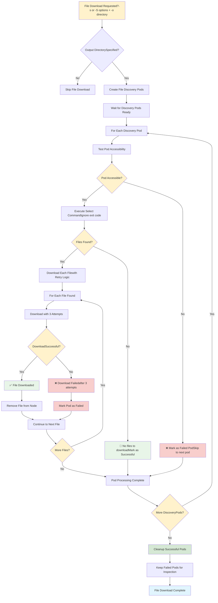
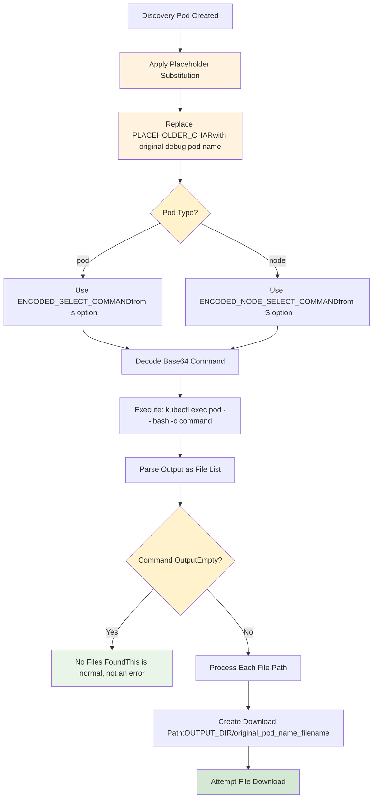

# File Download Decision Flow

## File Download Process Overview



## File Selection Command Processing



## Pod Accessibility Test Logic

```mermaid
graph TD
    A[Start Pod Accessibility Test] --> B[Execute: kubectl exec pod -- true]
    B --> C{CommandSuccessful?}
    
    C -->|Yes| D[✅ Pod is Accessible]
    C -->|No| E[❌ Pod Not Accessible]
    
    D --> F[Continue with File Selection]
    E --> G[Mark Pod as Failed]
    G --> H[Add to failed_pods array]
    H --> I[Skip File Processing]
    I --> J[Continue to Next Pod]
    
    F --> K[Execute Select Commandwith || true suffix]
    K --> L[Capture OutputExit code ignored]
    
    style C fill:#fff2cc
    style D fill:#e8f5e8
    style E fill:#f8cecc
    style K fill:#fff3e0
```

## File Download Retry Mechanism

```mermaid
graph TD
    A[Start File Download] --> B[Initialize:- attempt = 1- max_attempts = 3- download_success = false]
    
    B --> C{attempt <= max_attemptsAND not successful?}
    C -->|No| D[Max Attempts Reached]
    C -->|Yes| E{attempt > 1?}
    
    E -->|Yes| F[Sleep 1 secondBrief pause for recovery]
    E -->|No| G[Execute Download:kubectl cp pod:file local_file]
    
    F --> G
    G --> H{DownloadSuccessful?}
    
    H -->|Yes| I[download_success = true]
    H -->|No| J[attempt++]
    
    I --> K{First Attempt?}
    K -->|Yes| L[✅ filename]
    K -->|No| M[✅ filename(succeeded on attempt N)]
    
    J --> N{Last Attempt?}
    N -->|Yes| O[❌ Failed: filename(after 3 attempts)]
    N -->|No| P[⚠️ Retrying filename(attempt X/3)]
    
    L --> Q[Add to downloaded_files array]
    M --> Q
    P --> R[Continue to Next Attempt]
    O --> S[Mark pod_had_failure = true]
    
    D --> T{Any DownloadsSuccessful?}
    T -->|Yes| U[Remove Downloaded Filesfrom Node Filesystem]
    T -->|No| V[No Cleanup Needed]
    
    Q --> U
    R --> C
    S --> C
    U --> W[File Processing Complete]
    V --> W
    
    style C fill:#fff2cc
    style E fill:#fff2cc
    style H fill:#fff2cc
    style K fill:#fff2cc
    style N fill:#fff2cc
    style T fill:#fff2cc
    style I fill:#e8f5e8
    style L fill:#e8f5e8
    style M fill:#e8f5e8
    style O fill:#f8cecc
    style P fill:#fff3e0
```

## Discovery Pod Creation Process

```mermaid
graph TD
    A[Create File Discovery Pods] --> B{Pod or NodeSelect Commands?}
    B -->|Pod commands (-s)| C[Create Pod Discovery Pods]
    B -->|Node commands (-S)| D[Create Node Discovery Pods]
    B -->|Both| E[Create Both Types]
    
    C --> F[For Each Original Debug Pod]
    F --> G[Get Pod Info:name, container, node, namespace]
    G --> H[Create Discovery Pod Name:fd-{epoch}-{node}-{hash}]
    H --> I[Apply Pod Discovery Manifest]
    
    D --> J[For Each Node Debug Pod]
    J --> K[Get Node Name]
    K --> L[Create Node Discovery Pod Name:nfd-{epoch}-{node}]
    L --> M[Apply Node Discovery Manifest]
    
    I --> N[Pod Spec:- Image: DEBUG_IMAGE- Host networking: true- Host PID: true- Privileged: true- Command: tail -f /dev/null]
    
    M --> O[Node Pod Spec:- Image: DEBUG_IMAGE- Host networking: true- Host PID: true- Privileged: true- Command: tail -f /dev/null]
    
    N --> P[Mount /host (read-write)]
    O --> P
    P --> Q[Add to DISCOVERY_POD_INFO arrayFormat: pod:node:type:original]
    Q --> R[Wait for All Discovery Pods Ready]
    
    style B fill:#fff2cc
    style I fill:#d5e8d4
    style M fill:#d5e8d4
    style R fill:#e1f5fe
```

## File Download Success/Failure Tracking

```mermaid
graph TD
    A[Initialize Arrays:successful_pods=()failed_pods=()] --> B[Process Each Discovery Pod]
    
    B --> C[pod_had_failure = false]
    C --> D[Process All Files in Pod]
    D --> E{Any DownloadFailed?}
    
    E -->|Yes| F[pod_had_failure = true]
    E -->|No| G[All Downloads Successful]
    
    F --> H[Add to failed_pods array]
    G --> I{Pod WasAccessible?}
    
    I -->|Yes| J[Add to successful_pods array]
    I -->|No| H
    
    H --> K[Continue to Next Pod]
    J --> K
    K --> L{More Pods?}
    
    L -->|Yes| B
    L -->|No| M[Processing Complete]
    
    M --> N[Delete Successful Pods:kubectl delete pods successful_pods...]
    N --> O[Keep Failed Pods Running]
    O --> P[Display Failed Pods for Inspection:🔍 pod-name]
    
    style E fill:#fff2cc
    style I fill:#fff2cc
    style L fill:#fff2cc
    style G fill:#e8f5e8
    style J fill:#e8f5e8
    style F fill:#f8cecc
    style H fill:#f8cecc
    style N fill:#d5e8d4
    style O fill:#fff3e0
```