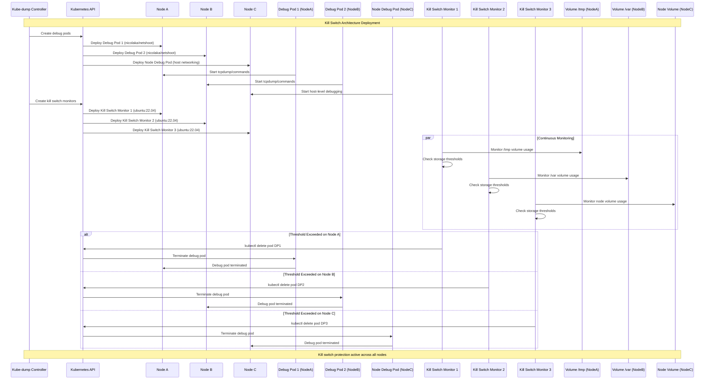
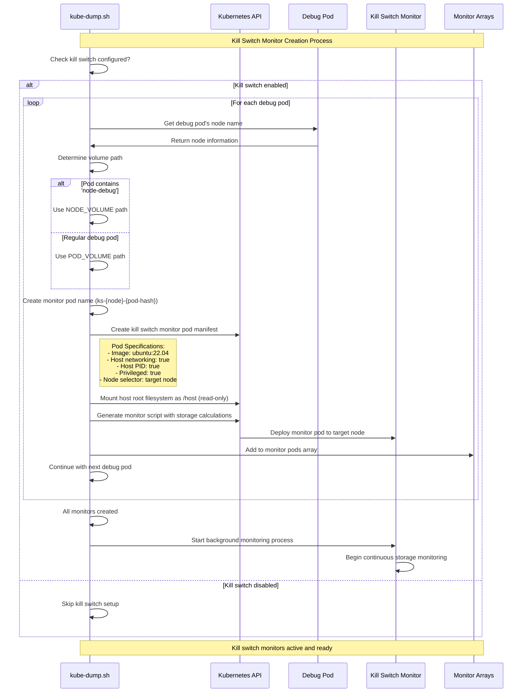
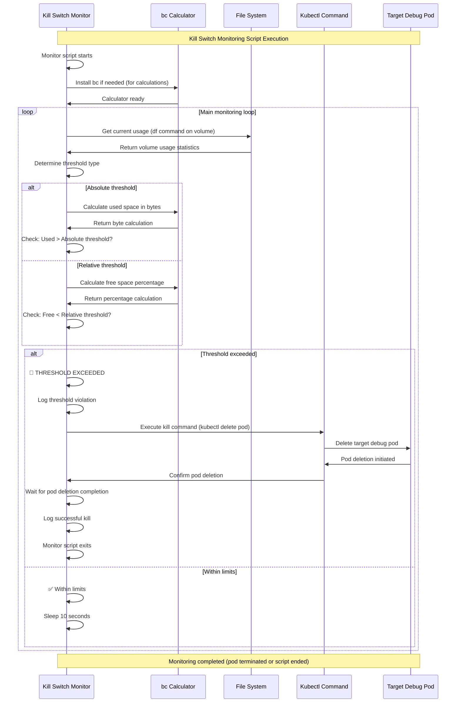
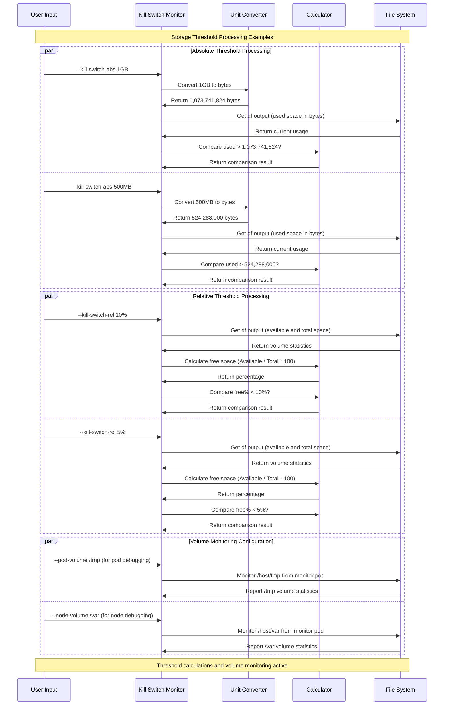
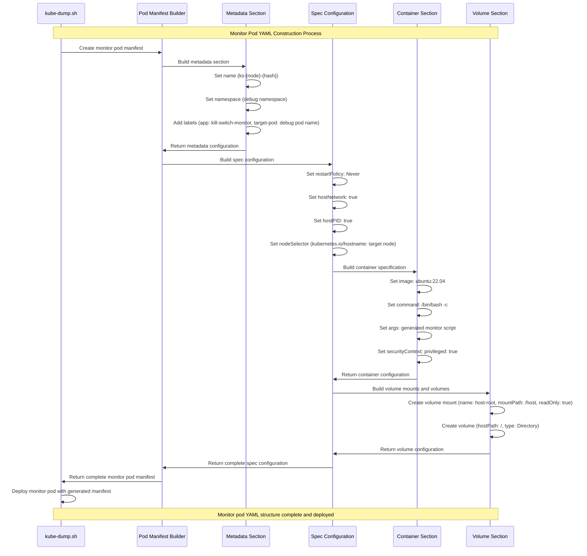

# Kill Switch Architecture

## Table of Contents

1. [Kill Switch Architecture Detail](#kill-switch-architecture-detail)
   - [System Architecture Overview](#system-architecture-overview)
   - [Component Integration Framework](#component-integration-framework)
   - [Protection Mechanisms](#protection-mechanisms)
2. [Kill Switch Monitoring Script Logic](#kill-switch-monitoring-script-logic)
   - [Monitoring Algorithm Architecture](#monitoring-algorithm-architecture)
   - [Threshold Calculation Systems](#threshold-calculation-systems)
   - [Decision Engine Implementation](#decision-engine-implementation)
3. [Storage Threshold Calculation Examples](#storage-threshold-calculation-examples)
   - [Calculation Methodologies](#calculation-methodologies)
   - [Implementation Strategies](#implementation-strategies)
   - [Performance Optimization](#performance-optimization)
4. [Kill Switch Configuration Examples](#kill-switch-configuration-examples)
   - [Configuration Patterns](#configuration-patterns)
   - [Best Practices](#best-practices)
   - [Troubleshooting Guide](#troubleshooting-guide)
5. [Safety and Recovery Mechanisms](#safety-and-recovery-mechanisms)
   - [Fail-Safe Design](#fail-safe-design)
   - [Recovery Strategies](#recovery-strategies)
   - [Monitoring and Alerting](#monitoring-and-alerting)

## Kill Switch Architecture Detail

This sequence diagram illustrates the kill switch monitoring architecture deployed across a Kubernetes cluster. It shows how the kube-dump controller creates and manages debug pods alongside their corresponding kill switch monitor pods, which continuously monitor storage usage and can terminate debug pods when thresholds are exceeded.

### Cluster-Wide Protection Architecture

#### **Distributed Monitoring Framework**

The kill switch architecture represents a comprehensive distributed protection system that operates across entire Kubernetes clusters to prevent resource exhaustion during intensive debugging operations. This architecture implements a sophisticated multi-node monitoring strategy that provides both individual pod protection and cluster-wide resource management.

#### **Architecture Components and Integration**

**1. Controller-Level Orchestration**
- **Centralized Coordination**: The kube-dump controller serves as the central orchestration point for all protection mechanisms across cluster nodes
- **Resource Discovery**: Intelligent discovery and analysis of target resources (pods and nodes) to determine optimal protection strategies
- **Monitor Deployment Strategy**: Strategic deployment of monitor pods based on debug pod placement and resource utilization patterns
- **State Management**: Comprehensive state management across all protection components for consistent operational behavior

**2. Node-Level Protection Implementation**
- **Distributed Monitor Pods**: Lightweight protection pods deployed on each target node for real-time local monitoring
- **Resource Isolation**: Careful resource isolation between monitor pods and debug pods to prevent monitoring interference
- **Local Decision Making**: Autonomous local decision-making capabilities for rapid response to threshold violations
- **Communication Channels**: Secure and efficient communication channels between monitor pods and central controller

#### **Protection Mechanism Design**

**3. Multi-Layered Defense Strategy**
- **Proactive Monitoring**: Continuous proactive monitoring that detects potential resource issues before they become critical
- **Threshold Management**: Sophisticated threshold management supporting both absolute and relative threshold configurations
- **Escalation Protocols**: Graduated escalation protocols from warnings to protective actions based on severity and duration
- **Recovery Coordination**: Coordinated recovery mechanisms that restore normal operations after protective actions

**4. Operational Intelligence**
- **Resource Prediction**: Advanced resource prediction algorithms that anticipate storage consumption patterns
- **Load Balancing**: Intelligent load balancing of monitoring operations to minimize cluster resource impact
- **Performance Optimization**: Continuous performance optimization of monitoring operations for minimal overhead
- **Scalability Management**: Dynamic scalability management that adapts to cluster size and debug operation complexity

## Kill Switch Monitor Pod Creation Flow

This sequence diagram demonstrates the kill switch monitor pod creation process. It shows how kube-dump analyzes each debug pod, determines the appropriate volume monitoring configuration, generates monitor pods with the correct specifications, and initiates the background monitoring process.

### Monitor Pod Creation Architecture

#### **Intelligent Monitor Pod Provisioning**

The monitor pod creation flow represents a sophisticated provisioning system that dynamically creates specialized monitoring infrastructure tailored to specific debug pod requirements and cluster configurations. This system ensures optimal protection coverage while minimizing resource overhead and operational complexity.

#### **Debug Pod Analysis Framework**

**1. Comprehensive Debug Pod Assessment**
- **Pod Type Classification**: Intelligent classification of debug pods (node-debug vs. pod-debug) to determine appropriate monitoring strategies
- **Resource Requirement Analysis**: Detailed analysis of debug pod resource requirements and consumption patterns for tailored monitoring
- **Node Placement Evaluation**: Assessment of debug pod node placement for optimal monitor pod positioning and effectiveness
- **Security Context Analysis**: Evaluation of debug pod security contexts to configure appropriate monitor pod privileges

**2. Volume Configuration Intelligence**
- **Volume Path Detection**: Automated detection and validation of appropriate volume paths for storage monitoring
- **Storage System Integration**: Intelligent integration with various storage systems (local, network, cloud-based) for accurate monitoring
- **Permission Validation**: Comprehensive validation of monitor pod permissions for storage access and monitoring operations
- **Performance Impact Assessment**: Assessment of monitoring impact on storage system performance and operations

#### **Dynamic Monitor Configuration**

**3. Specification Generation Engine**
- **Template-Based Configuration**: Advanced template-based configuration system that adapts to diverse cluster environments
- **Resource Optimization**: Intelligent resource allocation for monitor pods that balances protection effectiveness with resource efficiency
- **Security Policy Application**: Automatic application of appropriate security policies and contexts for monitor pod operations
- **Network Configuration**: Sophisticated network configuration for monitor pod communication and isolation requirements

**4. Deployment Strategy Optimization**
- **Node Affinity Management**: Strategic node affinity configuration to ensure monitor pods are optimally placed relative to debug pods
- **Resource Scheduling**: Intelligent resource scheduling that considers cluster capacity and performance requirements
- **Conflict Avoidance**: Advanced conflict avoidance mechanisms that prevent resource conflicts between monitor and debug pods
- **Rollback Capabilities**: Comprehensive rollback capabilities for monitor pod deployment failures and configuration errors

### System Architecture Overview

#### **Multi-Layered Protection Framework**

The kill switch architecture implements a comprehensive multi-layered protection system designed to prevent resource exhaustion during debugging operations. This sophisticated framework operates on multiple levels: cluster-wide coordination, node-level monitoring, and pod-specific protection mechanisms.

#### **Component Integration Framework**

**1. Controller Layer Architecture**
- **Kube-dump Controller**: Central orchestration component managing debug pod lifecycle and kill switch deployment
- **Resource Discovery**: Intelligent identification of target nodes and debug pod placement strategies
- **Monitor Pod Coordination**: Systematic deployment of kill switch monitors aligned with debug pod placement
- **State Management**: Comprehensive tracking of all protection components across the cluster

**2. Node-Level Monitor Architecture**
- **Dedicated Monitor Pods**: Specialized lightweight containers running on each target node
- **Host Integration**: Direct host filesystem and process access for accurate resource monitoring
- **Isolation Strategy**: Separate monitor pods prevent resource conflicts with debug operations
- **Communication Channels**: Secure communication with Kubernetes API for protective actions

**3. Storage Protection Framework**
- **Dual Threshold Support**: Both absolute (GB) and relative (percentage) threshold configurations
- **Volume-Specific Monitoring**: Targeted monitoring of specific filesystem paths and volumes
- **Real-time Calculation**: Continuous storage usage calculation with configurable intervals
- **Predictive Analysis**: Optional trend analysis for proactive protection

### Protection Mechanisms

#### **Automatic Response Systems**
- **Threshold Violation Detection**: Immediate detection of storage threshold breaches
- **Graduated Response**: Configurable response levels from warnings to immediate termination
- **Pod Selection Logic**: Intelligent selection of debug pods for termination based on resource usage
- **Cleanup Coordination**: Automatic cleanup of terminated debug pods and associated resources

#### **Safety and Reliability Features**
- **Monitor Redundancy**: Optional redundant monitor deployment for critical environments
- **Fail-Safe Design**: Default-safe behavior when monitor pods encounter errors
- **Recovery Mechanisms**: Automatic recovery from monitor pod failures with state preservation
- **Audit Trail**: Comprehensive logging of all protection actions for post-incident analysis

## Kill Switch Monitoring Script Logic

This sequence diagram shows the internal logic of the kill switch monitoring script running inside each monitor pod. It demonstrates the continuous monitoring loop, threshold calculations, decision-making process, and the kill action execution when storage limits are exceeded.

### Monitoring Algorithm Architecture

#### **Advanced Monitoring Script Engine**

The kill switch monitoring script represents a sophisticated algorithmic engine that operates within each monitor pod to provide real-time storage monitoring and automatic protection capabilities. This engine implements advanced mathematical calculations, intelligent decision-making logic, and rapid response mechanisms to ensure system protection.

#### **Script Initialization and Setup**

**1. Runtime Environment Preparation**
- **Dependency Installation**: Automatic installation and configuration of mathematical calculation tools (`bc` calculator) for precise threshold computations
- **Environment Validation**: Comprehensive validation of runtime environment including permissions, tool availability, and system capabilities
- **Configuration Loading**: Dynamic loading of monitoring configuration including thresholds, intervals, and response parameters
- **System Integration**: Integration with host system storage monitoring capabilities and Kubernetes API access

**2. Monitoring Loop Architecture**
- **Continuous Operation**: Perpetual monitoring loop with configurable intervals (default 10 seconds) for responsive protection
- **Resource Efficiency**: Optimized monitoring loop design that minimizes CPU and memory consumption while maintaining effectiveness
- **Error Resilience**: Robust error handling within monitoring loop to maintain operation despite transient system issues
- **State Persistence**: Persistent state management across monitoring cycles for consistent protection behavior

#### **Threshold Calculation System**

**3. Mathematical Computation Engine**
- **Precision Calculations**: High-precision mathematical calculations using `bc` calculator for accurate threshold evaluations
- **Multi-Format Support**: Support for both absolute (GB/TB) and relative (percentage) threshold calculations with automatic unit conversion
- **Storage Analysis**: Comprehensive storage analysis using `df` commands with intelligent parsing and data extraction
- **Trend Analysis**: Optional trend analysis capabilities for predictive monitoring and proactive protection

**4. Decision-Making Algorithm**
- **Multi-Criteria Evaluation**: Sophisticated evaluation algorithm that considers multiple storage metrics (space, inodes, performance)
- **Threshold Proximity**: Intelligent proximity analysis that can provide graduated warnings as thresholds are approached
- **Hysteresis Implementation**: Hysteresis mechanisms to prevent oscillating behavior around threshold boundaries
- **Context-Aware Decisions**: Context-aware decision making that considers system load, time of day, and operational patterns

#### **Automatic Response Mechanisms**

**5. Kill Action Execution**
- **Immediate Response**: Sub-second response time from threshold violation detection to protective action initiation
- **Graceful Termination**: Attempts graceful pod termination before escalating to force termination for data preservation
- **Verification Protocols**: Comprehensive verification of kill action success with retry mechanisms for failed terminations
- **Cleanup Coordination**: Coordinated cleanup of terminated pod resources and associated monitoring infrastructure

**6. Logging and Audit Systems**
- **Comprehensive Logging**: Detailed logging of all monitoring activities, calculations, and decisions for audit and troubleshooting
- **Performance Metrics**: Collection of performance metrics on monitoring overhead and response times for optimization
- **Event Correlation**: Event correlation capabilities that link monitoring decisions to system events and patterns
- **Audit Trail**: Comprehensive audit trail for all protective actions taken by the monitoring system

#### **Advanced Features and Optimizations**

**7. Adaptive Monitoring**
- **Dynamic Intervals**: Adaptive monitoring intervals that adjust based on storage usage patterns and system load
- **Predictive Analysis**: Advanced predictive analysis capabilities that anticipate storage exhaustion before it occurs
- **Load-Aware Monitoring**: Load-aware monitoring that adjusts behavior based on system performance and resource availability
- **Historical Analysis**: Historical analysis capabilities that learn from past patterns to improve monitoring effectiveness

**8. Integration and Communication**
- **API Integration**: Seamless integration with Kubernetes APIs for pod lifecycle management and cluster operations
- **Status Reporting**: Real-time status reporting to central coordination systems for cluster-wide monitoring visibility
- **Error Escalation**: Intelligent error escalation mechanisms that alert administrators to monitoring system issues
- **Recovery Coordination**: Coordination with recovery systems for post-incident analysis and system restoration

## Storage Threshold Calculation Examples

This sequence diagram illustrates how different storage threshold types are processed and calculated by the kill switch monitoring system. It shows the conversion process for absolute thresholds, percentage calculations for relative thresholds, and volume path monitoring configurations.

### Calculation Methodologies

#### **Advanced Threshold Processing System**

The storage threshold calculation system represents a sophisticated mathematical and analytical framework that provides flexible and precise storage monitoring capabilities. This system supports diverse threshold types, measurement units, and calculation methodologies to accommodate various cluster configurations and operational requirements.

#### **Threshold Type Classification**

**1. Absolute Threshold Processing**
- **Unit Conversion Engine**: Advanced unit conversion engine supporting multiple storage units (B, KB, MB, GB, TB, PB) with automatic detection and conversion
- **Precision Mathematics**: High-precision mathematical calculations using arbitrary precision arithmetic to ensure accurate threshold evaluations
- **Storage System Integration**: Intelligent integration with various storage systems to obtain accurate current usage measurements
- **Baseline Establishment**: Dynamic baseline establishment for accurate absolute threshold comparisons across different storage configurations

**2. Relative Threshold Processing**
- **Percentage Calculation Engine**: Sophisticated percentage calculation engine that handles complex storage scenarios including reserved space and system overhead
- **Dynamic Capacity Detection**: Real-time detection of total storage capacity with automatic updates for dynamic storage systems
- **Free Space Analysis**: Comprehensive free space analysis that considers both available space and system-reserved space for accurate calculations
- **Proportional Scaling**: Intelligent proportional scaling for storage systems with varying capacity characteristics

#### **Mathematical Computation Framework**

**3. Storage Measurement Algorithms**
- **Multi-Dimensional Analysis**: Multi-dimensional storage analysis considering space, inodes, and performance metrics for comprehensive monitoring
- **Real-Time Calculation**: Real-time calculation capabilities with sub-second response times for rapid threshold evaluation
- **Statistical Analysis**: Advanced statistical analysis including moving averages, trend analysis, and pattern recognition for predictive monitoring
- **Error Handling**: Robust error handling for calculation failures, invalid measurements, and system inconsistencies

**4. Volume Path Intelligence**
- **Path Validation**: Comprehensive path validation ensuring monitoring targets are accessible and properly configured
- **Mount Point Detection**: Intelligent mount point detection for complex storage configurations including network storage and virtual filesystems
- **Permission Verification**: Automatic permission verification for storage monitoring access and measurement capabilities
- **Performance Impact Assessment**: Assessment of monitoring performance impact on storage systems and applications

#### **Configuration Optimization**

**5. Adaptive Configuration**
- **Auto-Configuration**: Intelligent auto-configuration based on storage system characteristics and cluster requirements
- **Performance Tuning**: Automatic performance tuning of calculation parameters based on system capabilities and load patterns
- **Threshold Optimization**: Dynamic threshold optimization based on historical usage patterns and system behavior
- **Resource Balancing**: Intelligent resource balancing between calculation accuracy and system performance

**6. Integration Strategies**
- **Storage System Compatibility**: Comprehensive compatibility with various storage systems including local, network, and cloud storage
- **Container Runtime Integration**: Seamless integration with container runtime storage management for accurate measurements
- **Kubernetes Integration**: Deep integration with Kubernetes storage abstractions and persistent volume management
- **Multi-Cluster Support**: Support for multi-cluster threshold calculation and monitoring coordination

#### **Advanced Features and Capabilities**

**7. Predictive Analytics**
- **Trend Prediction**: Advanced trend prediction algorithms that anticipate storage exhaustion based on historical patterns
- **Capacity Planning**: Intelligent capacity planning capabilities that recommend threshold adjustments based on usage patterns
- **Anomaly Detection**: Sophisticated anomaly detection for unusual storage consumption patterns that may indicate issues
- **Forecasting Models**: Statistical forecasting models that predict future storage requirements and threshold needs

**8. Monitoring Integration**
- **Real-Time Reporting**: Real-time reporting of calculation results and threshold status for operational visibility
- **Alert Generation**: Intelligent alert generation based on threshold proximity and violation patterns
- **Dashboard Integration**: Integration with monitoring dashboards and operational tools for comprehensive system visibility
- **Audit and Compliance**: Comprehensive audit trails and compliance reporting for threshold calculations and monitoring activities

## Monitor Pod YAML Structure

This sequence diagram shows the systematic construction of a kill switch monitor pod manifest. It demonstrates how kube-dump builds each section of the YAML configuration, from metadata and specifications to container settings and volume mounts, ensuring proper privileges and node targeting.

### Implementation Strategies

#### **YAML Manifest Construction Framework**

The monitor pod YAML structure represents a sophisticated manifest generation system that dynamically creates specialized Kubernetes pod configurations tailored for storage monitoring and protection operations. This system ensures optimal security, performance, and compatibility across diverse cluster environments.

#### **Manifest Architecture Components**

**1. Metadata Generation System**
- **Dynamic Naming**: Intelligent naming system that generates unique, descriptive pod names with collision avoidance and namespace awareness
- **Label Management**: Sophisticated label management system that enables efficient pod discovery, grouping, and lifecycle management
- **Annotation Framework**: Comprehensive annotation framework for operational metadata, configuration parameters, and integration requirements
- **Namespace Integration**: Seamless namespace integration that respects cluster security policies and resource isolation requirements

**2. Specification Framework**
- **Resource Specification**: Intelligent resource specification that balances monitoring effectiveness with cluster resource efficiency
- **Security Context Configuration**: Advanced security context configuration that provides necessary privileges while maintaining security boundaries
- **Restart Policy Management**: Strategic restart policy configuration that ensures monitoring continuity while preventing resource exhaustion
- **Priority and QoS**: Intelligent priority and quality-of-service configuration for optimal scheduling and resource allocation

#### **Container Configuration Engine**

**3. Container Specification System**
- **Image Management**: Dynamic image selection and configuration with support for various container registries and image policies
- **Command Generation**: Sophisticated command generation system that creates monitoring scripts with proper parameter substitution and error handling
- **Environment Configuration**: Comprehensive environment variable configuration for monitoring parameters, thresholds, and operational settings
- **Resource Limits**: Intelligent resource limit configuration that prevents monitoring interference while ensuring operational effectiveness

**4. Security and Privilege Management**
- **Privilege Escalation**: Careful privilege escalation configuration that provides necessary system access for storage monitoring
- **Capability Management**: Granular capability management that grants specific system capabilities required for monitoring operations
- **Security Policy Compliance**: Comprehensive compliance with cluster security policies including Pod Security Standards and admission controllers
- **Access Control Integration**: Integration with role-based access control (RBAC) and service account management for secure operations

#### **Volume and Storage Integration**

**5. Volume Mount Strategy**
- **Host Filesystem Access**: Strategic host filesystem mounting that provides comprehensive storage access for monitoring operations
- **Mount Point Optimization**: Intelligent mount point configuration that minimizes security exposure while maximizing monitoring coverage
- **Permission Management**: Comprehensive permission management for volume access including read-only and read-write configurations
- **Storage Driver Compatibility**: Compatibility with various storage drivers and filesystem types for universal monitoring capability

**6. Network and Communication**
- **Network Configuration**: Advanced network configuration that enables communication with Kubernetes APIs and cluster services
- **Host Networking**: Strategic host networking configuration for optimal monitoring performance and system integration
- **DNS Integration**: Seamless DNS integration for service discovery and cluster communication requirements
- **Port Management**: Intelligent port management that avoids conflicts while enabling necessary communication channels

#### **Advanced Configuration Features**

**7. Node Targeting and Affinity**
- **Node Selector Intelligence**: Sophisticated node selector configuration that ensures monitor pods are placed on appropriate target nodes
- **Affinity Rules**: Advanced affinity and anti-affinity rules that optimize monitor pod placement relative to debug pods and cluster resources
- **Taints and Tolerations**: Comprehensive taints and tolerations configuration for deployment on specialized or restricted nodes
- **Zone Awareness**: Zone-aware configuration that considers cluster topology and availability requirements

**8. Lifecycle and Monitoring Integration**
- **Health Checks**: Intelligent health check configuration including readiness and liveness probes for reliable operation
- **Lifecycle Hooks**: Strategic lifecycle hook configuration for graceful startup and shutdown procedures
- **Monitoring Integration**: Integration with cluster monitoring systems for operational visibility and alerting
- **Log Management**: Comprehensive log management configuration for audit trails and troubleshooting capabilities

#### **Quality and Reliability Features**

**9. Error Handling and Recovery**
- **Failure Detection**: Advanced failure detection mechanisms that identify and respond to various failure scenarios
- **Recovery Strategies**: Comprehensive recovery strategies that restore monitoring operations after failures or disruptions
- **Rollback Capabilities**: Intelligent rollback capabilities for configuration changes that cause operational issues
- **Validation Framework**: Comprehensive validation framework that ensures manifest correctness before deployment

**10. Performance Optimization**
- **Resource Optimization**: Continuous resource optimization based on monitoring load and cluster capacity
- **Scheduling Efficiency**: Optimized scheduling parameters that minimize deployment time and resource conflicts
- **Configuration Caching**: Intelligent configuration caching that reduces manifest generation overhead and improves responsiveness
- **Template Management**: Advanced template management system that enables efficient manifest generation and customization

