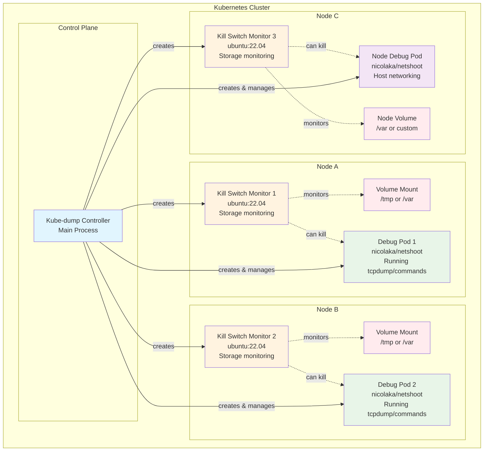
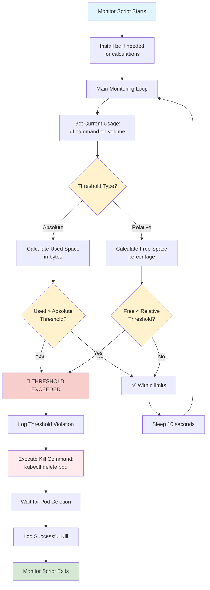
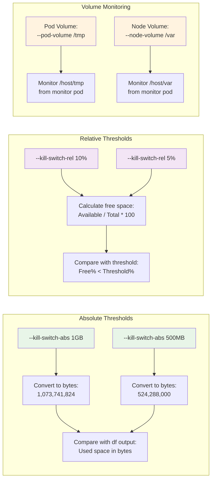

# Kill Switch Monitoring Architecture

## Kill Switch Architecture Overview



## Kill Switch Monitor Pod Creation Flow

```mermaid
graph TD
    A[Kill Switch Configured?] -->|Yes| B[For Each Debug Pod]
    A -->|No| Z[Skip Kill Switch Setup]
    
    B --> C[Get Debug Pod's Node Name]
    C --> D[Determine Volume Path]
    D --> E{Pod Type?}
    
    E -->|Contains 'node-debug'| F[Use NODE_VOLUME path]
    E -->|Regular debug pod| G[Use POD_VOLUME path]
    
    F --> H[Create Monitor Pod Name:<br/>ks-{node}-{pod-hash}]
    G --> H
    
    H --> I[Create Kill Switch Monitor Pod]
    I --> J[Pod Specifications:<br/>- Image: ubuntu:22.04<br/>- Host networking: true<br/>- Host PID: true<br/>- Privileged: true<br/>- Node selector: target node]
    
    J --> K[Mount Host Root Filesystem<br/>as /host (read-only)]
    K --> L[Generate Monitor Script<br/>with Storage Calculations]
    L --> M[Deploy Monitor Pod]
    M --> N[Add to Monitor Pods Array]
    N --> O[Continue with Next Debug Pod]
    O --> P[All Monitors Created]
    P --> Q[Start Background Monitoring Process]
    
    style A fill:#fff2cc
    style E fill:#fff2cc
    style I fill:#d5e8d4
    style Q fill:#e1f5fe
```

## Kill Switch Monitoring Script Logic



## Storage Threshold Calculation Examples



## Monitor Pod YAML Structure

```mermaid
graph TD
    A[Monitor Pod Manifest] --> B[Metadata]
    A --> C[Spec Configuration]
    
    B --> B1[Name: ks-{node}-{hash}]
    B --> B2[Namespace: debug namespace]
    B --> B3[Labels:<br/>- app: kill-switch-monitor<br/>- target-pod: debug pod name]
    
    C --> C1[RestartPolicy: Never]
    C --> C2[HostNetwork: true]
    C --> C3[HostPID: true]
    C --> C4[NodeSelector:<br/>kubernetes.io/hostname: target node]
    
    C --> D[Container Spec]
    D --> D1[Image: ubuntu:22.04]
    D --> D2[Command: /bin/bash -c]
    D --> D3[Args: Generated monitor script]
    D --> D4[SecurityContext: privileged: true]
    
    C --> E[Volume Mounts]
    E --> E1[Name: host-root]
    E --> E2[MountPath: /host]
    E --> E3[ReadOnly: true]
    
    C --> F[Volumes]
    F --> F1[HostPath: /]
    F --> F2[Type: Directory]
    
    style A fill:#e1f5fe
    style B fill:#f3e5f5
    style C fill:#e8f5e8
    style D fill:#fff3e0
    style E fill:#ffebee
    style F fill:#e0f2f1
```