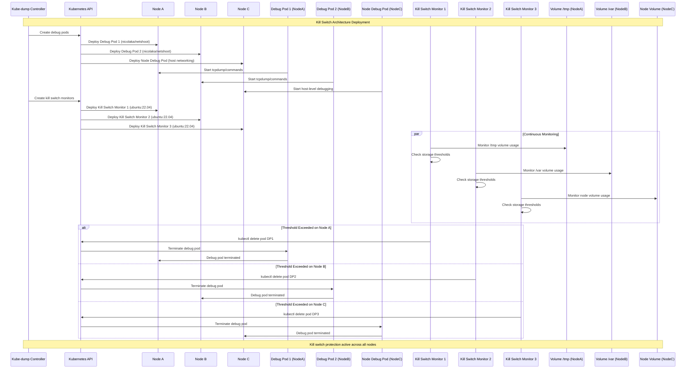
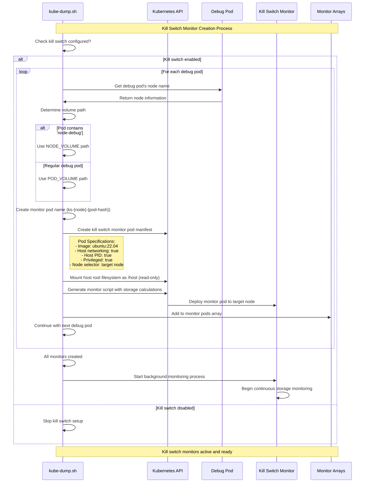
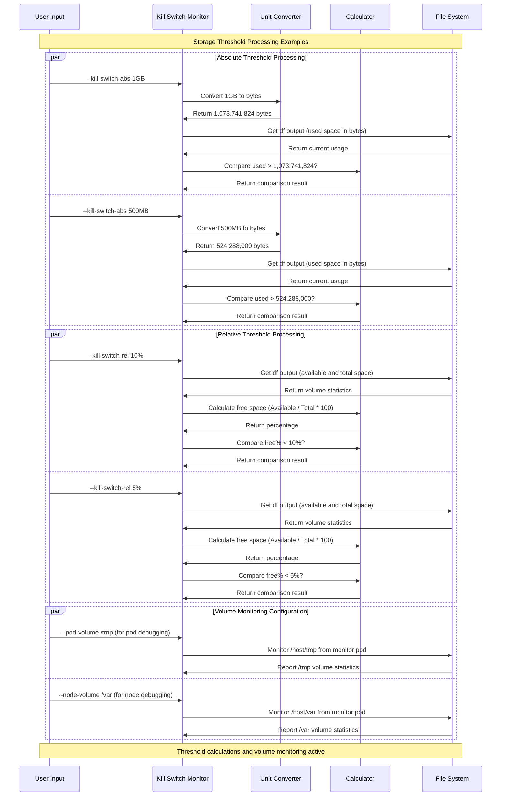
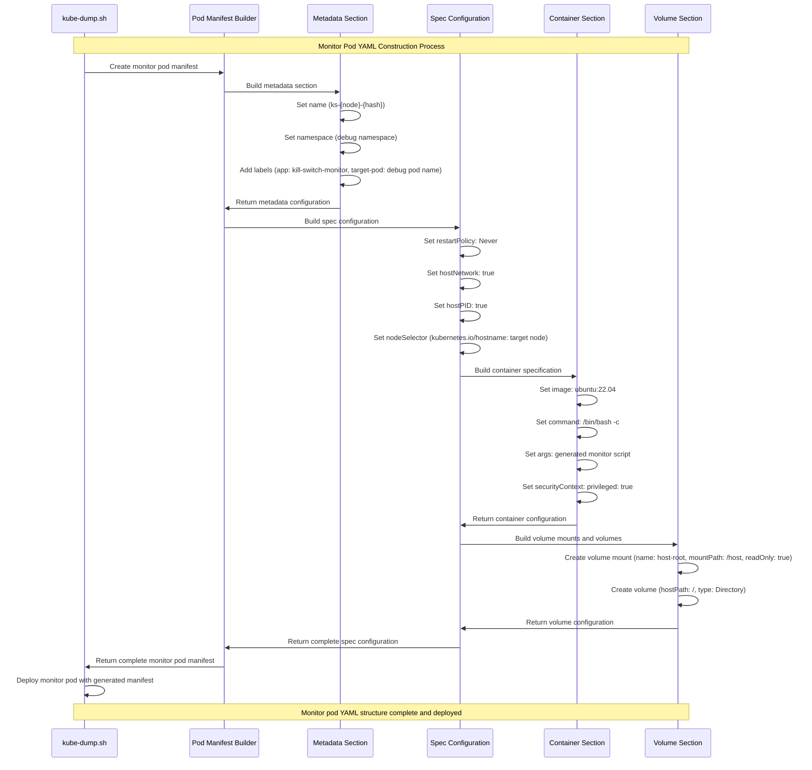

# Kill Switch Architecture

## Table of Contents

1. [Kill Switch Architecture Detail](#kill-switch-architecture-detail)
   - [System Architecture Overview](#system-architecture-overview)
   - [Component Integration Framework](#component-integration-framework)
   - [Protection Mechanisms](#protection-mechanisms)
2. [Kill Switch Monitoring Script Logic](#kill-switch-monitoring-script-logic)
   - [Monitoring Algorithm Architecture](#monitoring-algorithm-architecture)
   - [Threshold Calculation Systems](#threshold-calculation-systems)
   - [Decision Engine Implementation](#decision-engine-implementation)
3. [Storage Threshold Calculation Examples](#storage-threshold-calculation-examples)
   - [Calculation Methodologies](#calculation-methodologies)
   - [Implementation Strategies](#implementation-strategies)
   - [Performance Optimization](#performance-optimization)
4. [Kill Switch Configuration Examples](#kill-switch-configuration-examples)
   - [Configuration Patterns](#configuration-patterns)
   - [Best Practices](#best-practices)
   - [Troubleshooting Guide](#troubleshooting-guide)
5. [Safety and Recovery Mechanisms](#safety-and-recovery-mechanisms)
   - [Fail-Safe Design](#fail-safe-design)
   - [Recovery Strategies](#recovery-strategies)
   - [Monitoring and Alerting](#monitoring-and-alerting)

## Kill Switch Architecture Detail

This sequence diagram illustrates the kill switch monitoring architecture deployed across a Kubernetes cluster. It shows how the kube-dump controller creates and manages debug pods alongside their corresponding kill switch monitor pods, which continuously monitor storage usage and can terminate debug pods when thresholds are exceeded.



## Kill Switch Monitor Pod Creation Flow

This sequence diagram demonstrates the kill switch monitor pod creation process. It shows how kube-dump analyzes each debug pod, determines the appropriate volume monitoring configuration, generates monitor pods with the correct specifications, and initiates the background monitoring process.



### System Architecture Overview

#### **Multi-Layered Protection Framework**

The kill switch architecture implements a comprehensive multi-layered protection system designed to prevent resource exhaustion during debugging operations. This sophisticated framework operates on multiple levels: cluster-wide coordination, node-level monitoring, and pod-specific protection mechanisms.

#### **Component Integration Framework**

**1. Controller Layer Architecture**
- **Kube-dump Controller**: Central orchestration component managing debug pod lifecycle and kill switch deployment
- **Resource Discovery**: Intelligent identification of target nodes and debug pod placement strategies
- **Monitor Pod Coordination**: Systematic deployment of kill switch monitors aligned with debug pod placement
- **State Management**: Comprehensive tracking of all protection components across the cluster

**2. Node-Level Monitor Architecture**
- **Dedicated Monitor Pods**: Specialized lightweight containers running on each target node
- **Host Integration**: Direct host filesystem and process access for accurate resource monitoring
- **Isolation Strategy**: Separate monitor pods prevent resource conflicts with debug operations
- **Communication Channels**: Secure communication with Kubernetes API for protective actions

**3. Storage Protection Framework**
- **Dual Threshold Support**: Both absolute (GB) and relative (percentage) threshold configurations
- **Volume-Specific Monitoring**: Targeted monitoring of specific filesystem paths and volumes
- **Real-time Calculation**: Continuous storage usage calculation with configurable intervals
- **Predictive Analysis**: Optional trend analysis for proactive protection

### Protection Mechanisms

#### **Automatic Response Systems**
- **Threshold Violation Detection**: Immediate detection of storage threshold breaches
- **Graduated Response**: Configurable response levels from warnings to immediate termination
- **Pod Selection Logic**: Intelligent selection of debug pods for termination based on resource usage
- **Cleanup Coordination**: Automatic cleanup of terminated debug pods and associated resources

#### **Safety and Reliability Features**
- **Monitor Redundancy**: Optional redundant monitor deployment for critical environments
- **Fail-Safe Design**: Default-safe behavior when monitor pods encounter errors
- **Recovery Mechanisms**: Automatic recovery from monitor pod failures with state preservation
- **Audit Trail**: Comprehensive logging of all protection actions for post-incident analysis

## Kill Switch Monitoring Script Logic

This sequence diagram shows the internal logic of the kill switch monitoring script running inside each monitor pod. It demonstrates the continuous monitoring loop, threshold calculations, decision-making process, and the kill action execution when storage limits are exceeded.

```mermaid
sequenceDiagram
    participant KM as Kill Switch Monitor
    participant BC as bc Calculator
    participant FS as File System
    participant K8s as Kubectl Command
    participant DP as Target Debug Pod

    Note over KM,DP: Kill Switch Monitoring Script Execution

    KM->>KM: Monitor script starts
    KM->>BC: Install bc if needed (for calculations)
    BC->>KM: Calculator ready

    loop Main monitoring loop
        KM->>FS: Get current usage (df command on volume)
        FS->>KM: Return volume usage statistics

        KM->>KM: Determine threshold type

        alt Absolute threshold
            KM->>BC: Calculate used space in bytes
            BC->>KM: Return byte calculation
            KM->>KM: Check: Used > Absolute threshold?

        else Relative threshold
            KM->>BC: Calculate free space percentage
            BC->>KM: Return percentage calculation
            KM->>KM: Check: Free < Relative threshold?
        end

        alt Threshold exceeded
            KM->>KM: 🔴 THRESHOLD EXCEEDED
            KM->>KM: Log threshold violation
            KM->>K8s: Execute kill command (kubectl delete pod)
            K8s->>DP: Delete target debug pod
            DP->>K8s: Pod deletion initiated
            K8s->>KM: Confirm pod deletion
            KM->>KM: Wait for pod deletion completion
            KM->>KM: Log successful kill
            KM->>KM: Monitor script exits
            break
        else Within limits
            KM->>KM: ✅ Within limits
            KM->>KM: Sleep 10 seconds
        end
    end

    Note over KM,DP: Monitoring completed (pod terminated or script ended)
```

## Storage Threshold Calculation Examples

This sequence diagram illustrates how different storage threshold types are processed and calculated by the kill switch monitoring system. It shows the conversion process for absolute thresholds, percentage calculations for relative thresholds, and volume path monitoring configurations.



## Monitor Pod YAML Structure

This sequence diagram shows the systematic construction of a kill switch monitor pod manifest. It demonstrates how kube-dump builds each section of the YAML configuration, from metadata and specifications to container settings and volume mounts, ensuring proper privileges and node targeting.

