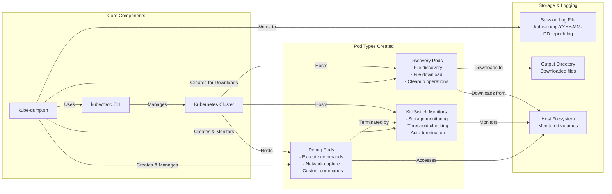
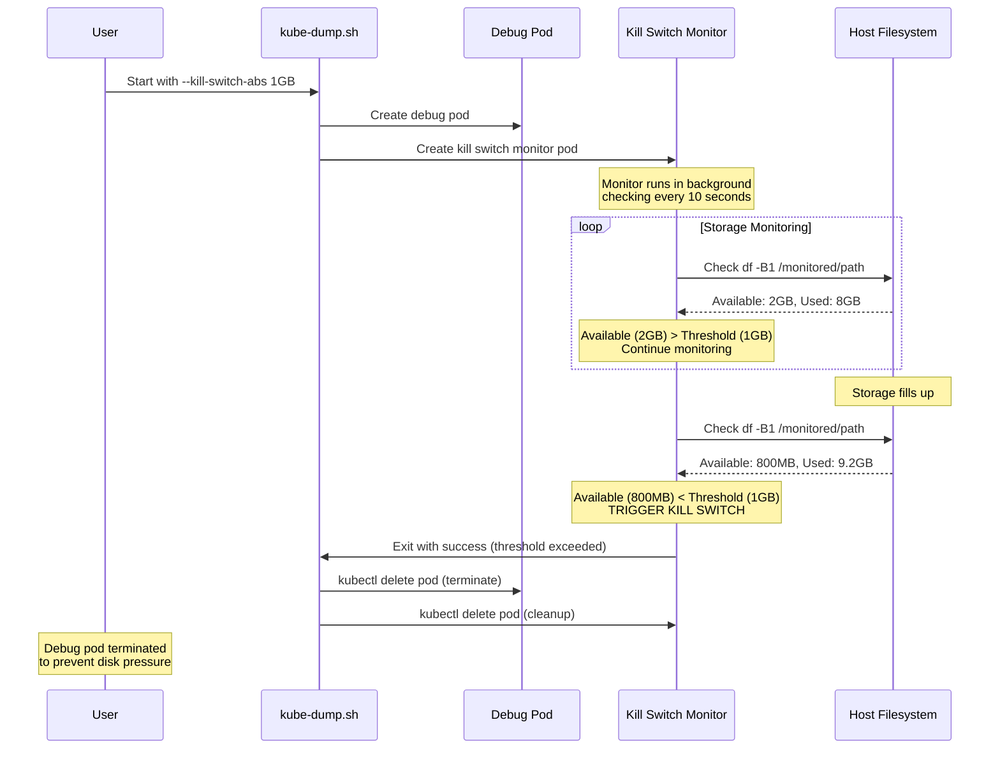
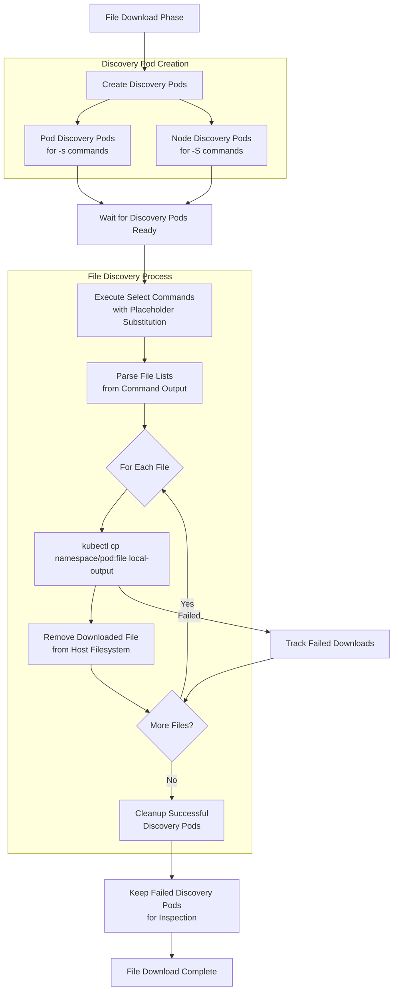

# Kube-Dump Architecture Diagram

This comprehensive Mermaid diagram shows the complete architecture and workflow of the kube-dump.sh script, including all new features like kill switches, logging, and no-glyphs mode.

## Complete Architecture & Workflow

```mermaid
graph TB
    %% User Input & Configuration
    Start([User Starts kube-dump.sh]) --> Init[Initialize Variables]
    Init --> ParseArgs[Parse Command Arguments]
    
    %% Configuration Decision Points
    ParseArgs --> LogCheck{"Output Directory Specified?"}
    LogCheck -->|Yes| CreateLog[Create Log File<br/>kube-dump-YYYY-MM-DD_epoch.log]
    LogCheck -->|No| ExecModeCheck
    CreateLog --> ExecModeCheck
    
    %% Execution Mode Selection
    ExecModeCheck{Execution Mode?}
    ExecModeCheck -->|Pod Mode| PodFlow[Pod Execution Flow]
    ExecModeCheck -->|Node Mode| NodeFlow[Node Execution Flow]
    ExecModeCheck -->|Mixed Mode| MixedFlow[Mixed Execution Flow]
    
    %% Pod Flow
    PodFlow --> FindPods[Find Pods by Label<br/>using kubectl/oc]
    FindPods --> PrepPods[Prepare Target Pods<br/>validate running state]
    PrepPods --> CreatePodDebug[Create Debug Pods<br/>for Pod Targets]
    
    %% Node Flow
    NodeFlow --> FindNodes[Find Nodes by Label<br/>using kubectl/oc]
    FindNodes --> CreateNodeDebug[Create Debug Pods<br/>for Node Targets]
    
    %% Mixed Flow
    MixedFlow --> MixedPods[Process Pod Targets]
    MixedPods --> MixedNodes[Process Node Targets]
    MixedNodes --> MixedCreate[Create Debug Pods<br/>for Both Types]
    
    %% Consolidation
    CreatePodDebug --> WaitReady
    CreateNodeDebug --> WaitReady
    MixedCreate --> WaitReady
    
    %% Kill Switch Decision
    WaitReady[Wait for Debug Pods Ready] --> KillSwitchCheck{Kill Switch<br/>Configured?}
    
    %% Kill Switch Flow
    KillSwitchCheck -->|Yes| CreateKillMonitors[Create Kill Switch<br/>Monitor Pods]
    KillSwitchCheck -->|No| MonitorPhase
    
    CreateKillMonitors --> KillSwitchType{Kill Switch Type?}
    KillSwitchType -->|Absolute| AbsMonitor[Monitor Available Space<br/>vs Threshold]
    KillSwitchType -->|Relative| RelMonitor[Monitor Free Space %<br/>vs Threshold]
    
    AbsMonitor --> StartBgMonitor[Start Background<br/>Kill Switch Monitoring]
    RelMonitor --> StartBgMonitor
    StartBgMonitor --> MonitorPhase
    
    %% Main Monitoring Phase
    MonitorPhase[📊 Debug Pods Running<br/>Monitor Command Output] --> CleanupCheck{No-Cleanup<br/>Mode?}
    
    %% Kill Switch Background Process
    StartBgMonitor -.-> KillMonitorLoop{Monitor Loop<br/>Check Every 5s}
    KillMonitorLoop -.-> KillThresholdCheck{Threshold<br/>Exceeded?}
    KillThresholdCheck -.->|Yes| KillDebugPods[🔴 Kill Debug Pods<br/>Clean Monitor Pods]
    KillThresholdCheck -.->|No| KillMonitorLoop
    KillDebugPods -.-> KillComplete[Kill Switch Complete]
    
    %% Cleanup Decision
    CleanupCheck -->|No Cleanup Mode| NoCleanupFlow[Keep Debug Pods Running<br/>Show Monitor Commands]
    CleanupCheck -->|Normal| UserWait[Wait for User Input<br/>Press Enter to cleanup]
    
    UserWait --> CleanupDebug[🧹 Cleanup Debug Pods]
    CleanupDebug --> CleanupKillSwitches[🧹 Cleanup Kill Switch<br/>Monitor Pods]
    
    %% File Download Decision
    CleanupKillSwitches --> FileDownloadCheck{File Download<br/>Requested?}
    NoCleanupFlow --> FileDownloadCheck
    
    FileDownloadCheck -->|Yes| CreateDiscovery[Create File Discovery Pods]
    FileDownloadCheck -->|No| Complete
    
    %% File Discovery & Download Flow
    CreateDiscovery --> DiscoveryType{Discovery Type?}
    DiscoveryType -->|Pod Files| PodDiscovery[Pod File Discovery<br/>Execute select command<br/>with placeholder substitution]
    DiscoveryType -->|Node Files| NodeDiscovery[Node File Discovery<br/>Execute select command<br/>with placeholder substitution]
    DiscoveryType -->|Both| BothDiscovery[Both Pod & Node<br/>Discovery]
    
    PodDiscovery --> ExecuteSelect[Execute Select Commands<br/>Get File Lists]
    NodeDiscovery --> ExecuteSelect
    BothDiscovery --> ExecuteSelect
    
    ExecuteSelect --> DownloadFiles[📥 Download Files<br/>to Output Directory]
    DownloadFiles --> CleanupDiscovery[🧹 Cleanup Successful<br/>Discovery Pods]
    CleanupDiscovery --> Complete
    
    %% Completion
    Complete[🎉 Session Complete<br/>Close Log File if Created]
    
    %% Styling for different component types
    classDef startEnd fill:#e1f5fe,stroke:#01579b,stroke-width:3px
    classDef decision fill:#fff3e0,stroke:#e65100,stroke-width:2px
    classDef process fill:#e8f5e8,stroke:#2e7d32,stroke-width:2px
    classDef killswitch fill:#ffebee,stroke:#c62828,stroke-width:2px
    classDef monitor fill:#f3e5f5,stroke:#7b1fa2,stroke-width:2px
    classDef cleanup fill:#fff8e1,stroke:#f57f17,stroke-width:2px
    
    class Start,Complete startEnd
    class LogCheck,ExecModeCheck,KillSwitchCheck,KillSwitchType,CleanupCheck,FileDownloadCheck,DiscoveryType decision
    class Init,ParseArgs,FindPods,FindNodes,CreatePodDebug,CreateNodeDebug,WaitReady process
    class CreateKillMonitors,AbsMonitor,RelMonitor,StartBgMonitor,KillDebugPods killswitch
    class MonitorPhase,KillMonitorLoop,KillThresholdCheck monitor
    class CleanupDebug,CleanupKillSwitches,CleanupDiscovery cleanup
```

## Key Components & Data Flows

## Kill Switch Architecture Detail

## File Download Workflow Detail

## Feature Matrix

| Feature | Flag | Description | Integration Points |
|---------|------|-------------|-------------------|
| **Kill Switch (Absolute)** | `--kill-switch-abs` | Monitor absolute disk usage (e.g., 1GB, 500MB) | Creates monitor pods, background monitoring, auto-termination |
| **Kill Switch (Relative)** | `--kill-switch-rel` | Monitor relative disk usage (e.g., 10%) | Creates monitor pods, percentage calculations, auto-termination |
| **Volume Monitoring** | `--pod-volume`, `--node-volume` | Specify paths to monitor for kill switches | Volume mount points, df command targets |
| **No Glyphs Mode** | `--no-glyphs` | Replace emojis with text labels | Message formatting, logging output |
| **Session Logging** | `-o` (triggers logging) | Log all session activity | File creation, message logging, session archival |
| **Mixed Mode** | `-l` + `-L` | Execute on both pods and nodes | Dual pod creation, parallel monitoring |
| **File Download** | `-s`, `-S`, `-o` | Download files created during debug | Discovery pods, file transfer, cleanup |
| **No Cleanup** | `--no-cleanup` | Keep debug pods running | Skip cleanup phase, show monitoring commands |

This diagram provides a complete view of the kube-dump.sh architecture, showing how the new kill switch and logging features integrate seamlessly with the existing pod/node debugging capabilities.