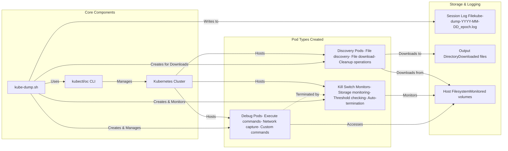
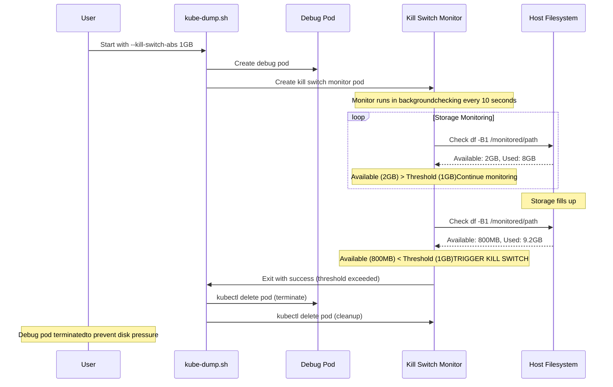
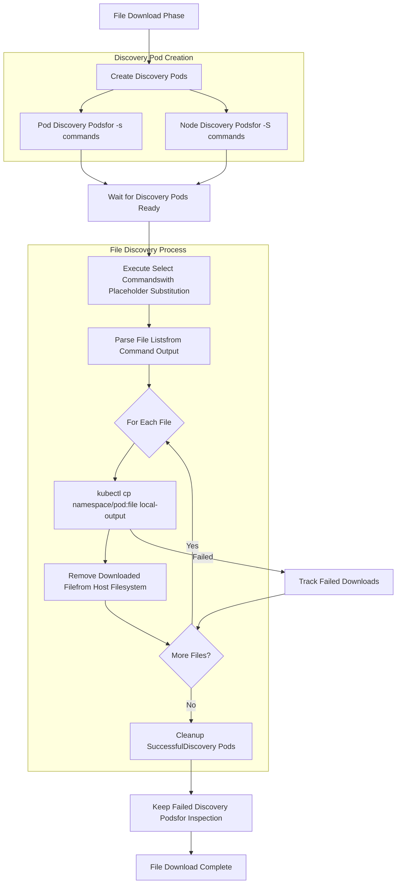

# Kube-Dump Architecture Diagram

This comprehensive Mermaid diagram shows the complete architecture and workflow of the kube-dump.sh script, including all new features like kill switches, logging, and no-glyphs mode.

## Complete Architecture & Workflow

```mermaid
graph TB
    %% User Input & Configuration
    Start([User Starts kube-dump.sh]) --> Init[Initialize Variables]
    Init --> ParseArgs[Parse Command Arguments]
    
    %% Configuration Decision Points
    ParseArgs --> LogCheck{Output DirectorySpecified (-o)?}
    LogCheck -->|Yes| CreateLog[Create Log Filekube-dump-YYYY-MM-DD_epoch.log]
    LogCheck -->|No| ExecModeCheck
    CreateLog --> ExecModeCheck
    
    %% Execution Mode Selection
    ExecModeCheck{Execution Mode?}
    ExecModeCheck -->|Pod Mode(-l label)| PodFlow[Pod Execution Flow]
    ExecModeCheck -->|Node Mode(-L node-label)| NodeFlow[Node Execution Flow]
    ExecModeCheck -->|Mixed Mode(-l + -L)| MixedFlow[Mixed Execution Flow]
    
    %% Pod Flow
    PodFlow --> FindPods[Find Pods by Labelusing kubectl/oc]
    FindPods --> PrepPods[Prepare Target Podsvalidate running state]
    PrepPods --> CreatePodDebug[Create Debug Podsfor Pod Targets]
    
    %% Node Flow
    NodeFlow --> FindNodes[Find Nodes by Labelusing kubectl/oc]
    FindNodes --> CreateNodeDebug[Create Debug Podsfor Node Targets]
    
    %% Mixed Flow
    MixedFlow --> MixedPods[Process Pod Targets]
    MixedPods --> MixedNodes[Process Node Targets]
    MixedNodes --> MixedCreate[Create Debug Podsfor Both Types]
    
    %% Consolidation
    CreatePodDebug --> WaitReady
    CreateNodeDebug --> WaitReady
    MixedCreate --> WaitReady
    
    %% Kill Switch Decision
    WaitReady[Wait for Debug Pods Ready] --> KillSwitchCheck{Kill SwitchConfigured?}
    
    %% Kill Switch Flow
    KillSwitchCheck -->|Yes--kill-switch-abs/rel| CreateKillMonitors[Create Kill SwitchMonitor Pods]
    KillSwitchCheck -->|No| MonitorPhase
    
    CreateKillMonitors --> KillSwitchType{Kill Switch Type?}
    KillSwitchType -->|Absolute--kill-switch-abs| AbsMonitor[Monitor Available Spacevs Thresholde.g., 1GB, 500MB]
    KillSwitchType -->|Relative--kill-switch-rel| RelMonitor[Monitor Free Space %vs Thresholde.g., 10%]
    
    AbsMonitor --> StartBgMonitor[Start BackgroundKill Switch Monitoring]
    RelMonitor --> StartBgMonitor
    StartBgMonitor --> MonitorPhase
    
    %% Main Monitoring Phase
    MonitorPhase[📊 Debug Pods RunningMonitor Command Output] --> CleanupCheck{No-CleanupMode?}
    
    %% Kill Switch Background Process
    StartBgMonitor -.-> KillMonitorLoop{Monitor LoopCheck Every 5s}
    KillMonitorLoop -.-> KillThresholdCheck{ThresholdExceeded?}
    KillThresholdCheck -.->|Yes| KillDebugPods[🔴 Kill Debug PodsClean Monitor Pods]
    KillThresholdCheck -.->|No| KillMonitorLoop
    KillDebugPods -.-> KillComplete[Kill Switch Complete]
    
    %% Cleanup Decision
    CleanupCheck -->|--no-cleanup| NoCleanupFlow[Keep Debug Pods RunningShow Monitor Commands]
    CleanupCheck -->|Normal| UserWait[Wait for User InputPress Enter to cleanup]
    
    UserWait --> CleanupDebug[🧹 Cleanup Debug Pods]
    CleanupDebug --> CleanupKillSwitches[🧹 Cleanup Kill SwitchMonitor Pods]
    
    %% File Download Decision
    CleanupKillSwitches --> FileDownloadCheck{File DownloadRequested?}
    NoCleanupFlow --> FileDownloadCheck
    
    FileDownloadCheck -->|Yes-s/-S + -o| CreateDiscovery[Create File Discovery Pods]
    FileDownloadCheck -->|No| Complete
    
    %% File Discovery & Download Flow
    CreateDiscovery --> DiscoveryType{Discovery Type?}
    DiscoveryType -->|Pod Files-s command| PodDiscovery[Pod File DiscoveryExecute select commandwith placeholder substitution]
    DiscoveryType -->|Node Files-S command| NodeDiscovery[Node File DiscoveryExecute select commandwith placeholder substitution]
    DiscoveryType -->|Both| BothDiscovery[Both Pod & NodeDiscovery]
    
    PodDiscovery --> ExecuteSelect[Execute Select CommandsGet File Lists]
    NodeDiscovery --> ExecuteSelect
    BothDiscovery --> ExecuteSelect
    
    ExecuteSelect --> DownloadFiles[📥 Download Filesto Output Directory]
    DownloadFiles --> CleanupDiscovery[🧹 Cleanup SuccessfulDiscovery Pods]
    CleanupDiscovery --> Complete
    
    %% Completion
    Complete[🎉 Session CompleteClose Log File if Created]
    
    %% Styling for different component types
    classDef startEnd fill:#e1f5fe,stroke:#01579b,stroke-width:3px
    classDef decision fill:#fff3e0,stroke:#e65100,stroke-width:2px
    classDef process fill:#e8f5e8,stroke:#2e7d32,stroke-width:2px
    classDef killswitch fill:#ffebee,stroke:#c62828,stroke-width:2px
    classDef monitor fill:#f3e5f5,stroke:#7b1fa2,stroke-width:2px
    classDef cleanup fill:#fff8e1,stroke:#f57f17,stroke-width:2px
    
    class Start,Complete startEnd
    class LogCheck,ExecModeCheck,KillSwitchCheck,KillSwitchType,CleanupCheck,FileDownloadCheck,DiscoveryType decision
    class Init,ParseArgs,FindPods,FindNodes,CreatePodDebug,CreateNodeDebug,WaitReady process
    class CreateKillMonitors,AbsMonitor,RelMonitor,StartBgMonitor,KillDebugPods killswitch
    class MonitorPhase,KillMonitorLoop,KillThresholdCheck monitor
    class CleanupDebug,CleanupKillSwitches,CleanupDiscovery cleanup
```

## Complete Architecture Process Description

This comprehensive architecture diagram illustrates the complete workflow and decision tree for kube-dump execution, showing how different execution modes, kill switch protection, and file operations integrate into a unified system.

### 🏗️ **Architecture Overview Process Flow**

**Primary Execution Path**: User Input → Configuration → Target Discovery → Debug Pod Creation → Monitoring → Cleanup

**Detailed Architecture Process**:

1. **Initial Configuration and Logging Setup**:
   - **User Input Processing**: The script begins by capturing and validating all user-provided arguments
   - **Logging Decision Point**: When `-o` (output directory) is specified, creates timestamped log file (`kube-dump-YYYY-MM-DD_epoch.log`)
   - **Mode Detection**: Analyzes arguments to determine execution strategy (Pod/Node/Mixed mode)
   - **Prerequisites Validation**: Ensures cluster connectivity and required permissions

2. **Execution Mode Routing and Target Discovery**:
   - **Pod Mode Flow**: When `-l` (pod label) is specified
     - Queries Kubernetes API for pods matching label selector
     - Filters to Running pods only and extracts metadata (name, namespace, node, containers)
     - Prepares target pod list for debug pod co-location
   - **Node Mode Flow**: When `-L` (node label) is specified
     - Queries cluster nodes using label selectors
     - Validates node availability and readiness
     - Prepares node target list for host-level debugging
   - **Mixed Mode Flow**: When both pod and node labels are provided
     - Executes both pod and node discovery processes in parallel
     - Coordinates target lists for unified debug pod creation

3. **Kill Switch Integration and Background Monitoring**:
   - **Kill Switch Configuration Decision**: When `--kill-switch-abs` or `--kill-switch-rel` is specified
   - **Threshold Type Determination**:
     - **Absolute Monitoring**: Tracks available disk space against fixed thresholds (e.g., 1GB, 500MB)
     - **Relative Monitoring**: Monitors free space percentage against relative thresholds (e.g., 10%)
   - **Background Monitor Creation**: Deploys kill switch monitor pods alongside debug pods
   - **Continuous Monitoring Loop**:
     - Monitors every 1 second for kill switch triggers
     - Checks specified volume paths (`--pod-volume`, `--node-volume`)
     - Automatically terminates debug pods when thresholds are exceeded

4. **Debug Pod Execution and User Interaction**:
   - **Monitoring Phase**: Displays real-time status and provides monitoring commands
   - **User Control Decision**:
     - **No-Cleanup Mode**: Skips user interaction, proceeds directly to file operations
     - **Interactive Mode**: Waits for user input (Enter to cleanup, Ctrl+C to keep running)
   - **Resource Management**: Maintains state of all created pods for proper cleanup

5. **Cleanup and File Operations Workflow**:
   - **Debug Pod Cleanup**: Systematically removes all debug pods and kill switch monitors
   - **File Operations Decision**: When `-s` (pod files) or `-S` (node files) with `-o` is specified
   - **Discovery Pod Creation**: Creates specialized file discovery pods for download operations
   - **File Collection Process**:
     - Executes user-specified select commands with placeholder substitution
     - Downloads identified files using `kubectl cp` with retry logic
     - Organizes files in output directory structure
     - Cleans up discovery pods (successful ones removed, failed ones preserved)

6. **Session Completion and Documentation**:
   - **Final Cleanup**: Ensures all temporary resources are removed
   - **Session Documentation**: Closes log files and provides operation summary
   - **Exit Status**: Returns appropriate exit codes based on operation success/failure

### 🔄 **Parallel Process Management**

**Kill Switch Background Process**: Runs continuously parallel to main execution, providing automated protection against disk pressure scenarios.

**Error Recovery**: Multiple checkpoints throughout the workflow ensure graceful failure handling with appropriate resource cleanup.

**State Management**: Comprehensive tracking of all created resources enables reliable cleanup even in failure scenarios.

## Key Components & Data Flows



## Components and Data Flow Process Description

This component diagram illustrates the core architectural elements and their relationships within the kube-dump ecosystem, showing how different types of pods, external tools, and data flows interact.

### 🏢 **Core Components Architecture**

**Component Interaction Flow**: User → kube-dump.sh → kubectl/oc CLI → Kubernetes Cluster → Pod Types

**Detailed Component Process**:

1. **Core System Components**:
   - **kubectl/oc CLI**: Primary interface to Kubernetes cluster, handles all API communications
   - **kube-dump.sh Script**: Central orchestrator that manages the entire debugging workflow
   - **Kubernetes Cluster**: Target environment where all debugging operations are performed

2. **Pod Type Specialization**:
   - **Debug Pods**: Primary execution containers that run debugging commands
     - Execute commands within target pod network namespaces (pod mode)
     - Perform host-level debugging operations (node mode)
     - Handle custom user commands and network capture operations
   - **Kill Switch Monitors**: Protection containers that prevent resource exhaustion
     - Monitor storage usage on specified volume paths
     - Implement threshold checking (absolute and relative)
     - Automatically terminate debug pods when limits are exceeded
   - **Discovery Pods**: File operation containers for automated file collection
     - Execute file selection commands with placeholder substitution
     - Handle file download operations using kubectl cp
     - Manage cleanup of downloaded files from source locations

3. **Data Flow and Storage Components**:
   - **Session Log File**: Timestamped comprehensive logging (`kube-dump-YYYY-MM-DD_epoch.log`)
     - Records all operations, commands, and status information
     - Provides audit trail for debugging sessions
     - Enables post-session analysis and troubleshooting
   - **Output Directory**: Organized file storage for downloaded artifacts
     - Structured directory layout for pod and node files
     - Maintains file organization by source and type
     - Provides accessible location for collected debugging data
   - **Host Filesystem**: Target storage locations for monitoring and operations
     - Volume paths monitored by kill switch systems
     - Source locations for file discovery and download
     - Integration point for host-level debugging operations

### 🔄 **Component Interaction Patterns**

**Management Flow**: Script uses CLI to manage cluster, which hosts various specialized pod types.

**Data Flow**: Log files and output directories provide persistent storage for session data and collected artifacts.

**Protection Flow**: Kill switch monitors provide automated protection by monitoring host filesystem and terminating operations when necessary.

## Kill Switch Architecture Detail



## Kill Switch Sequence Process Description

This sequence diagram demonstrates the real-time interaction between user, script, debug pods, kill switch monitors, and host filesystem during a kill switch protection scenario.

### ⚡ **Kill Switch Protection Sequence Flow**

**Timeline Process**: User Initiation → Pod Deployment → Background Monitoring → Threshold Detection → Automatic Termination

**Detailed Sequence Process**:

1. **Kill Switch Initialization Sequence**:
   - **User Command**: User starts kube-dump with kill switch parameters (`--kill-switch-abs 1GB`)
   - **Script Processing**: Script validates kill switch configuration and volume paths
   - **Debug Pod Creation**: Script creates primary debug pod for command execution
   - **Monitor Deployment**: Script deploys kill switch monitor pod with threshold configuration

2. **Background Monitoring Activation**:
   - **Monitor Startup**: Kill switch monitor pod begins continuous storage monitoring
   - **Threshold Configuration**: Monitor configures absolute threshold (1GB available space required)
   - **Volume Monitoring**: Monitor checks specified volume path every 1 second
   - **Status Reporting**: Monitor provides periodic status updates to script

3. **Normal Operation Phase**:
   - **Debug Execution**: Debug pod executes user commands (tcpdump, custom commands, etc.)
   - **Storage Monitoring**: Monitor continuously checks available space against threshold
   - **Threshold Compliance**: Monitor reports "Available (2GB) > Threshold (1GB)" status
   - **Continued Operation**: Debug pod continues execution while storage remains above threshold

4. **Threshold Breach Detection**:
   - **Storage Depletion**: Available space drops below configured threshold (800MB < 1GB)
   - **Kill Switch Trigger**: Monitor detects threshold breach and initiates termination sequence
   - **Script Notification**: Monitor signals script that kill switch has been triggered
   - **Emergency Response**: Script immediately begins emergency shutdown procedures

5. **Automatic Termination Sequence**:
   - **Debug Pod Termination**: Script terminates debug pod to prevent further storage consumption
   - **Monitor Cleanup**: Script cleans up kill switch monitor pod
   - **User Notification**: Script notifies user that debug pod was terminated to prevent disk pressure
   - **Session Conclusion**: Script completes cleanup and exits with appropriate status

### 🛡️ **Protection Mechanism Details**

**Real-time Monitoring**: Kill switch monitors operate continuously with 1-second intervals for rapid response to storage depletion.

**Proactive Termination**: Debug pods are terminated before storage exhaustion can impact cluster stability.

**Threshold Flexibility**: Both absolute (GB/MB) and relative (percentage) thresholds supported for different scenarios.

**Volume Targeting**: Specific volume paths can be monitored for granular storage protection.

## File Download Workflow Detail



## Feature Matrix

| Feature | Flag | Description | Integration Points |
|---------|------|-------------|-------------------|
| **Kill Switch (Absolute)** | `--kill-switch-abs` | Monitor absolute disk usage (e.g., 1GB, 500MB) | Creates monitor pods, background monitoring, auto-termination |
| **Kill Switch (Relative)** | `--kill-switch-rel` | Monitor relative disk usage (e.g., 10%) | Creates monitor pods, percentage calculations, auto-termination |
| **Volume Monitoring** | `--pod-volume`, `--node-volume` | Specify paths to monitor for kill switches | Volume mount points, df command targets |
| **No Glyphs Mode** | `--no-glyphs` | Replace emojis with text labels | Message formatting, logging output |
| **Session Logging** | `-o` (triggers logging) | Log all session activity | File creation, message logging, session archival |
| **Mixed Mode** | `-l` + `-L` | Execute on both pods and nodes | Dual pod creation, parallel monitoring |
| **File Download** | `-s`, `-S`, `-o` | Download files created during debug | Discovery pods, file transfer, cleanup |
| **No Cleanup** | `--no-cleanup` | Keep debug pods running | Skip cleanup phase, show monitoring commands |

This diagram provides a complete view of the kube-dump.sh architecture, showing how the new kill switch and logging features integrate seamlessly with the existing pod/node debugging capabilities.