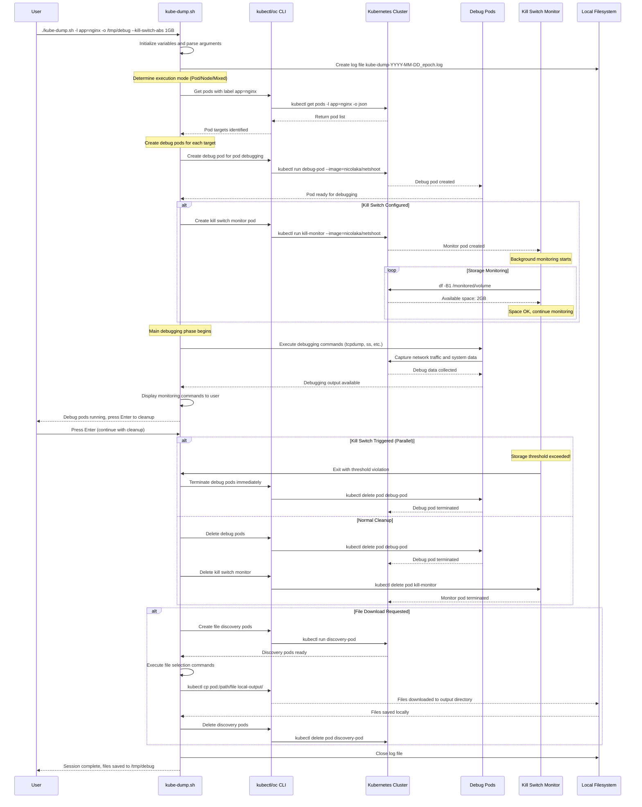
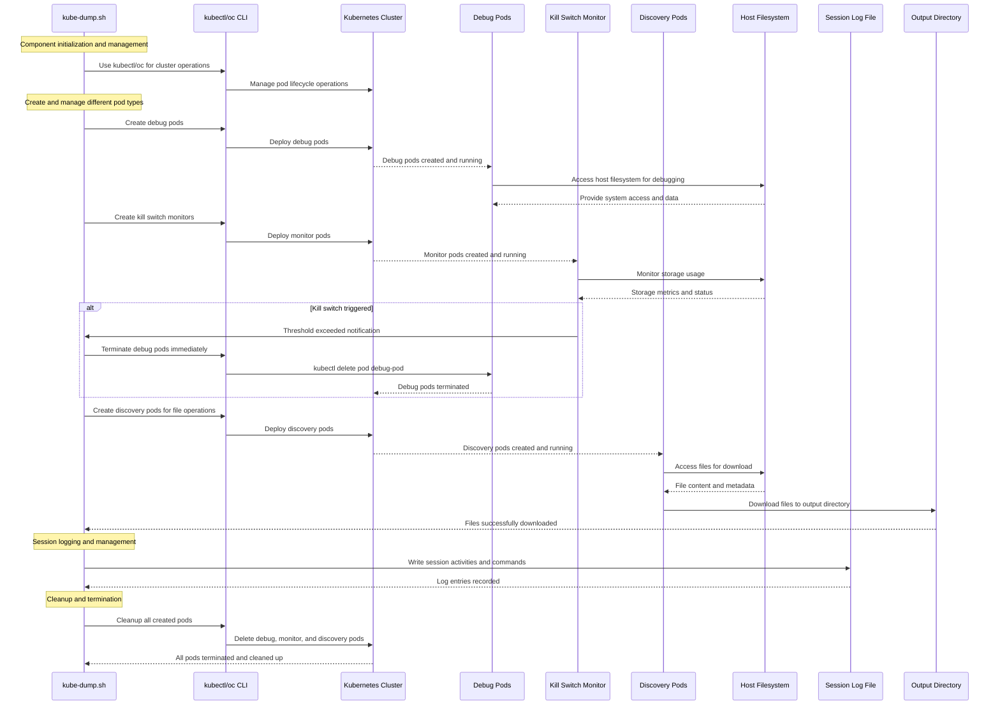
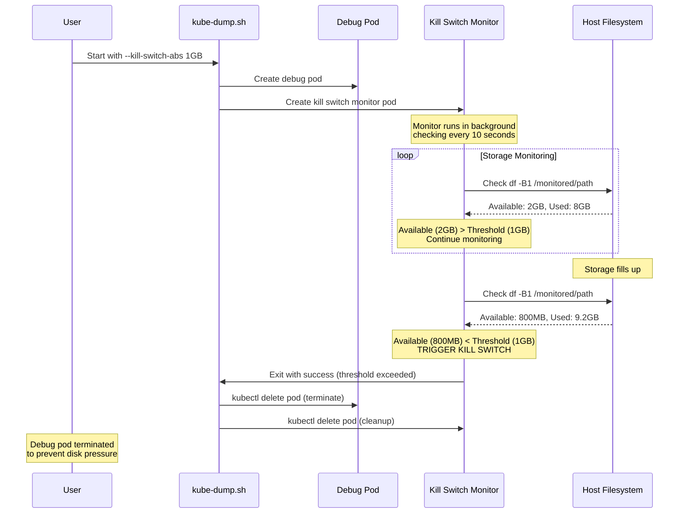
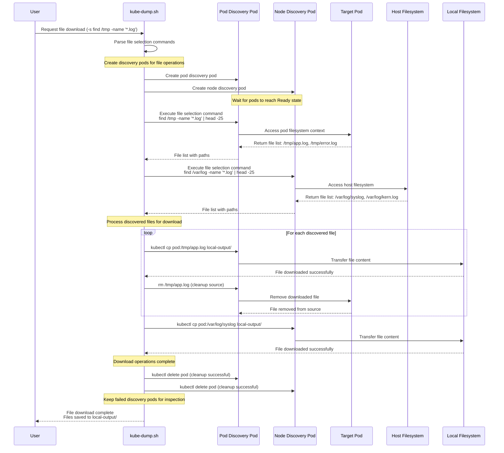

# Kube-Dump Architecture Diagram

This comprehensive documentation provides detailed explanations of kube-dump's architecture and workflow, including all features like kill switches, logging, and multi-mode execution.

## Table of Contents

1. [Complete Architecture & Workflow](#complete-architecture--workflow)
   - [Process Description](#architecture-process-description)
2. [Key Components & Data Flows](#key-components--data-flows)
   - [Process Description](#components-process-description)
3. [Kill Switch Architecture Detail](#kill-switch-architecture-detail)
   - [Process Description](#kill-switch-process-description)
4. [File Download Workflow Detail](#file-download-workflow-detail)
   - [Process Description](#file-download-process-description)
5. [Feature Matrix](#feature-matrix)

## Complete Architecture & Workflow

### Architecture Process Description

This diagram illustrates the complete execution flow of kube-dump from startup to completion, showing how different components interact and how various execution modes are handled.

#### Phase 1: Initialization and Configuration (Steps 1-4)

1. **Script Startup**: The user executes `kube-dump.sh` with various command-line options. The script begins by validating the runtime environment and checking for required dependencies.

2. **Variable Initialization**: Core variables are set up including default labels (`dumpme=yes`), command templates, CRI runtime settings, and internal arrays for tracking pods and operations.

3. **Argument Parsing**: All command-line flags are processed and validated. This includes pod/node selectors, custom commands, kill switch thresholds, output directories, and execution modes.

4. **Logging Decision**: If an output directory (`-o`) is specified, a timestamped log file is created (`kube-dump-YYYY-MM-DD_epoch.log`) to record all session activities, commands executed, and system responses.

#### Phase 2: Execution Mode Selection (Steps 5-8)

5. **Mode Determination**: Based on the provided arguments, the script determines the execution mode:
   - **Pod Mode**: When only pod labels (`-l`) are specified, targets specific pods for debugging
   - **Node Mode**: When only node labels (`-L`) are specified, targets entire nodes for system-level debugging
   - **Mixed Mode**: When both pod and node labels are provided, combines both approaches

6. **Pod Flow Path**: For pod-based operations, the system queries the Kubernetes API to find all pods matching the label selector, validates they are in Running state, and prepares debugging configurations specific to each pod's container environment.

7. **Node Flow Path**: For node-based operations, the system identifies target nodes using label selectors and prepares host-level debugging configurations with privileged access to node resources.

8. **Mixed Flow Path**: For combined operations, both pod and node discovery processes run in parallel, creating a comprehensive debugging environment across multiple resource types.

#### Phase 3: Debug Pod Creation and Readiness (Steps 9-12)

9. **Debug Pod Creation**: Specialized debugging pods are created based on the execution mode:
   - **Pod Debug Pods**: Share network namespaces with target pods, enabling network traffic capture and container-specific debugging
   - **Node Debug Pods**: Mount host filesystems and use host networking for system-level analysis
   - **Mixed Debug Pods**: Combine both approaches for comprehensive coverage

10. **Pod Readiness Wait**: The system monitors all created debug pods until they reach Running state, implementing timeout mechanisms and failure handling for pods that don't start successfully.

11. **Kill Switch Evaluation**: If kill switch protection is configured (`--kill-switch-abs` or `--kill-switch-rel`), the system determines the monitoring strategy and prepares protective mechanisms.

12. **Monitor Pod Creation**: When kill switches are enabled, dedicated monitor pods are created to continuously watch storage usage on specified volumes and automatically terminate debug pods if thresholds are exceeded.

#### Phase 4: Active Monitoring and Kill Switch Protection (Steps 13-16)

13. **Background Monitoring**: Kill switch monitors run continuously in the background, checking storage usage every second and calculating available space against configured thresholds.

14. **Debug Pod Execution**: Main debug pods execute their configured commands (tcpdump by default, or custom commands specified by users), capturing network traffic, system information, or running diagnostic procedures.

15. **Threshold Monitoring**: Monitor pods continuously evaluate storage conditions:
    - **Absolute Monitoring**: Checks if available disk space falls below specified amounts (e.g., 1GB, 500MB)
    - **Relative Monitoring**: Checks if free space percentage drops below specified thresholds (e.g., 10%, 5%)

16. **Emergency Termination**: If thresholds are exceeded, monitor pods immediately terminate their associated debug pods and log the kill switch activation for audit purposes.

#### Phase 5: User Interaction and Cleanup Decision (Steps 17-20)

17. **Monitoring Commands Display**: The system provides kubectl commands for users to monitor debug pod outputs in real-time, enabling interactive debugging and live analysis.

18. **Cleanup Mode Evaluation**: The script checks if `--no-cleanup` mode is enabled, determining whether to keep debug pods running for extended analysis or proceed with standard cleanup procedures.

19. **User Input Waiting**: In normal mode, the system waits for user input (Enter key) before proceeding with cleanup, allowing users to control the debugging session duration.

20. **Cleanup Execution**: When triggered, the system systematically removes debug pods, kill switch monitors, and associated resources while preserving any generated files or logs.

#### Phase 6: File Operations and Session Completion (Steps 21-25)

21. **File Download Assessment**: If file selection commands (`-s` for pods, `-S` for nodes) were specified along with an output directory, the system prepares for file download operations.

22. **Discovery Pod Creation**: Specialized discovery pods are created to execute file selection commands and transfer files from the cluster to the local system.

23. **File Discovery and Transfer**: Discovery pods execute the specified commands, locate target files, and use `kubectl cp` to transfer files to the local output directory with proper naming conventions.

24. **Discovery Cleanup**: Successfully completed discovery pods are automatically removed, while failed pods are preserved for troubleshooting and manual inspection.

25. **Session Completion**: The script concludes by closing log files, summarizing operations performed, and providing information about any preserved resources or downloaded files.

This comprehensive workflow ensures reliable, safe, and efficient debugging operations across diverse Kubernetes environments while providing multiple layers of protection and monitoring.

## Key Components & Data Flows

### Components Process Description

This diagram shows the relationship between core components, pod types, and data flows within the kube-dump ecosystem, illustrating how different elements interact to provide comprehensive debugging capabilities.

#### Core Components Interaction

**kubectl/oc CLI**: Serves as the primary interface to the Kubernetes cluster, executing all pod management operations, resource queries, and file transfers. The CLI tool is automatically detected (preferring `oc` for OpenShift environments, falling back to `kubectl` for standard Kubernetes).

**kube-dump.sh Script**: Acts as the orchestration layer, coordinating all operations between the CLI tools and the Kubernetes cluster. It manages pod lifecycles, monitors operations, handles error conditions, and provides user interaction points.

**Kubernetes Cluster**: Provides the runtime environment for all debugging operations, hosting the various pod types and providing the API endpoints for resource management and monitoring.

#### Pod Types and Their Functions

**Debug Pods**: The primary workhorses that execute debugging commands within target environments. They are configured with specific networking and security contexts based on the debugging target (pod-level or node-level), and they generate the core debugging data.

**Kill Switch Monitors**: Specialized protection pods that continuously monitor storage usage on specified volumes. They run lightweight monitoring scripts with mathematical calculations (`bc` tool) to evaluate storage thresholds and automatically terminate debug pods when resource limits are approached.

**Discovery Pods**: Temporary pods created specifically for file transfer operations. They execute user-defined file selection commands, locate target files within the cluster, and facilitate secure file extraction to the local system.

#### Data Flow Relationships

**Script to Pod Management**: The kube-dump script creates and manages all pod types, configuring their specifications, monitoring their status, and coordinating their operations based on user requirements and system conditions.

**Host Filesystem Access**: All pod types require access to host filesystems for their specific functions - debug pods for capturing network traffic and system data, kill switch monitors for storage monitoring, and discovery pods for file location and extraction.

**Storage and Logging Integration**: The script manages session logging when output directories are specified, while discovery pods populate these directories with downloaded files. Kill switch monitors protect the storage systems that host these outputs.

**Protective Relationships**: Kill switch monitors maintain protective oversight over debug pods, with the ability to terminate them when resource thresholds are exceeded, ensuring system stability during intensive debugging operations.

This component architecture ensures separation of concerns while maintaining coordinated operation across all debugging functions.

## Kill Switch Architecture Detail

### Kill Switch Process Description

This sequence diagram illustrates the real-time interaction between components during kill switch operation, showing how storage monitoring and automatic protection mechanisms work to prevent system resource exhaustion.

#### Kill Switch Activation Sequence

**Initialization Phase (Steps 1-3)**:
1. **User Invocation**: User starts kube-dump with kill switch protection enabled using `--kill-switch-abs 1GB`, specifying that debug operations should be terminated if available disk space falls below 1GB.

2. **Debug Pod Creation**: The script creates the primary debug pod configured with the user's debugging requirements (network capture, custom commands, etc.) and appropriate resource access permissions.

3. **Monitor Pod Deployment**: A dedicated kill switch monitor pod is created specifically to watch storage conditions on the target volume, running independently from the debug operations.

#### Continuous Monitoring Phase (Steps 4-6)**:
4. **Background Monitoring Loop**: The monitor pod establishes a continuous monitoring loop, checking storage conditions every second using `df -B1` commands to get byte-level precision on storage availability.

5. **Threshold Evaluation**: During normal operation, the monitor continuously compares available space against the configured threshold. In this example, available space (2GB) exceeds the threshold (1GB), so monitoring continues without intervention.

6. **Status Reporting**: The monitoring loop maintains logs of storage conditions, providing audit trails and debugging information for storage consumption patterns during debug operations.

#### Emergency Response Phase (Steps 7-10)**:
7. **Critical Condition Detection**: When storage consumption increases due to debug activities (network captures, log generation, etc.), available space drops below the configured threshold (800MB < 1GB threshold).

8. **Kill Switch Trigger**: The monitor pod immediately recognizes the threshold violation and initiates the kill switch sequence, logging the event with timestamp and storage metrics for audit purposes.

9. **Debug Pod Termination**: The monitor pod executes `kubectl delete pod` command to immediately terminate the debug pod, preventing further storage consumption and potential system instability.

10. **Cleanup and Notification**: The monitor pod completes its protective action and exits successfully, while the main script detects the termination event and proceeds with cleanup of associated resources.

#### Protection Benefits

**Proactive Resource Protection**: The kill switch prevents debug operations from consuming excessive storage that could impact cluster stability, application performance, or system availability.

**Independent Operation**: Monitor pods operate independently of debug pods, ensuring that even if debug operations become resource-intensive or unresponsive, protective mechanisms remain functional.

**Immediate Response**: Sub-second detection and response times ensure rapid intervention before storage exhaustion can cause broader system impacts.

**Audit Trail**: Complete logging of kill switch events provides forensic information for understanding resource consumption patterns and improving future debug operation planning.

This architecture ensures that debugging operations remain safe and controlled, even during intensive data collection activities that might otherwise risk system stability.

## File Download Workflow Detail

### File Download Process Description

This diagram illustrates the comprehensive file download workflow that occurs when users specify file selection commands along with output directories, showing how kube-dump safely extracts files from cluster environments to local systems.

#### File Download Workflow Overview

The file download process represents the final phase of debugging operations when users need to extract files generated during debug sessions or collect existing files from target pods and nodes for offline analysis.

#### Discovery Pod Creation Phase

**Pod Type Determination**: The system analyzes the user's file selection commands to determine what types of discovery pods are needed:
- **Pod File Discovery**: Created when `-s` commands are specified, designed to execute file selection within pod contexts using the same network and security contexts as the original debug pods
- **Node File Discovery**: Created when `-S` commands are specified, designed for host-level file operations with direct access to node filesystems
- **Combined Discovery**: When both pod and node file commands are provided, the system creates both types of discovery pods for comprehensive file collection

**Discovery Pod Configuration**: Each discovery pod is configured with:
- Privileged security context for filesystem access
- Host filesystem mounts via `/host` for node-level access
- Network namespace access matching the original debug environment
- Lightweight `tail -f /dev/null` command to keep pods running during file operations

#### File Discovery and Selection Phase

**Command Execution**: Discovery pods execute the user-specified file selection commands with placeholder character substitution, replacing `PLACEHOLDER_CHAR` with actual debug pod names to enable context-specific file selection.

**Output Parsing**: Command outputs are parsed to extract file paths, with empty outputs handled gracefully as normal conditions (indicating no matching files found rather than errors).

**File Path Processing**: Located files are processed to create appropriate local download paths, typically following the pattern `OUTPUT_DIR/original_pod_name_filename` to maintain organization and prevent naming conflicts.

#### File Transfer and Error Handling Phase

**Download Loop**: For each discovered file, the system initiates a robust download process using `kubectl cp` with built-in retry mechanisms and error handling.

**Success Path**: Successfully downloaded files trigger several actions:
- File verification to ensure complete transfer
- Removal of the original file from the cluster node to clean up temporary debugging artifacts
- Addition to the successful downloads tracking list
- Continuation to process remaining files

**Failure Path**: Failed downloads are handled gracefully:
- Multiple retry attempts with exponential backoff
- Error logging with detailed failure information
- Pod marking for manual inspection
- Preservation of failed discovery pods for troubleshooting

#### Cleanup and Completion Phase

**Selective Cleanup**: The system implements intelligent cleanup strategies:
- **Successful Discovery Pods**: Automatically deleted after completing all file operations successfully
- **Failed Discovery Pods**: Preserved and clearly marked for manual inspection and troubleshooting

**Completion Summary**: The process concludes with comprehensive reporting of:
- Total files successfully downloaded with their local paths
- Failed download attempts with error details
- Discovery pods preserved for troubleshooting
- Overall operation status and recommendations for handling failures

#### Error Recovery and Troubleshooting

**Failed Pod Preservation**: Discovery pods that encounter errors during file operations remain running and accessible, allowing users to manually investigate issues, retry operations, or extract additional diagnostic information.

**Audit Trail**: Complete logging of all file operations provides forensic information for understanding download failures, optimizing file selection commands, and improving future operations.

This comprehensive file download workflow ensures reliable extraction of debugging artifacts while maintaining system cleanliness and providing robust error handling for production debugging scenarios.

## Feature Matrix

| Feature | Flag | Description | Integration Points |
|---------|------|-------------|-------------------|
| **Kill Switch (Absolute)** | `--kill-switch-abs` | Monitor absolute disk usage (e.g., 1GB, 500MB) | Creates monitor pods, background monitoring, auto-termination |
| **Kill Switch (Relative)** | `--kill-switch-rel` | Monitor relative disk usage (e.g., 10%) | Creates monitor pods, percentage calculations, auto-termination |
| **Volume Monitoring** | `--pod-volume`, `--node-volume` | Specify paths to monitor for kill switches | Volume mount points, df command targets |
| **No Glyphs Mode** | `--no-glyphs` | Replace emojis with text labels | Message formatting, logging output |
| **Session Logging** | `-o` (triggers logging) | Log all session activity | File creation, message logging, session archival |
| **Mixed Mode** | `-l` + `-L` | Execute on both pods and nodes | Dual pod creation, parallel monitoring |
| **File Download** | `-s`, `-S`, `-o` | Download files created during debug | Discovery pods, file transfer, cleanup |
| **No Cleanup** | `--no-cleanup` | Keep debug pods running | Skip cleanup phase, show monitoring commands |

This diagram provides a complete view of the kube-dump.sh architecture, showing how the new kill switch and logging features integrate seamlessly with the existing pod/node debugging capabilities.