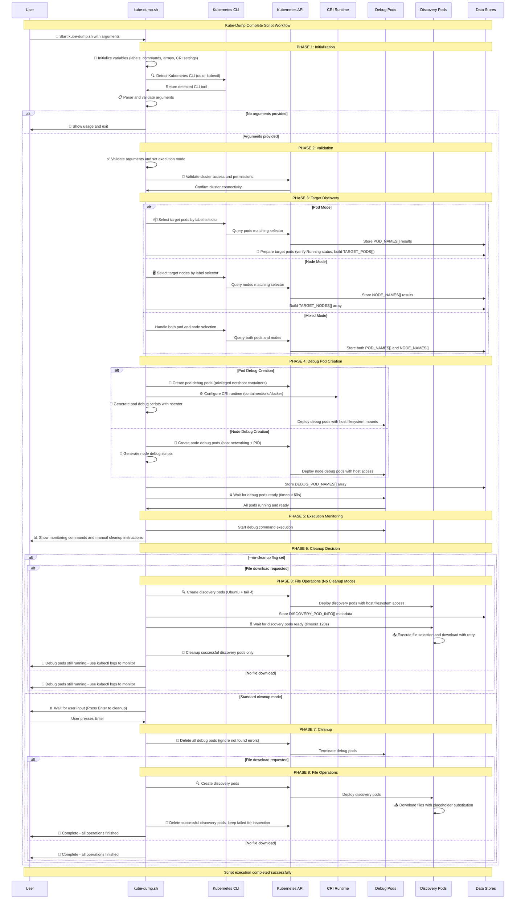

# Kube-Dump Script Workflow Diagram

This comprehensive sequence diagram illustrates the complete kube-dump.sh script workflow from startup through completion. It demonstrates the interaction between the user, script components, Kubernetes API, and various processes throughout all execution phases including initialization, validation, target discovery, debug pod creation, monitoring, cleanup, and file operations.

## Key Features Visualized:

### 🎯 **Execution Modes**
- **Pod Mode**: Target pods by label selector, execute in container network namespace
- **Node Mode**: Target nodes by label selector, execute directly on host
- **Mixed Mode**: Both pod and node targeting simultaneously

### 🔧 **CRI Runtime Support**
- **Containerd**: Default runtime with `/run/containerd/containerd.sock`
- **CRI-O**: Alternative runtime with `/run/crio/crio.sock` 
- **Docker**: Legacy support with `/var/run/cri-dockerd.sock`
- **Custom Socket**: User-specified CRI socket path

### 📦 **Debug Pod Architecture**
- **Privileged Access**: Required for network namespace entry and host filesystem access
- **Host Networking**: Enables access to host network interfaces and processes
- **Host PID Namespace**: Allows nsenter to access target container processes
- **Volume Mounts**: Host filesystem mounted at `/host` for complete access

### 🔍 **Target Discovery Process**
- **Label Selectors**: Flexible pod and node selection via Kubernetes labels
- **Namespace Handling**: Support for cross-namespace operations
- **Container Selection**: Automatic first container selection (shared network namespace)
- **Status Filtering**: Only Running pods are included in operations

### ⚙️ **Command Execution**
- **Default Command**: `tcpdump -i any -nn -s 0` for network capture
- **Custom Commands**: User-specified commands with full shell support
- **Placeholder Substitution**: Dynamic hostname replacement using configurable character
- **Network Namespace Entry**: `nsenter -n -t $PID` for pod network access

### 📥 **File Operations**
- **Discovery Pods**: Separate pods for file discovery and download
- **Select Commands**: Custom commands to identify files for download
- **Placeholder Support**: Hostname substitution in file paths
- **Cleanup Strategy**: Remove successful discovery pods, keep failed for inspection

### 🧹 **Cleanup Management**
- **Default Behavior**: User confirmation before cleanup
- **No-Cleanup Mode**: `--no-cleanup` flag keeps debug pods running
- **Selective Cleanup**: File discovery pods cleaned based on success/failure
- **Manual Override**: Commands provided for manual cleanup

This comprehensive flowchart captures the complete execution flow of the kube-dump.sh script, showing how it handles different execution modes, manages privileged debugging containers, and provides flexible file download capabilities while maintaining proper cleanup procedures.