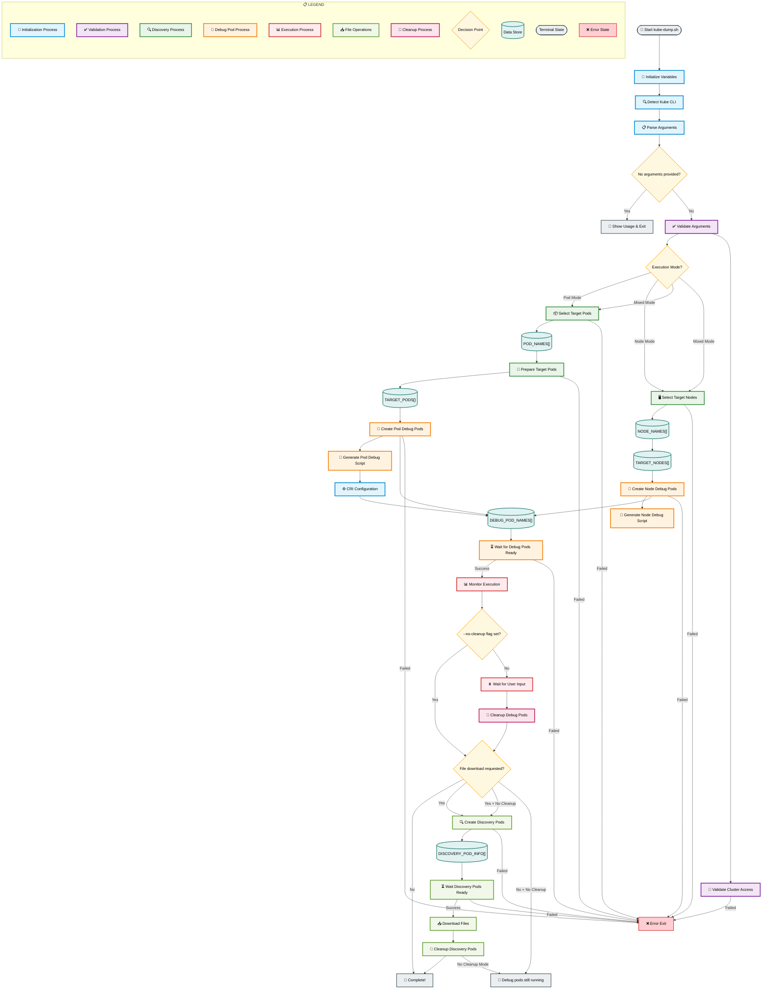

# Kube-Dump Script Workflow Diagram

## Comprehensive Process Flow Description

This flowchart represents the complete execution workflow of the kube-dump.sh script, encompassing all phases from initialization through cleanup. Each phase contains multiple decision points and process steps that handle different execution scenarios.

### 🚀 **Phase 1: Script Initialization Process**

**Process Flow**: START → INIT → DETECT → PARSE → NO_ARGS Decision

**Detailed Description**:
The initialization phase establishes the foundation for all subsequent operations. When the script starts, it immediately begins setting up the execution environment:

1. **Variable Initialization (INIT)**:
   - Sets default values for all configuration arrays (DEBUG_POD_NAMES, TARGET_PODS, etc.)
   - Configures default label selector (`dumpme=yes`) for pod targeting
   - Establishes default commands for both pod and node operations (`tcpdump -i any -nn -s 0`)
   - Sets up CRI runtime defaults (containerd as primary choice)
   - Initializes placeholder character system (`%` as default)
   - Creates empty arrays for tracking all pod and node operations

2. **CLI Detection (DETECT)**:
   - Probes system environment for available Kubernetes CLI tools
   - Prioritizes OpenShift CLI (`oc`) over standard `kubectl` when both are present
   - Sets global KUBE_CLI variable that will be used throughout script execution
   - Validates CLI tool accessibility and basic functionality
   - Establishes connection context for subsequent Kubernetes API calls

3. **Argument Processing (PARSE)**:
   - Iterates through all command-line arguments using systematic parsing
   - Validates argument syntax and detects incompatible option combinations
   - Converts user-friendly options into internal script variables
   - Handles complex arguments like label selectors, file patterns, and threshold values
   - Sets execution mode flags based on argument analysis (pod/node/mixed mode)

4. **Usage Validation (NO_ARGS)**:
   - Checks if script was invoked without any arguments
   - Displays comprehensive help information when no arguments provided
   - Prevents execution with insufficient configuration
   - Ensures user understands available options before proceeding

### ✅ **Phase 2: Validation and Configuration Process**

**Process Flow**: VALIDATE → MODE_CHECK → CLUSTER_VAL → [Pod/Node/Mixed Discovery]

**Detailed Description**:
The validation phase ensures all prerequisites are met and configures the script for the specific execution mode requested:

1. **Argument Validation (VALIDATE)**:
   - Performs deep validation of all provided arguments
   - Checks for required parameter combinations (e.g., kill switch thresholds require volume paths)
   - Validates enum values (CRI types, execution modes, etc.)
   - Ensures logical consistency between related options
   - Sets internal execution flags based on validated configuration

2. **Mode Determination (MODE_CHECK)**:
   - Analyzes provided arguments to determine execution strategy
   - **Pod Mode**: When only `-l` (pod label) is specified
   - **Node Mode**: When only `-L` (node label) is specified
   - **Mixed Mode**: When both pod and node labels are provided
   - Routes execution to appropriate discovery processes based on mode

3. **Cluster Access Validation (CLUSTER_VAL)**:
   - Tests connectivity to Kubernetes cluster using selected CLI tool
   - Verifies sufficient permissions for creating privileged pods
   - Checks ability to query pods and nodes across required namespaces
   - Validates access to container runtime interfaces on target nodes
   - Ensures script can perform all necessary cluster operations

### 🔍 **Phase 3: Target Discovery and Preparation Process**

**Process Flow**: [POD_SELECT|NODE_SELECT] → PREPARE_PODS → TARGET_[PODS|NODES]

**Detailed Description**:
The discovery phase identifies and prepares all targets for debugging operations:

1. **Pod Discovery (POD_SELECT)**:
   - Executes label selector queries against Kubernetes API
   - Filters results to include only Running pods (skips Pending, Failed, etc.)
   - Extracts comprehensive pod metadata (name, namespace, node, containers)
   - Cross-references pod locations with available nodes
   - Builds initial target candidate list for further processing

2. **Node Discovery (NODE_SELECT)**:
   - Queries cluster nodes using provided label selectors
   - Validates node readiness and availability for pod scheduling
   - Handles `--include-nodes` flag to automatically include nodes hosting selected pods
   - Filters out nodes in maintenance or unavailable states
   - Creates node target list for host-level debugging operations

3. **Pod Preparation (PREPARE_PODS)**:
   - Validates each discovered pod's runtime status
   - Selects first container from each pod for PID namespace operations
   - Determines target node for each pod to enable debug pod co-location
   - Constructs TARGET_PODS array with complete pod:container:node:namespace mapping
   - Performs final filtering to ensure all targets are actionable

### 🚀 **Phase 4: Debug Pod Creation and Configuration Process**

**Process Flow**: [POD_DEBUG|NODE_DEBUG] → [POD_SCRIPT|NODE_SCRIPT] → CRI_CONFIG → WAIT_READY

**Detailed Description**:
The debug pod creation phase deploys privileged containers that will perform the actual debugging operations:

1. **Pod-Targeted Debug Creation (POD_DEBUG)**:
   - Generates unique debug pod names using timestamp and hash algorithms
   - Creates privileged debug pods co-located on same nodes as target pods
   - Configures pod specifications with required security contexts and capabilities
   - Mounts host filesystem and container runtime sockets for namespace access
   - Injects generated debug scripts into pod configurations

2. **Node-Targeted Debug Creation (NODE_DEBUG)**:
   - Creates debug pods with host networking and PID namespace access
   - Configures pods for direct host-level command execution
   - Sets up filesystem mounts for complete host access
   - Applies necessary security policies for privileged host operations
   - Schedules pods on specified target nodes using node selectors

3. **Script Generation (POD_SCRIPT/NODE_SCRIPT)**:
   - **Pod Scripts**: Generate complex scripts that use CRI tools to find target container PIDs, then use `nsenter` to enter container network namespaces
   - **Node Scripts**: Create direct execution scripts that run commands on host with proper placeholder substitution
   - Handles custom command injection with proper shell escaping
   - Implements placeholder substitution system for dynamic hostname replacement
   - Configures script execution with appropriate error handling and logging

4. **CRI Configuration (CRI_CONFIG)**:
   - Detects and configures appropriate container runtime interface (containerd/CRI-O/Docker)
   - Sets up crictl socket paths for container PID discovery
   - Installs runtime tools when `--install-deps` is specified
   - Configures runtime-specific commands for namespace operations
   - Handles edge cases for different Kubernetes distributions

5. **Readiness Validation (WAIT_READY)**:
   - Monitors debug pod startup process with configurable timeout (60s default)
   - Checks pod phase progression from Pending → Running
   - Validates container startup and script injection completion
   - Tracks failed pod creation for error reporting
   - Ensures all debug infrastructure is operational before proceeding

### 📊 **Phase 5: Execution Monitoring and User Interaction Process**

**Process Flow**: MONITOR → NO_CLEANUP_FLAG → [USER_INPUT|FILE_DOWNLOAD_CHECK]

**Detailed Description**:
The monitoring phase manages active debug pod execution and user interaction:

1. **Execution Monitoring (MONITOR)**:
   - Displays kubectl/oc commands for real-time log monitoring
   - Provides manual cleanup commands for user reference
   - Shows debug pod names and locations for direct access
   - Presents status information about ongoing operations
   - Maintains background monitoring of debug pod health

2. **Cleanup Mode Decision (NO_CLEANUP_FLAG)**:
   - **Normal Mode**: Proceeds to user input phase for interactive cleanup
   - **No-Cleanup Mode**: Bypasses user interaction and proceeds to file operations
   - Determines final script behavior based on user preferences
   - Routes to appropriate cleanup or preservation workflows

3. **User Input Handling (USER_INPUT)**:
   - Displays "Press Enter to cleanup" prompt to user
   - Waits for user confirmation before proceeding with cleanup
   - Handles Ctrl+C gracefully to leave debug pods running
   - Provides opportunity for user to examine debug pod outputs
   - Ensures user control over when cleanup operations begin

### 🧹 **Phase 6: Cleanup and Resource Management Process**

**Process Flow**: CLEANUP_DEBUG → FILE_DOWNLOAD_CHECK → [File Operations|COMPLETE]

**Detailed Description**:
The cleanup phase manages resource removal and optional file operations:

1. **Debug Pod Cleanup (CLEANUP_DEBUG)**:
   - Systematically deletes all debug pods in DEBUG_POD_NAMES array
   - Uses `--ignore-not-found` flag to handle already-deleted pods gracefully
   - Maintains cleanup order to prevent resource dependency issues
   - Logs cleanup operations for audit and debugging purposes
   - Ensures cluster resource hygiene by removing all created resources

2. **File Download Decision (FILE_DOWNLOAD_CHECK)**:
   - **No File Operations**: Routes directly to completion when `-o` not specified
   - **File Operations Requested**: Proceeds to discovery pod creation when file collection is needed
   - Validates output directory accessibility and permissions
   - Determines scope of file operations based on `-s` and `-S` commands

### 📥 **Phase 7: File Discovery and Download Process**

**Process Flow**: CREATE_DISCOVERY → WAIT_DISCOVERY → DOWNLOAD_FILES → CLEANUP_DISCOVERY

**Detailed Description**:
The file operations phase handles automated file discovery and collection:

1. **Discovery Pod Creation (CREATE_DISCOVERY)**:
   - Creates specialized pods for file discovery operations separate from debug pods
   - Uses Ubuntu image with `tail -f /dev/null` to keep pods running
   - Mounts host filesystem with read-write access for file operations
   - Configures pods with privileged access for complete file system access
   - Applies proper scheduling to match original debug pod locations

2. **Discovery Pod Readiness (WAIT_DISCOVERY)**:
   - Waits for discovery pod startup with extended timeout (120s)
   - Validates pod accessibility for command execution
   - Ensures file discovery infrastructure is ready for operations
   - Handles discovery pod creation failures gracefully

3. **File Download Execution (DOWNLOAD_FILES)**:
   - Executes user-specified select commands (`-s` for pods, `-S` for nodes)
   - Applies placeholder substitution to file selection commands
   - Parses command output to identify files for download
   - Downloads files using `kubectl cp` with retry logic (3 attempts per file)
   - Organizes downloaded files in output directory structure
   - Removes downloaded files from source locations to clean up

4. **Discovery Cleanup (CLEANUP_DISCOVERY)**:
   - Removes successful discovery pods after file operations complete
   - Preserves failed discovery pods for user inspection and debugging
   - Provides summary of file operations and any failures encountered
   - Maintains detailed logging of all file operations performed

### 🎯 **Phase 8: Completion and Finalization Process**

**Process Flow**: [COMPLETE|NO_CLEANUP_COMPLETE]

**Detailed Description**:
The completion phase finalizes all operations and provides user feedback:

1. **Normal Completion (COMPLETE)**:
   - Confirms successful completion of all requested operations
   - Closes log files and finalizes session documentation
   - Provides summary of operations performed
   - Ensures clean exit with appropriate status codes

2. **No-Cleanup Completion (NO_CLEANUP_COMPLETE)**:
   - Confirms debug pods are left running as requested
   - Provides monitoring commands for continued pod access
   - Documents pod names and locations for future reference
   - Maintains session information for manual cleanup later

### 🔄 **Background Processes and Data Flow**

**Kill Switch Monitoring**: Runs parallel to main execution, continuously monitoring storage thresholds and automatically terminating debug pods when limits are exceeded.

**Error Handling**: Multiple error exit points throughout the flow ensure graceful failure handling with appropriate cleanup of any created resources.

**Data Store Management**: Arrays like POD_NAMES, DEBUG_POD_NAMES, and DISCOVERY_POD_INFO maintain state throughout execution and drive cleanup operations.

## Key Features Visualized:

### 🎯 **Execution Modes**
- **Pod Mode**: Target pods by label selector, execute in container network namespace
- **Node Mode**: Target nodes by label selector, execute directly on host
- **Mixed Mode**: Both pod and node targeting simultaneously

### 🔧 **CRI Runtime Support**
- **Containerd**: Default runtime with `/run/containerd/containerd.sock`
- **CRI-O**: Alternative runtime with `/run/crio/crio.sock` 
- **Docker**: Legacy support with `/var/run/cri-dockerd.sock`
- **Custom Socket**: User-specified CRI socket path

### 📦 **Debug Pod Architecture**
- **Privileged Access**: Required for network namespace entry and host filesystem access
- **Host Networking**: Enables access to host network interfaces and processes
- **Host PID Namespace**: Allows nsenter to access target container processes
- **Volume Mounts**: Host filesystem mounted at `/host` for complete access

### 🔍 **Target Discovery Process**
- **Label Selectors**: Flexible pod and node selection via Kubernetes labels
- **Namespace Handling**: Support for cross-namespace operations
- **Container Selection**: Automatic first container selection (shared network namespace)
- **Status Filtering**: Only Running pods are included in operations

### ⚙️ **Command Execution**
- **Default Command**: `tcpdump -i any -nn -s 0` for network capture
- **Custom Commands**: User-specified commands with full shell support
- **Placeholder Substitution**: Dynamic hostname replacement using configurable character
- **Network Namespace Entry**: `nsenter -n -t $PID` for pod network access

### 📥 **File Operations**
- **Discovery Pods**: Separate pods for file discovery and download
- **Select Commands**: Custom commands to identify files for download
- **Placeholder Support**: Hostname substitution in file paths
- **Cleanup Strategy**: Remove successful discovery pods, keep failed for inspection

### 🧹 **Cleanup Management**
- **Default Behavior**: User confirmation before cleanup
- **No-Cleanup Mode**: `--no-cleanup` flag keeps debug pods running
- **Selective Cleanup**: File discovery pods cleaned based on success/failure
- **Manual Override**: Commands provided for manual cleanup

This comprehensive flowchart captures the complete execution flow of the kube-dump.sh script, showing how it handles different execution modes, manages privileged debugging containers, and provides flexible file download capabilities while maintaining proper cleanup procedures.