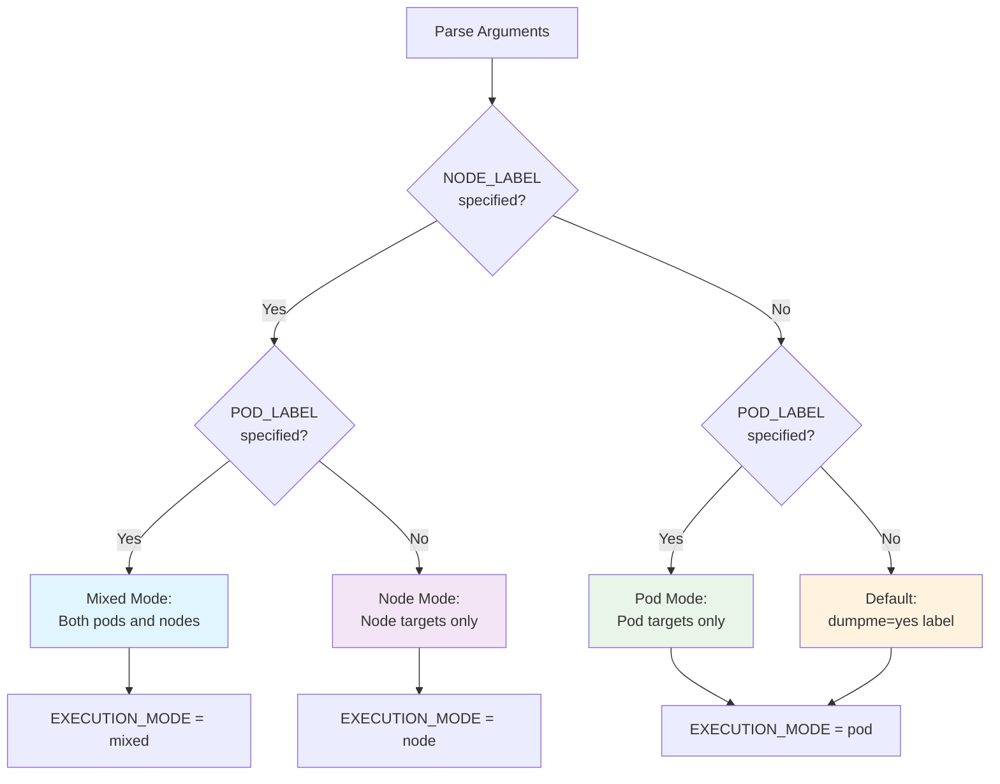
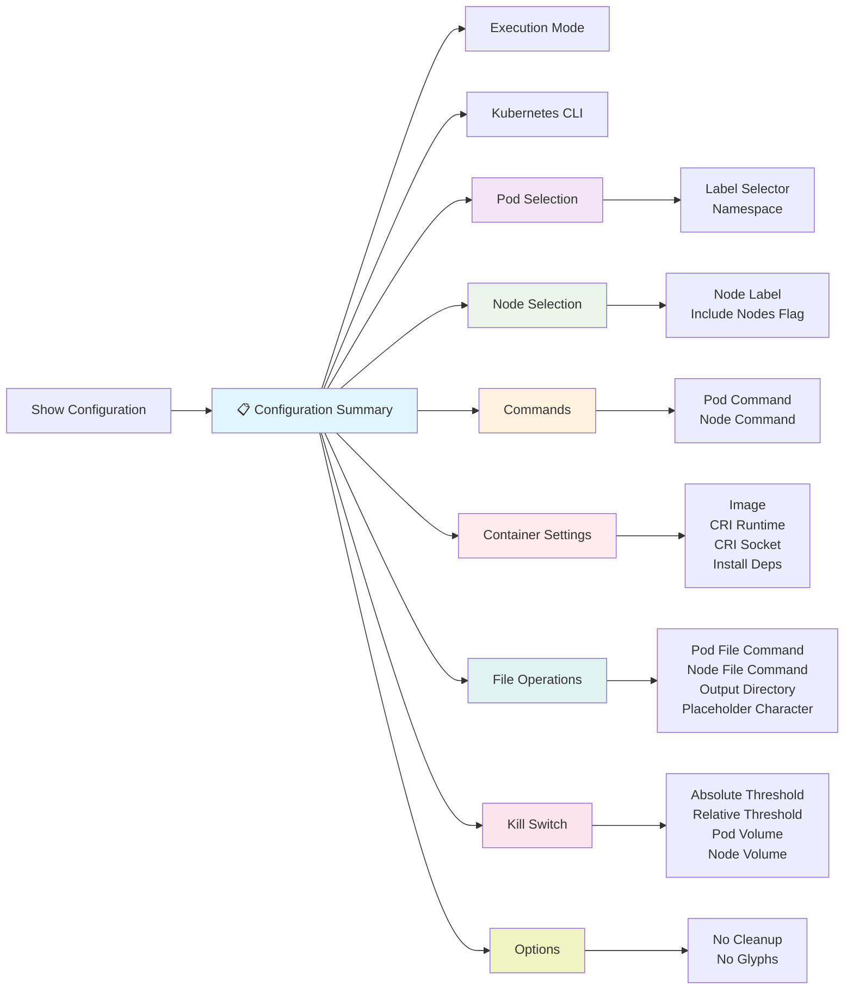

# Kube-Dump Main Execution Flow

This document provides detailed explanations of the main execution phases in kube-dump, from startup initialization through completion.

## Table of Contents

1. [Complete Main Execution Flow with All Phases](#complete-main-execution-flow-with-all-phases)
   - [Process Description](#main-execution-process-description)
2. [Execution Mode Decision Flow](#execution-mode-decision-flow)
   - [Process Description](#mode-decision-process-description)
3. [Configuration Summary Display](#configuration-summary-display)
   - [Process Description](#configuration-display-process-description)

## Complete Main Execution Flow with All Phases

```mermaid
graph TD
    A[Start: kube-dump.sh] --> B[Initialize Variables]
    B --> C[Detect Kube CLI<br/>oc or kubectl]
    C --> D[Parse Arguments]
    D --> E{Arguments<br/>provided?}
    E -->|No| F[Show Usage & Exit]
    E -->|Yes| G[Validate Arguments]
    G --> H[Show Configuration Summary]
    H --> I[Setup Log File if -o specified]
    I --> J[Validate Requirements]
    J --> K[PHASE 1: Target Selection & Debug Pod Creation]
    
    K --> L{Execution Mode?}
    L -->|pod| M[Pod-based Mode]
    L -->|node| N[Node-based Mode]
    L -->|mixed| O[Mixed Mode]
    
    M --> P[Select Target Pods]
    P --> Q[Prepare Target Pods]
    Q --> R[Create Debug Pods for Pod Targets]
    
    N --> S[Select Target Nodes]
    S --> T[Create Debug Pods for Node Targets]
    
    O --> U[Handle Pod Targets]
    U --> V[Handle Node Targets]
    V --> W[Create Debug Pods for Both]
    
    R --> X[Wait for Debug Pods Ready]
    T --> X
    W --> X
    
    X --> Y{Kill Switch<br/>Configured?}
    Y -->|Yes| Z[Create Kill Switch Monitor Pods]
    Y -->|No| AA[Skip Kill Switch]
    Z --> BB[Start Background Kill Switch Monitoring]
    AA --> CC[PHASE 2: Debug Pods Running - Monitor Output]
    BB --> CC
    
    CC --> DD[Show Monitoring Commands]
    DD --> EE{No Cleanup<br/>Flag Set?}
    
    EE -->|Yes| FF[PHASE 3: No-Cleanup Mode]
    FF --> GG{File Download<br/>Requested?}
    GG -->|Yes| HH[PHASE 4: File Discovery & Download]
    GG -->|No| II[Keep Debug Pods Running]
    
    EE -->|No| JJ[PHASE 3: Wait for User Input]
    JJ --> KK[Press Enter to Continue]
    KK --> LL[Stop Kill Switch Monitoring]
    LL --> MM[PHASE 4: Cleanup Debug Pods]
    MM --> NN[Delete Debug Pods]
    NN --> OO[Cleanup Kill Switch Monitor Pods]
    OO --> PP{File Download<br/>Requested?}
    PP -->|Yes| QQ[PHASE 5: File Discovery & Download]
    PP -->|No| RR[Complete - All Operations Done]
    
    HH --> SS[Create File Discovery Pods]
    QQ --> SS
    SS --> TT[Handle File Downloads]
    TT --> UU[Download Files with Retry Logic]
    UU --> VV[Cleanup Successful Discovery Pods]
    VV --> WW[Keep Failed Pods for Inspection]
    
    WW --> XX[Session Complete]
    RR --> XX
    II --> YY[Debug Pods Still Running]
    XX --> ZZ[End]
    YY --> ZZ
    F --> ZZ
    
    style A fill:#e1f5fe
    style K fill:#f3e5f5
    style CC fill:#e8f5e8
    style JJ fill:#fff3e0
    style MM fill:#ffebee
    style QQ fill:#e0f2f1
    style ZZ fill:#fce4ec
    
    classDef phaseStyle fill:#f9f9f9,stroke:#333,stroke-width:2px,color:#333
    classDef decisionStyle fill:#fff2cc,stroke:#d6b656,stroke-width:2px
    classDef actionStyle fill:#d5e8d4,stroke:#82b366,stroke-width:2px
    classDef errorStyle fill:#f8cecc,stroke:#b85450,stroke-width:2px
    
    class K,CC,JJ,MM,QQ phaseStyle
    class E,L,Y,EE,GG,PP decisionStyle
    class A,ZZ errorStyle
```

### Main Execution Process Description

This comprehensive flow diagram illustrates the complete lifecycle of a kube-dump execution from initial startup through final completion, showing all major decision points, phases, and possible execution paths.

#### Initial Startup and Validation (Steps A-J)

**A. Script Initialization**: The kube-dump.sh script begins execution, setting up the runtime environment and preparing for argument processing. Initial shell options are configured, and basic prerequisites are checked.

**B. Variable Initialization**: Core system variables are established including:
- Default label selectors (`dumpme=yes`)
- Command templates for pod and node debugging
- Array structures for tracking pods and operations
- CRI (Container Runtime Interface) configuration settings
- Placeholder character settings for dynamic substitution

**C. CLI Tool Detection**: The system automatically detects the available Kubernetes CLI tool, preferring OpenShift's `oc` command when available, falling back to standard `kubectl` for regular Kubernetes clusters. This ensures compatibility across different cluster types.

**D. Argument Processing**: All command-line arguments are parsed, validated, and stored in appropriate variables. This includes pod/node selectors, custom commands, kill switch configurations, file operation settings, and output preferences.

**E. Argument Validation**: The system checks if any arguments were provided. If no arguments are given, the help system is activated to guide users through available options and usage patterns.

**F. Usage Display**: When no arguments are provided, comprehensive usage information is displayed including examples, flag descriptions, and common use cases, then the script exits cleanly.

**G. Argument Validation**: Provided arguments are validated for syntax correctness, logical consistency, and system compatibility. Invalid combinations are detected and reported with helpful error messages.

**H. Configuration Summary**: A detailed summary of the parsed configuration is displayed, showing users exactly what operations will be performed, which resources will be targeted, and what safety measures are in place.

**I. Log File Setup**: If an output directory is specified (`-o` flag), a timestamped log file is created to capture all session activities, providing audit trails and debugging information for later analysis.

**J. Requirements Validation**: Final system checks ensure all prerequisites are met including cluster connectivity, required permissions, and tool availability before proceeding with pod operations.

#### Phase 1: Target Selection and Debug Pod Creation (Steps K-X)

**K. Phase 1 Entry**: The system transitions into the first major operational phase, focusing on target discovery and debug pod deployment across the determined execution mode.

**L-O. Execution Mode Branching**: Based on the provided arguments, the system branches into one of three execution paths:
- **Pod-based Mode (M)**: Targets specific pods using label selectors for container-level debugging
- **Node-based Mode (N)**: Targets entire nodes using node labels for system-level debugging
- **Mixed Mode (O)**: Combines both approaches for comprehensive debugging across multiple resource types

**P-W. Target Processing**: Each execution mode follows specific workflows:
- **Pod Processing**: Discovery of target pods, validation of running state, and preparation of container-specific debugging configurations
- **Node Processing**: Identification of target nodes, validation of accessibility, and preparation of host-level debugging configurations
- **Mixed Processing**: Parallel execution of both pod and node discovery processes

**X. Debug Pod Readiness**: All created debug pods are monitored until they reach Running state, with timeout handling and failure recovery mechanisms ensuring reliable deployment.

#### Phase 2: Kill Switch Configuration (Steps Y-BB)

**Y. Kill Switch Decision**: The system evaluates whether kill switch protection has been configured through `--kill-switch-abs` or `--kill-switch-rel` flags, determining the need for protective monitoring.

**Z. Monitor Pod Creation**: When kill switches are enabled, specialized monitor pods are created to continuously watch storage usage on specified volumes and provide automatic protection against resource exhaustion.

**BB. Background Monitoring**: Kill switch monitors begin continuous operation, checking storage conditions every second and maintaining readiness to terminate debug pods if thresholds are exceeded.

#### Phase 3: Active Debugging and User Interaction (Steps CC-MM)

**CC. Debug Pod Execution**: Debug pods begin executing their configured commands (network capture, custom diagnostics, system analysis), generating debugging data while being monitored for completion and resource usage.

**DD. Monitoring Commands Display**: Users are provided with kubectl commands to monitor debug pod outputs in real-time, enabling interactive debugging and live analysis of collected data.

**EE. Cleanup Mode Decision**: The system evaluates whether `--no-cleanup` mode has been specified, determining the cleanup strategy and user interaction requirements.

**FF-II. No-Cleanup Path**: When `--no-cleanup` is specified, debug pods continue running for extended analysis, with the session transitioning directly to file download operations if requested, or completing while leaving pods active.

**JJ-MM. Standard Cleanup Path**: In normal mode, the system waits for user input (Enter key press) before proceeding with systematic cleanup of debug pods and associated monitoring infrastructure.

#### Phase 4/5: File Operations and Completion (Steps NN-ZZ)

**NN-PP. Resource Cleanup**: Debug pods and kill switch monitors are systematically removed, with proper error handling for resources that may have been terminated by kill switches or other cluster operations.

**QQ-WW. File Download Operations**: When file selection commands have been specified (`-s` for pods, `-S` for nodes), the system creates discovery pods, executes file selection commands, downloads located files with retry mechanisms, and cleans up successful operations while preserving failed pods for inspection.

**XX-ZZ. Session Completion**: The script concludes by closing log files, providing operation summaries, and displaying information about any preserved resources or downloaded files, ensuring users have complete visibility into session outcomes.

This comprehensive workflow provides multiple decision points, error handling mechanisms, and user control options while maintaining safety through protective monitoring and systematic resource management.

## Execution Mode Decision Flow

## Configuration Summary Display

