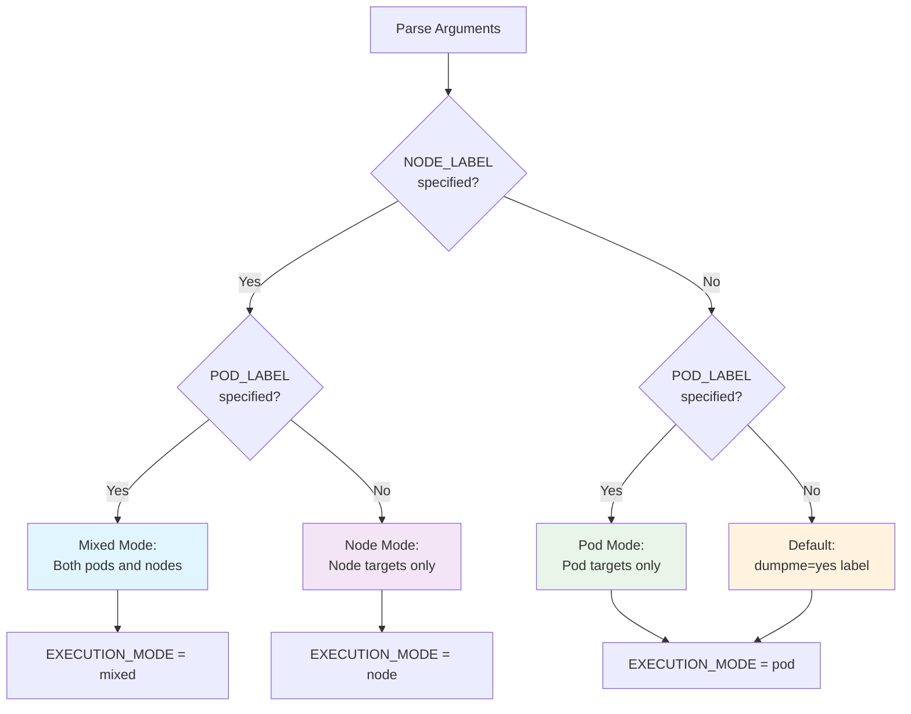
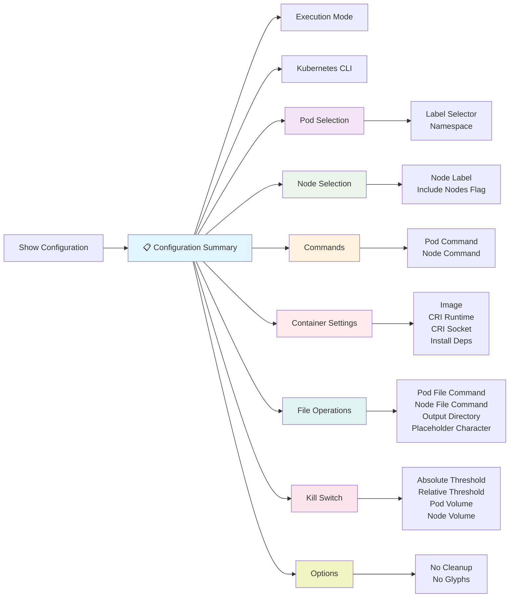

# Kube-Dump Main Execution Flow

## Complete Main Execution Flow with All Phases

```mermaid
graph TD
    A[Start: kube-dump.sh] --> B[Initialize Variables]
    B --> C[Detect Kube CLI<br/>oc or kubectl]
    C --> D[Parse Arguments]
    D --> E{Arguments<br/>provided?}
    E -->|No| F[Show Usage & Exit]
    E -->|Yes| G[Validate Arguments]
    G --> H[Show Configuration Summary]
    H --> I[Setup Log File if -o specified]
    I --> J[Validate Requirements]
    J --> K[PHASE 1: Target Selection & Debug Pod Creation]
    
    K --> L{Execution Mode?}
    L -->|pod| M[Pod-based Mode]
    L -->|node| N[Node-based Mode]
    L -->|mixed| O[Mixed Mode]
    
    M --> P[Select Target Pods]
    P --> Q[Prepare Target Pods]
    Q --> R[Create Debug Pods for Pod Targets]
    
    N --> S[Select Target Nodes]
    S --> T[Create Debug Pods for Node Targets]
    
    O --> U[Handle Pod Targets]
    U --> V[Handle Node Targets]
    V --> W[Create Debug Pods for Both]
    
    R --> X[Wait for Debug Pods Ready]
    T --> X
    W --> X
    
    X --> Y{Kill Switch<br/>Configured?}
    Y -->|Yes| Z[Create Kill Switch Monitor Pods]
    Y -->|No| AA[Skip Kill Switch]
    Z --> BB[Start Background Kill Switch Monitoring]
    AA --> CC[PHASE 2: Debug Pods Running - Monitor Output]
    BB --> CC
    
    CC --> DD[Show Monitoring Commands]
    DD --> EE{No Cleanup<br/>Flag Set?}
    
    EE -->|Yes| FF[PHASE 3: No-Cleanup Mode]
    FF --> GG{File Download<br/>Requested?}
    GG -->|Yes| HH[PHASE 4: File Discovery & Download]
    GG -->|No| II[Keep Debug Pods Running]
    
    EE -->|No| JJ[PHASE 3: Wait for User Input]
    JJ --> KK[Press Enter to Continue]
    KK --> LL[Stop Kill Switch Monitoring]
    LL --> MM[PHASE 4: Cleanup Debug Pods]
    MM --> NN[Delete Debug Pods]
    NN --> OO[Cleanup Kill Switch Monitor Pods]
    OO --> PP{File Download<br/>Requested?}
    PP -->|Yes| QQ[PHASE 5: File Discovery & Download]
    PP -->|No| RR[Complete - All Operations Done]
    
    HH --> SS[Create File Discovery Pods]
    QQ --> SS
    SS --> TT[Handle File Downloads]
    TT --> UU[Download Files with Retry Logic]
    UU --> VV[Cleanup Successful Discovery Pods]
    VV --> WW[Keep Failed Pods for Inspection]
    
    WW --> XX[Session Complete]
    RR --> XX
    II --> YY[Debug Pods Still Running]
    XX --> ZZ[End]
    YY --> ZZ
    F --> ZZ
    
    style A fill:#e1f5fe
    style K fill:#f3e5f5
    style CC fill:#e8f5e8
    style JJ fill:#fff3e0
    style MM fill:#ffebee
    style QQ fill:#e0f2f1
    style ZZ fill:#fce4ec
    
    classDef phaseStyle fill:#f9f9f9,stroke:#333,stroke-width:2px,color:#333
    classDef decisionStyle fill:#fff2cc,stroke:#d6b656,stroke-width:2px
    classDef actionStyle fill:#d5e8d4,stroke:#82b366,stroke-width:2px
    classDef errorStyle fill:#f8cecc,stroke:#b85450,stroke-width:2px
    
    class K,CC,JJ,MM,QQ phaseStyle
    class E,L,Y,EE,GG,PP decisionStyle
    class A,ZZ errorStyle
```

## Execution Mode Decision Flow

```mermaid
graph TD
    A[Parse Arguments] --> B{NODE_LABEL<br/>specified?}
    B -->|Yes| C{POD_LABEL<br/>specified?}
    B -->|No| D{POD_LABEL<br/>specified?}
    
    C -->|Yes| E[Mixed Mode:<br/>Both pods and nodes]
    C -->|No| F[Node Mode:<br/>Node targets only]
    
    D -->|Yes| G[Pod Mode:<br/>Pod targets only]
    D -->|No| H[Default:<br/>dumpme=yes label]
    
    E --> I[EXECUTION_MODE = mixed]
    F --> J[EXECUTION_MODE = node]
    G --> K[EXECUTION_MODE = pod]
    H --> K
    
    style E fill:#e1f5fe
    style F fill:#f3e5f5
    style G fill:#e8f5e8
    style H fill:#fff3e0
```

## Configuration Summary Display

```mermaid
graph LR
    A[Show Configuration] --> B[📋 Configuration Summary]
    B --> C[Execution Mode]
    B --> D[Kubernetes CLI]
    B --> E[Pod Selection]
    B --> F[Node Selection]
    B --> G[Commands]
    B --> H[Container Settings]
    B --> I[File Operations]
    B --> J[Kill Switch]
    B --> K[Options]
    
    E --> E1[Label Selector<br/>Namespace]
    F --> F1[Node Label<br/>Include Nodes Flag]
    G --> G1[Pod Command<br/>Node Command]
    H --> H1[Image<br/>CRI Runtime<br/>CRI Socket<br/>Install Deps]
    I --> I1[Pod File Command<br/>Node File Command<br/>Output Directory<br/>Placeholder Character]
    J --> J1[Absolute Threshold<br/>Relative Threshold<br/>Pod Volume<br/>Node Volume]
    K --> K1[No Cleanup<br/>No Glyphs]
    
    style B fill:#e1f5fe
    style E fill:#f3e5f5
    style F fill:#e8f5e8
    style G fill:#fff3e0
    style H fill:#ffebee
    style I fill:#e0f2f1
    style J fill:#fce4ec
    style K fill:#f0f4c3
```