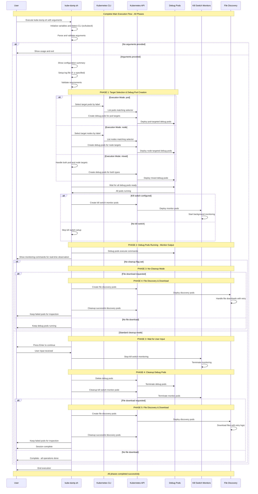
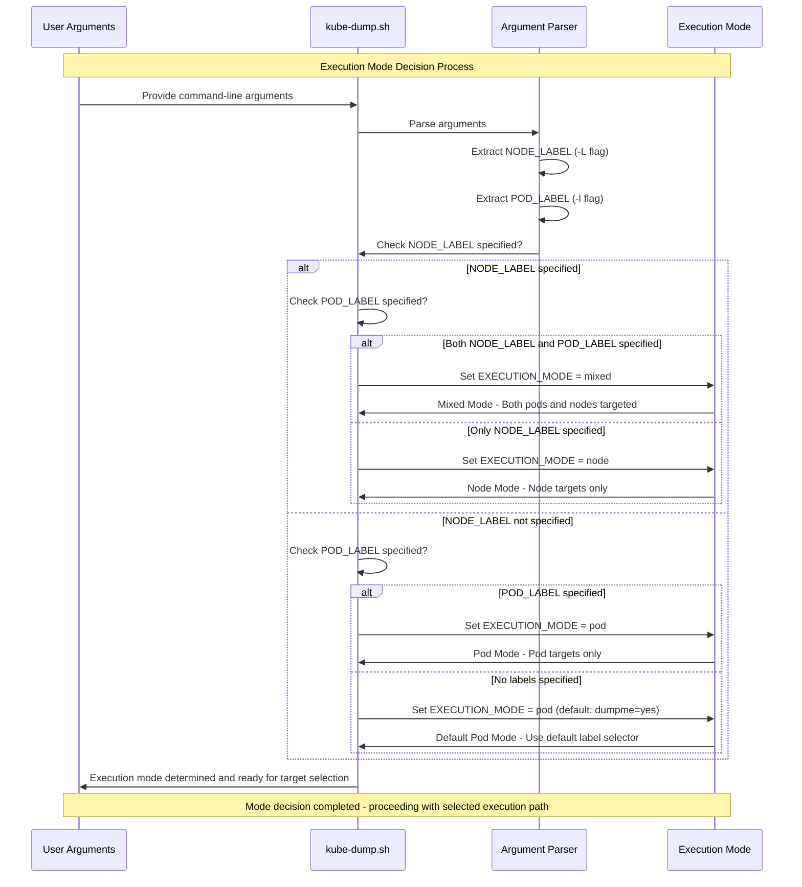
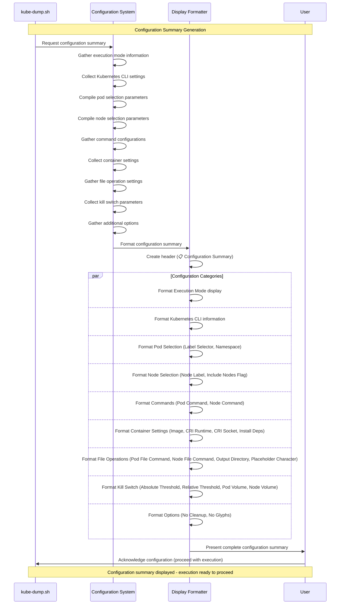

# Kube-Dump Main Execution Flow

## Table of Contents

1. [Complete Main Execution Flow with All Phases](#complete-main-execution-flow-with-all-phases)
   - [Main Execution Process Description](#main-execution-process-description)
2. [Execution Mode Decision Flow](#execution-mode-decision-flow)
   - [Comprehensive Analysis and Characteristics](#comprehensive-analysis-and-characteristics)
   - [Core Decision-Making Algorithm](#core-decision-making-algorithm)
   - [Decision Matrix and Logic Flow](#decision-matrix-and-logic-flow)
   - [Technical Implementation Details](#technical-implementation-details)
   - [Error Handling and Validation](#error-handling-and-validation)
   - [Performance and Scalability Considerations](#performance-and-scalability-considerations)
3. [Configuration Summary Display](#configuration-summary-display)

This document provides detailed explanations of the main execution phases in kube-dump, from startup initialization through completion.

## Complete Main Execution Flow with All Phases

This comprehensive sequence diagram illustrates the complete execution lifecycle of kube-dump from startup through completion. It shows all major phases including initialization, target selection, debug pod creation, kill switch configuration, user interaction, cleanup operations, and file download processing.



### Main Execution Process Description

This comprehensive flow diagram illustrates the complete lifecycle of a kube-dump execution from initial startup through final completion, showing all major decision points, phases, and possible execution paths.

#### Initial Startup and Validation (Steps A-J)

**A. Script Initialization**: The kube-dump.sh script begins execution, setting up the runtime environment and preparing for argument processing. Initial shell options are configured, and basic prerequisites are checked.

**B. Variable Initialization**: Core system variables are established including:
- Default label selectors (`dumpme=yes`)
- Command templates for pod and node debugging
- Array structures for tracking pods and operations
- CRI (Container Runtime Interface) configuration settings
- Placeholder character settings for dynamic substitution

**C. CLI Tool Detection**: The system automatically detects the available Kubernetes CLI tool, preferring OpenShift's `oc` command when available, falling back to standard `kubectl` for regular Kubernetes clusters. This ensures compatibility across different cluster types.

**D. Argument Processing**: All command-line arguments are parsed, validated, and stored in appropriate variables. This includes pod/node selectors, custom commands, kill switch configurations, file operation settings, and output preferences.

**E. Argument Validation**: The system checks if any arguments were provided. If no arguments are given, the help system is activated to guide users through available options and usage patterns.

**F. Usage Display**: When no arguments are provided, comprehensive usage information is displayed including examples, flag descriptions, and common use cases, then the script exits cleanly.

**G. Argument Validation**: Provided arguments are validated for syntax correctness, logical consistency, and system compatibility. Invalid combinations are detected and reported with helpful error messages.

**H. Configuration Summary**: A detailed summary of the parsed configuration is displayed, showing users exactly what operations will be performed, which resources will be targeted, and what safety measures are in place.

**I. Log File Setup**: If an output directory is specified (`-o` flag), a timestamped log file is created to capture all session activities, providing audit trails and debugging information for later analysis.

**J. Requirements Validation**: Final system checks ensure all prerequisites are met including cluster connectivity, required permissions, and tool availability before proceeding with pod operations.

#### Phase 1: Target Selection and Debug Pod Creation (Steps K-X)

**K. Phase 1 Entry**: The system transitions into the first major operational phase, focusing on target discovery and debug pod deployment across the determined execution mode.

**L-O. Execution Mode Branching**: Based on the provided arguments, the system branches into one of three execution paths:
- **Pod-based Mode (M)**: Targets specific pods using label selectors for container-level debugging
- **Node-based Mode (N)**: Targets entire nodes using node labels for system-level debugging
- **Mixed Mode (O)**: Combines both approaches for comprehensive debugging across multiple resource types

**P-W. Target Processing**: Each execution mode follows specific workflows:
- **Pod Processing**: Discovery of target pods, validation of running state, and preparation of container-specific debugging configurations
- **Node Processing**: Identification of target nodes, validation of accessibility, and preparation of host-level debugging configurations
- **Mixed Processing**: Parallel execution of both pod and node discovery processes

**X. Debug Pod Readiness**: All created debug pods are monitored until they reach Running state, with timeout handling and failure recovery mechanisms ensuring reliable deployment.

#### Phase 2: Kill Switch Configuration (Steps Y-BB)

**Y. Kill Switch Decision**: The system evaluates whether kill switch protection has been configured through `--kill-switch-abs` or `--kill-switch-rel` flags, determining the need for protective monitoring.

**Z. Monitor Pod Creation**: When kill switches are enabled, specialized monitor pods are created to continuously watch storage usage on specified volumes and provide automatic protection against resource exhaustion.

**BB. Background Monitoring**: Kill switch monitors begin continuous operation, checking storage conditions every second and maintaining readiness to terminate debug pods if thresholds are exceeded.

#### Phase 3: Active Debugging and User Interaction (Steps CC-MM)

**CC. Debug Pod Execution**: Debug pods begin executing their configured commands (network capture, custom diagnostics, system analysis), generating debugging data while being monitored for completion and resource usage.

**DD. Monitoring Commands Display**: Users are provided with kubectl commands to monitor debug pod outputs in real-time, enabling interactive debugging and live analysis of collected data.

**EE. Cleanup Mode Decision**: The system evaluates whether `--no-cleanup` mode has been specified, determining the cleanup strategy and user interaction requirements.

**FF-II. No-Cleanup Path**: When `--no-cleanup` is specified, debug pods continue running for extended analysis, with the session transitioning directly to file download operations if requested, or completing while leaving pods active.

**JJ-MM. Standard Cleanup Path**: In normal mode, the system waits for user input (Enter key press) before proceeding with systematic cleanup of debug pods and associated monitoring infrastructure.

#### Phase 4/5: File Operations and Completion (Steps NN-ZZ)

**NN-PP. Resource Cleanup**: Debug pods and kill switch monitors are systematically removed, with proper error handling for resources that may have been terminated by kill switches or other cluster operations.

**QQ-WW. File Download Operations**: When file selection commands have been specified (`-s` for pods, `-S` for nodes), the system creates discovery pods, executes file selection commands, downloads located files with retry mechanisms, and cleans up successful operations while preserving failed pods for inspection.

**XX-ZZ. Session Completion**: The script concludes by closing log files, providing operation summaries, and displaying information about any preserved resources or downloaded files, ensuring users have complete visibility into session outcomes.

This comprehensive workflow provides multiple decision points, error handling mechanisms, and user control options while maintaining safety through protective monitoring and systematic resource management.

## Execution Mode Decision Flow

This sequence diagram demonstrates how kube-dump analyzes command-line arguments to determine the appropriate execution mode. It shows the decision-making process that leads to pod-targeted, node-targeted, or mixed-mode operations based on the presence of pod and node label selectors.

### Comprehensive Analysis and Characteristics

#### **Core Decision-Making Algorithm**

The execution mode determination follows a sophisticated hierarchical decision tree that evaluates command-line arguments to select the most appropriate debugging strategy. This process is fundamental to kube-dump's flexibility in handling diverse debugging scenarios across different Kubernetes deployment patterns.

#### **Decision Matrix and Logic Flow**

**1. Argument Classification and Parsing Phase**
- **Primary Inputs**: Command-line flags `-L` (node labels) and `-l` (pod labels)
- **Parser Validation**: Ensures label selector syntax conforms to Kubernetes label selector specifications
- **Syntax Verification**: Validates that selectors follow `key=value`, `key!=value`, `key in (value1,value2)`, or `key notin (value1,value2)` patterns
- **Error Handling**: Provides clear feedback for malformed label selectors before mode determination

**2. Execution Mode Categories and Characteristics**

**Pod-Targeted Mode (`EXECUTION_MODE = pod`)**
- **Activation Condition**: Only `-l` flag specified or no flags provided
- **Default Behavior**: Uses `dumpme=yes` as the default label selector when no arguments provided
- **Target Discovery**: Queries Kubernetes API for pods matching the label selector across specified namespaces
- **Debug Pod Deployment**: Creates privileged debug containers that share network namespaces with target pods
- **Network Access Method**: Uses `nsenter` to enter target pod network namespace for network-level debugging
- **Container Runtime Integration**: Automatically detects and configures CRI socket paths (containerd, CRI-O, Docker)
- **Ideal Use Cases**: Application-level debugging, network traffic analysis within specific pods, container filesystem inspection

**Node-Targeted Mode (`EXECUTION_MODE = node`)**
- **Activation Condition**: Only `-L` flag specified
- **Target Discovery**: Queries Kubernetes API for nodes matching the label selector
- **Debug Pod Deployment**: Creates privileged debug containers with host networking and host PID access
- **System Access Method**: Direct host-level access without namespace isolation
- **Resource Monitoring**: Full access to host filesystem, process tree, and network interfaces
- **Ideal Use Cases**: System-level debugging, host network analysis, kernel-level troubleshooting, cluster infrastructure issues

**Mixed Mode (`EXECUTION_MODE = mixed`)**
- **Activation Condition**: Both `-L` and `-l` flags specified simultaneously
- **Dual Target Discovery**: Performs parallel queries for both matching pods and nodes
- **Hybrid Deployment Strategy**: Creates both pod-targeted and node-targeted debug containers
- **Resource Coordination**: Manages multiple debugging contexts simultaneously
- **Advanced Scenarios**: Comprehensive debugging across application and infrastructure layers
- **Ideal Use Cases**: Complex multi-tier application issues, network problems spanning pod and host layers, performance analysis requiring both perspectives

#### **Technical Implementation Details**

**3. Mode Selection Algorithm**
```bash
# Simplified decision logic flow
if [[ -n "$NODE_LABEL" ]]; then
    if [[ -n "$POD_LABEL" ]]; then
        EXECUTION_MODE="mixed"    # Both node and pod targets
    else
        EXECUTION_MODE="node"     # Node targets only
    fi
else
    if [[ -n "$POD_LABEL" ]]; then
        EXECUTION_MODE="pod"      # Pod targets only
    else
        EXECUTION_MODE="pod"      # Default mode with dumpme=yes
        POD_LABEL="dumpme=yes"
    fi
fi
```

**4. Mode-Specific Resource Management**

**Pod Mode Resource Characteristics:**
- **Network Namespace Sharing**: Debug pods share network stack with target pods
- **Filesystem Access**: Target pod filesystem mounted at `/host/pods/{pod-id}/volumes`
- **Process Visibility**: Can see target pod processes through shared PID namespace
- **Security Context**: Runs with `privileged: true` for namespace entry capabilities

**Node Mode Resource Characteristics:**
- **Host Network Access**: Direct access to host network interfaces and routing tables
- **Complete Filesystem Access**: Host filesystem mounted at `/host` with full read/write access
- **System Process Visibility**: Can see all host processes and system services
- **Kernel Access**: Can interact with kernel modules and system-level resources

**Mixed Mode Resource Characteristics:**
- **Dual Resource Allocation**: Manages both pod-level and node-level debug containers
- **Resource Coordination**: Ensures non-conflicting resource usage across debug types
- **Unified Monitoring**: Coordinates monitoring and cleanup across both debug pod types

#### **5. Error Handling and Validation**

**Argument Validation Process:**
- **Label Syntax Verification**: Ensures Kubernetes-compliant label selector format
- **Resource Existence Checks**: Validates that target pods/nodes exist before debug pod creation
- **Permission Validation**: Confirms necessary RBAC permissions for selected execution mode
- **Namespace Access Control**: Verifies access rights to target namespaces

**Fallback Mechanisms:**
- **Default Mode Activation**: Automatically falls back to pod mode with `dumpme=yes` when no arguments provided
- **Graceful Degradation**: Continues with available targets when partial matches found
- **Clear Error Messages**: Provides actionable feedback when target discovery fails

#### **6. Performance and Scalability Considerations**

**Target Discovery Optimization:**
- **Parallel Queries**: In mixed mode, pod and node discovery occur simultaneously
- **Result Caching**: Target lists cached to avoid redundant API calls
- **Pagination Support**: Handles large numbers of target resources efficiently

**Resource Management:**
- **Pod Limit Awareness**: Respects cluster resource quotas and limits
- **Cleanup Coordination**: Ensures proper cleanup regardless of execution mode
- **Kill Switch Integration**: Mode-aware kill switch monitoring for all execution types

This comprehensive decision-making framework ensures that kube-dump can adapt to virtually any debugging scenario while maintaining operational safety and resource efficiency.



## Configuration Summary Display

This sequence diagram shows how kube-dump generates and presents a comprehensive configuration summary to users before execution begins. It demonstrates the systematic gathering and display of all configuration parameters across different functional areas.

