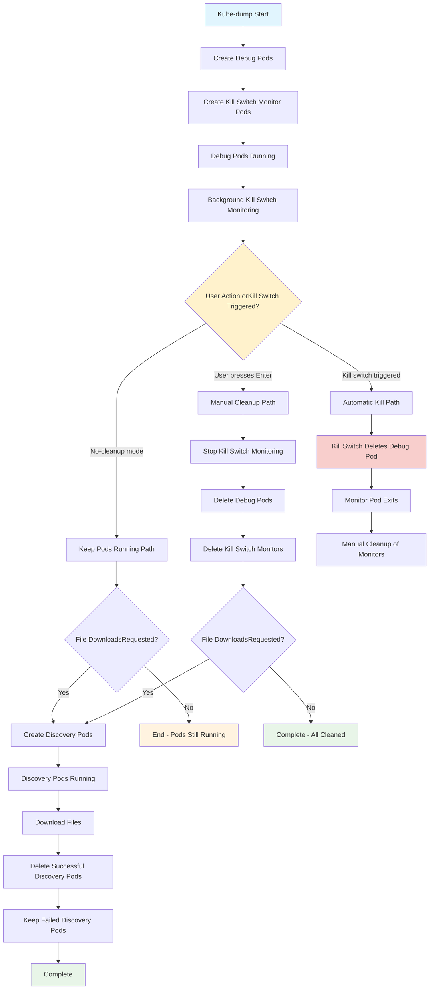
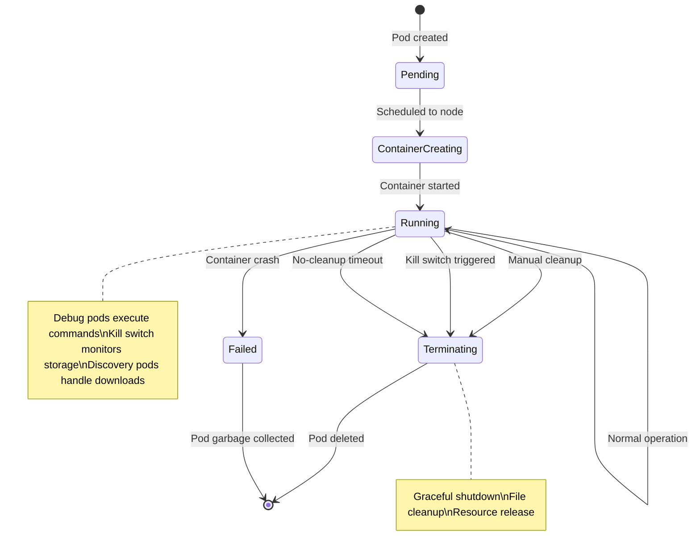
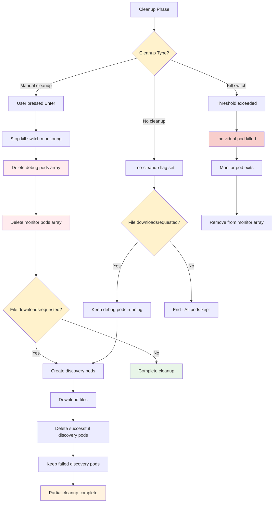

# Pod Lifecycle Management

## Complete Pod Lifecycle Overview

This diagram illustrates the comprehensive pod lifecycle in kube-dump, showing how different types of pods are created, managed, and cleaned up based on user actions and system triggers. The lifecycle encompasses three main paths: manual cleanup (user-initiated), automatic kill switch activation, and no-cleanup mode where pods continue running.

The process begins with debug pod creation, followed by optional kill switch monitor deployment. The system then enters a monitoring phase where it waits for one of three possible triggers: user input for manual cleanup, kill switch activation due to resource thresholds, or no-cleanup mode continuation. Each path has distinct cleanup strategies and file download handling, ultimately converging on completion states that preserve failed discovery pods for inspection while cleaning up successful operations.



## Debug Pod Creation and Management

This diagram details the debug pod creation process, which varies based on execution mode (pod-targeted, node-targeted, or mixed). The system intelligently determines the appropriate debug pod type based on the target resources and creates pods with the necessary privileges and namespace access.

For pod-targeted debugging, the system creates debug pods that share the target pod's network and PID namespaces, enabling deep inspection of application behavior. Node-targeted debugging creates pods with host-level access, allowing system-wide monitoring and troubleshooting. Each debug pod is assigned a unique name incorporating timestamps and node identifiers to ensure proper tracking and avoid conflicts during concurrent operations.

```mermaid
graph TD
    A[Debug Pod Creation Request] --> B{Execution Mode?}
    B -->|pod| C[Create Pod-targeted Debug Pods]
    B -->|node| D[Create Node-targeted Debug Pods]
    B -->|mixed| E[Create Both Types]
    
    C --> F[For Each Target Pod]
    F --> G[Get Pod Details:name, container, node, namespace]
    G --> H[Create Debug Pod Name:debug-{epoch}-{node}-{hash}]
    H --> I[Apply Debug Pod Manifest]
    I --> J[Pod Spec for Pod-targeting:- Image: DEBUG_IMAGE- Target PID namespace- Network namespace shared- Privileged: true]
    
    D --> K[For Each Target Node]
    K --> L[Get Node Name]
    L --> M[Create Node Debug Pod Name:node-debug-{epoch}-{node}]
    M --> N[Apply Node Debug Manifest]
    N --> O[Pod Spec for Node-targeting:- Image: DEBUG_IMAGE- Host networking: true- Host PID: true- Privileged: true]
    
    J --> P[Set Command with Placeholder Substitution]
    O --> P
    P --> Q[Add to DEBUG_POD_NAMES array]
    Q --> R[Wait for Pod Ready]
    R --> S{All PodsReady?}
    S -->|No| T[Continue Waiting]
    S -->|Yes| U[Debug Pods Active]
    
    style B fill:#fff2cc
    style S fill:#fff2cc
    style I fill:#d5e8d4
    style N fill:#d5e8d4
    style U fill:#e8f5e8
```

## Kill Switch Monitor Pod Lifecycle

This diagram illustrates the kill switch monitoring system that protects nodes from resource exhaustion. Monitor pods continuously check storage usage every second and automatically terminate debug pods when thresholds are exceeded, preventing system instability.

The kill switch mechanism operates independently for each debug pod, creating dedicated monitor pods that run storage calculations using the `bc` calculator. When a threshold violation occurs, the monitor pod immediately executes a targeted kill command, logs the action, and exits successfully. The main process detects these completed monitor pods and performs immediate log collection before cleaning up the terminated debug pods, ensuring no forensic data is lost during emergency terminations.

```mermaid
graph TD
    A[Kill Switch Configured] --> B[For Each Debug Pod]
    B --> C[Create Monitor Pod:ks-{node}-{hash}]
    C --> D[Monitor Pod Starts]
    D --> E[Install bc Calculator]
    E --> F[Start Storage Monitoring Loop]
    
    F --> G[Check Storage Every 10s]
    G --> H{ThresholdExceeded?}
    H -->|No| I[Continue Monitoring]
    H -->|Yes| J[Execute Kill Command]
    
    I --> G
    J --> K[kubectl delete pod DEBUG_POD]
    K --> L[Wait for Pod Deletion]
    L --> M[Log Kill Success]
    M --> N[Monitor Pod Exits]
    
    N --> O[Background Monitoring Detects Exit]
    O --> P[Clean up Monitor Pod Entry]
    
    style H fill:#fff2cc
    style J fill:#f8cecc
    style K fill:#ffebee
    style N fill:#e8f5e8
```

## Discovery Pod Lifecycle (File Downloads)

This diagram shows the file download process that occurs when users request file extraction from debug pods. Discovery pods are created specifically for file operations, with different configurations for pod-level and node-level file discovery.

The discovery phase creates specialized pods with read-write access to the host filesystem via `/host` mounts. These pods execute user-defined file selection commands and handle the secure transfer of files from the cluster to the local system. The process includes automatic cleanup of successful discovery pods while preserving failed ones for troubleshooting, ensuring that file download issues can be diagnosed and resolved efficiently.

```mermaid
graph TD
    A[File Download Phase] --> B[Create Discovery Pods]
    B --> C{Pod Type?}
    C -->|Pod discovery| D[Create fd-{epoch}-{node}-{hash}]
    C -->|Node discovery| E[Create nfd-{epoch}-{node}]
    
    D --> F[Pod Discovery Spec:- Same node as original debug pod- Host networking and PID- Privileged access- Mount /host read-write]
    
    E --> G[Node Discovery Spec:- Target node- Host networking and PID- Privileged access- Mount /host read-write]
    
    F --> H[Discovery Pod Active]
    G --> H
    H --> I[Execute File Selection Commands]
    I --> J[Download Files with Retry]
    J --> K[Remove Downloaded Files from Node]
    K --> L{DownloadSuccessful?}
    
    L -->|Yes| M[Add to successful_pods array]
    L -->|No| N[Add to failed_pods array]
    
    M --> O[Pod Marked for Deletion]
    N --> P[Pod Kept for Inspection]
    
    O --> Q[kubectl delete successful pods]
    P --> R[Display Failed Pods Info]
    
    Q --> S[Discovery Phase Complete]
    R --> S
    
    style C fill:#fff2cc
    style L fill:#fff2cc
    style M fill:#e8f5e8
    style N fill:#f8cecc
    style S fill:#e1f5fe
```

## Pod State Transitions

This state diagram represents the standard Kubernetes pod states and transitions that occur throughout the kube-dump lifecycle. Understanding these states is crucial for monitoring pod health and troubleshooting deployment issues.

Pods progress through predictable states from creation to termination: Pending (scheduled but not running), ContainerCreating (image pulling and container setup), Running (active execution), and Terminating (graceful shutdown). Failed states can occur due to container crashes or resource constraints. The diagram highlights that running pods can be terminated through multiple paths: manual cleanup by users, automatic kill switch activation, or timeout-based cleanup in no-cleanup mode. Each transition includes specific cleanup actions and resource release procedures.



## Pod Resource Management

This diagram illustrates the internal resource tracking system that manages different pod types throughout their lifecycle. The system maintains separate arrays for debug pods, monitor pods, and discovery pods, enabling precise control over cleanup operations.

The resource management system uses dedicated arrays to track pod names, states, and metadata. DEBUG_POD_NAMES tracks active debug pods, KILL_SWITCH_MONITOR_PODS manages monitoring infrastructure, DISCOVERY_POD_NAMES handles file operation pods, and DISCOVERY_POD_INFO maintains detailed metadata for download operations. This separation allows for granular cleanup strategies where successful pods are automatically removed while failed pods are preserved for analysis, ensuring operational efficiency while maintaining troubleshooting capabilities.

```mermaid
graph LR
    subgraph "Resource Arrays"
        A[DEBUG_POD_NAMES[]]
        B[KILL_SWITCH_MONITOR_PODS[]]
        C[DISCOVERY_POD_NAMES[]]
        D[DISCOVERY_POD_INFO[]]
    end
    
    subgraph "Operations"
        E[Create Pods] --> A
        E --> B
        E --> C
        E --> D
        
        F[Monitor Pods] --> A
        F --> B
        
        G[Cleanup Pods] --> A
        G --> B
        G --> C
        
        H[File Operations] --> C
        H --> D
    end
    
    subgraph "Pod States"
        I[Active Debug Pods]
        J[Active Monitor Pods]
        K[Active Discovery Pods]
        L[Failed Discovery Pods]
    end
    
    A -.-> I
    B -.-> J
    C -.-> K
    D -.-> L
    
    style A fill:#e8f5e8
    style B fill:#fff3e0
    style C fill:#e0f2f1
    style D fill:#f3e5f5
    style I fill:#d5e8d4
    style J fill:#fff2cc
    style K fill:#b39ddb
    style L fill:#f8cecc
```

## Pod Cleanup Strategies

This diagram outlines the different cleanup approaches based on user preferences and system events. The cleanup strategy determines which pods are removed, which are preserved, and how file download operations are handled.

The system supports three primary cleanup modes: manual cleanup (user presses Enter), no-cleanup mode (--no-cleanup flag), and kill switch activation (threshold exceeded). Each mode has distinct behaviors: manual cleanup removes all pods after optional file downloads, no-cleanup mode preserves debug pods for continued use, and kill switch activation performs emergency pod termination with immediate log collection. The strategy selection affects resource utilization, forensic data availability, and operational continuity, allowing users to balance between thorough cleanup and debugging capability preservation.

