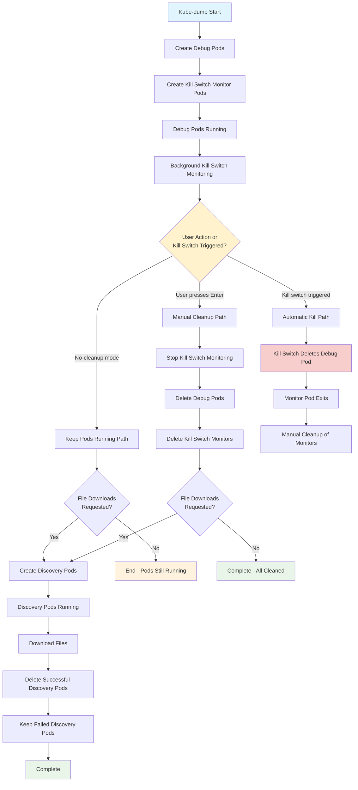
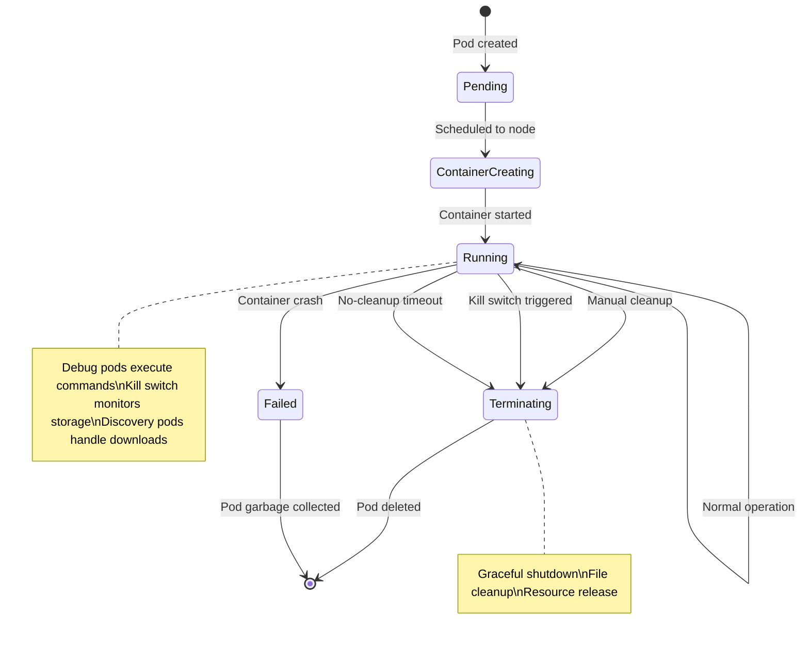
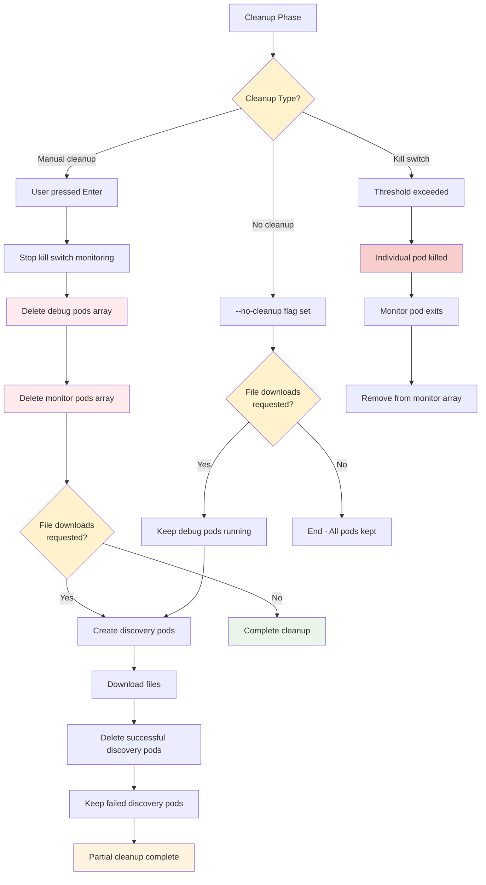

# Pod Lifecycle Management

## Complete Pod Lifecycle Overview



## Debug Pod Creation and Management

```mermaid
graph TD
    A[Debug Pod Creation Request] --> B{Execution Mode?}
    B -->|pod| C[Create Pod-targeted Debug Pods]
    B -->|node| D[Create Node-targeted Debug Pods]
    B -->|mixed| E[Create Both Types]
    
    C --> F[For Each Target Pod]
    F --> G[Get Pod Details:<br/>name, container, node, namespace]
    G --> H[Create Debug Pod Name:<br/>debug-{epoch}-{node}-{hash}]
    H --> I[Apply Debug Pod Manifest]
    I --> J[Pod Spec for Pod-targeting:<br/>- Image: DEBUG_IMAGE<br/>- Target PID namespace<br/>- Network namespace shared<br/>- Privileged: true]
    
    D --> K[For Each Target Node]
    K --> L[Get Node Name]
    L --> M[Create Node Debug Pod Name:<br/>node-debug-{epoch}-{node}]
    M --> N[Apply Node Debug Manifest]
    N --> O[Pod Spec for Node-targeting:<br/>- Image: DEBUG_IMAGE<br/>- Host networking: true<br/>- Host PID: true<br/>- Privileged: true]
    
    J --> P[Set Command with Placeholder Substitution]
    O --> P
    P --> Q[Add to DEBUG_POD_NAMES array]
    Q --> R[Wait for Pod Ready]
    R --> S{All Pods<br/>Ready?}
    S -->|No| T[Continue Waiting]
    S -->|Yes| U[Debug Pods Active]
    
    style B fill:#fff2cc
    style S fill:#fff2cc
    style I fill:#d5e8d4
    style N fill:#d5e8d4
    style U fill:#e8f5e8
```

## Kill Switch Monitor Pod Lifecycle

```mermaid
graph TD
    A[Kill Switch Configured] --> B[For Each Debug Pod]
    B --> C[Create Monitor Pod:<br/>ks-{node}-{hash}]
    C --> D[Monitor Pod Starts]
    D --> E[Install bc Calculator]
    E --> F[Start Storage Monitoring Loop]
    
    F --> G[Check Storage Every 10s]
    G --> H{Threshold<br/>Exceeded?}
    H -->|No| I[Continue Monitoring]
    H -->|Yes| J[Execute Kill Command]
    
    I --> G
    J --> K[kubectl delete pod DEBUG_POD]
    K --> L[Wait for Pod Deletion]
    L --> M[Log Kill Success]
    M --> N[Monitor Pod Exits]
    
    N --> O[Background Monitoring Detects Exit]
    O --> P[Clean up Monitor Pod Entry]
    
    style H fill:#fff2cc
    style J fill:#f8cecc
    style K fill:#ffebee
    style N fill:#e8f5e8
```

## Discovery Pod Lifecycle (File Downloads)

```mermaid
graph TD
    A[File Download Phase] --> B[Create Discovery Pods]
    B --> C{Pod Type?}
    C -->|Pod discovery| D[Create fd-{epoch}-{node}-{hash}]
    C -->|Node discovery| E[Create nfd-{epoch}-{node}]
    
    D --> F[Pod Discovery Spec:<br/>- Same node as original debug pod<br/>- Host networking and PID<br/>- Privileged access<br/>- Mount /host read-write]
    
    E --> G[Node Discovery Spec:<br/>- Target node<br/>- Host networking and PID<br/>- Privileged access<br/>- Mount /host read-write]
    
    F --> H[Discovery Pod Active]
    G --> H
    H --> I[Execute File Selection Commands]
    I --> J[Download Files with Retry]
    J --> K[Remove Downloaded Files from Node]
    K --> L{Download<br/>Successful?}
    
    L -->|Yes| M[Add to successful_pods array]
    L -->|No| N[Add to failed_pods array]
    
    M --> O[Pod Marked for Deletion]
    N --> P[Pod Kept for Inspection]
    
    O --> Q[kubectl delete successful pods]
    P --> R[Display Failed Pods Info]
    
    Q --> S[Discovery Phase Complete]
    R --> S
    
    style C fill:#fff2cc
    style L fill:#fff2cc
    style M fill:#e8f5e8
    style N fill:#f8cecc
    style S fill:#e1f5fe
```

## Pod State Transitions



## Pod Resource Management

```mermaid
graph LR
    subgraph "Resource Arrays"
        A[DEBUG_POD_NAMES[]]
        B[KILL_SWITCH_MONITOR_PODS[]]
        C[DISCOVERY_POD_NAMES[]]
        D[DISCOVERY_POD_INFO[]]
    end
    
    subgraph "Operations"
        E[Create Pods] --> A
        E --> B
        E --> C
        E --> D
        
        F[Monitor Pods] --> A
        F --> B
        
        G[Cleanup Pods] --> A
        G --> B
        G --> C
        
        H[File Operations] --> C
        H --> D
    end
    
    subgraph "Pod States"
        I[Active Debug Pods]
        J[Active Monitor Pods]
        K[Active Discovery Pods]
        L[Failed Discovery Pods]
    end
    
    A -.-> I
    B -.-> J
    C -.-> K
    D -.-> L
    
    style A fill:#e8f5e8
    style B fill:#fff3e0
    style C fill:#e0f2f1
    style D fill:#f3e5f5
    style I fill:#d5e8d4
    style J fill:#fff2cc
    style K fill:#b39ddb
    style L fill:#f8cecc
```

## Pod Cleanup Strategies

