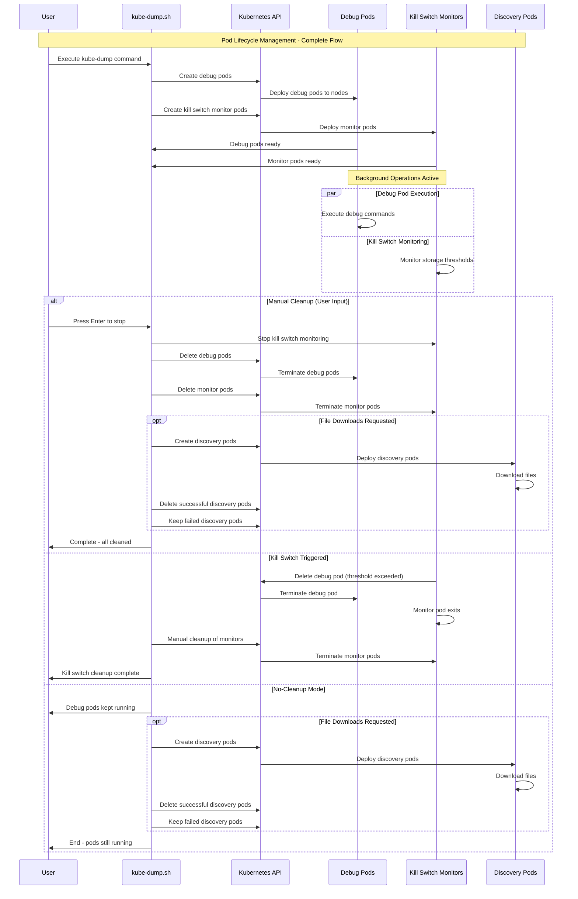
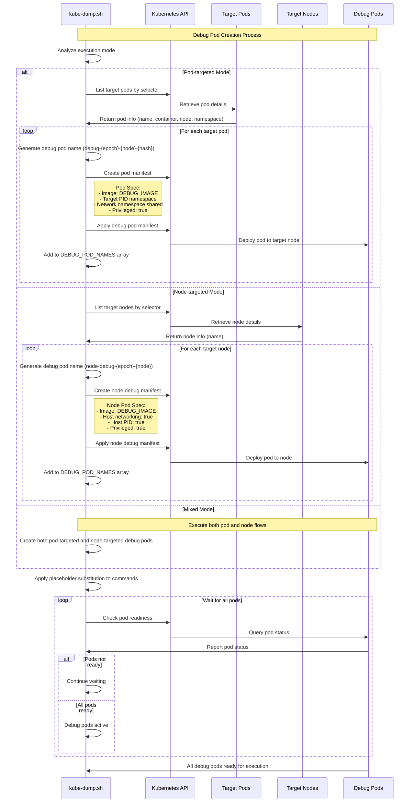
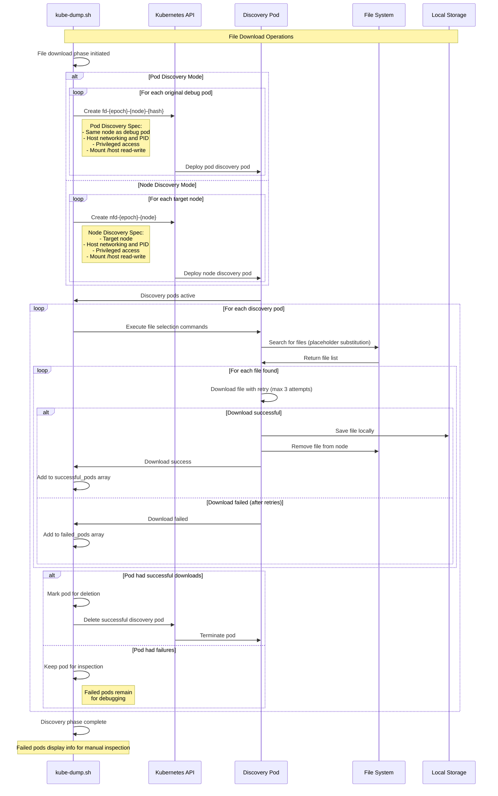
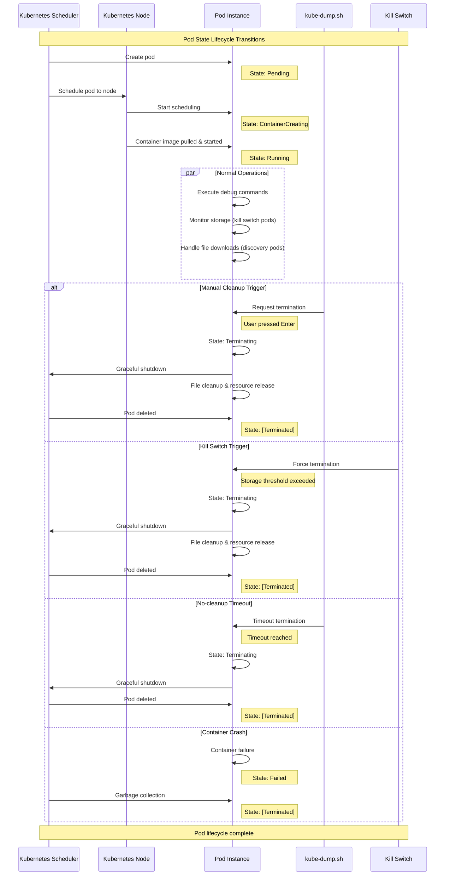
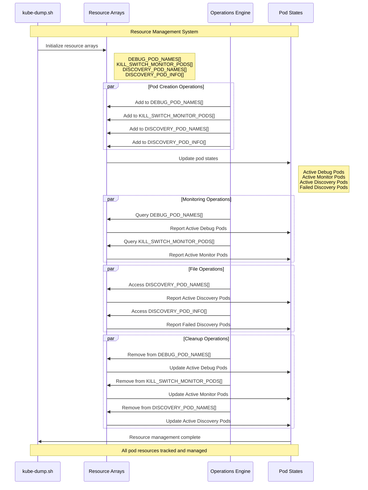
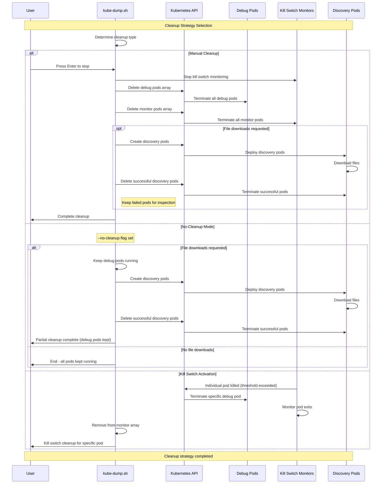

# Pod Lifecycle Management

## Table of Contents

1. [Complete Pod Lifecycle Overview](#complete-pod-lifecycle-overview)
   - [Comprehensive Analysis and Architecture](#comprehensive-analysis-and-architecture)
   - [System Integration Patterns](#system-integration-patterns)
   - [Resource Management Strategy](#resource-management-strategy)
2. [Debug Pod Creation and Management](#debug-pod-creation-and-management)
   - [Pod Creation Architecture](#pod-creation-architecture)
   - [Deployment Strategies](#deployment-strategies)
   - [Resource Allocation Patterns](#resource-allocation-patterns)
3. [Kill Switch Monitor Pod Lifecycle](#kill-switch-monitor-pod-lifecycle)
   - [Protection System Architecture](#protection-system-architecture)
   - [Monitoring Algorithms](#monitoring-algorithms)
   - [Automatic Response Mechanisms](#automatic-response-mechanisms)
4. [Discovery Pod Lifecycle (File Downloads)](#discovery-pod-lifecycle-file-downloads)
   - [File Operation Architecture](#file-operation-architecture)
   - [Download Strategies](#download-strategies)
   - [Error Handling and Recovery](#error-handling-and-recovery)
5. [Pod State Transitions](#pod-state-transitions)
   - [State Management System](#state-management-system)
   - [Transition Triggers](#transition-triggers)
   - [Lifecycle Events](#lifecycle-events)
6. [Pod Resource Management](#pod-resource-management)
   - [Resource Tracking Architecture](#resource-tracking-architecture)
   - [Memory Management](#memory-management)
   - [Cleanup Coordination](#cleanup-coordination)
7. [Pod Cleanup Strategies](#pod-cleanup-strategies)
   - [Cleanup Decision Matrix](#cleanup-decision-matrix)
   - [Strategy Implementation](#strategy-implementation)
   - [Recovery Mechanisms](#recovery-mechanisms)

## Complete Pod Lifecycle Overview

This sequence diagram shows the complete lifecycle of kube-dump operations, from initialization through cleanup. It illustrates the interactions between the user, the kube-dump script, debug pods, kill switch monitors, and discovery pods throughout the entire debugging session.



### Comprehensive Analysis and Architecture

#### **Pod Lifecycle Orchestration Framework**

The complete pod lifecycle management in kube-dump represents a sophisticated orchestration system that coordinates multiple pod types with distinct purposes while maintaining operational safety and resource efficiency. This framework manages three primary pod categories: debug pods, kill switch monitor pods, and discovery pods, each with specialized roles in the debugging ecosystem.

#### **Multi-Pod Coordination Strategy**

**1. Debug Pod Coordination**
- **Primary Function**: Execute debugging commands within target environments
- **Lifecycle Span**: From initialization through manual or automatic cleanup
- **Resource Characteristics**: Privileged access, namespace sharing, volume mounting
- **Coordination Points**: Synchronized with kill switch monitors for protection

**2. Kill Switch Monitor Coordination**
- **Primary Function**: Continuous monitoring and protection against resource exhaustion
- **Lifecycle Span**: Parallel to debug pods with automatic termination capability
- **Resource Characteristics**: Lightweight monitoring containers with kubectl access
- **Coordination Points**: Real-time communication with debug pods for protective actions

**3. Discovery Pod Coordination**
- **Primary Function**: File discovery, selection, and download operations
- **Lifecycle Span**: Post-debug phase or parallel execution in no-cleanup mode
- **Resource Characteristics**: File system access, download capabilities, retry mechanisms
- **Coordination Points**: Sequential execution after debug completion or parallel operation

### System Integration Patterns

#### **Kubernetes API Integration**
- **Resource Creation Patterns**: Batch creation of related pod resources with dependency management
- **State Synchronization**: Real-time monitoring of pod states across all categories
- **Event Handling**: Comprehensive event handling for pod lifecycle events
- **Error Recovery**: Automatic recovery mechanisms for failed pod operations

#### **Container Runtime Integration**
- **CRI Compatibility**: Seamless integration with containerd, CRI-O, and Docker runtimes
- **Namespace Management**: Sophisticated namespace sharing and isolation strategies
- **Volume Coordination**: Complex volume mounting strategies for different pod types
- **Security Context Management**: Dynamic security context configuration based on pod purpose

### Resource Management Strategy

#### **Resource Allocation Patterns**
- **Memory Management**: Intelligent memory allocation based on pod type and expected workload
- **CPU Scheduling**: Optimized CPU resource allocation with priority-based scheduling
- **Storage Coordination**: Efficient storage allocation and cleanup coordination
- **Network Resource Management**: Careful network resource allocation to avoid conflicts

#### **Cleanup Coordination Mechanisms**
- **Dependency-Aware Cleanup**: Ensures proper cleanup order respecting pod dependencies
- **Failure Recovery**: Robust cleanup mechanisms even in failure scenarios
- **Resource Leak Prevention**: Comprehensive tracking and cleanup of all allocated resources
- **Orphan Resource Detection**: Automatic detection and cleanup of orphaned resources

## Debug Pod Creation and Management

This sequence diagram demonstrates how kube-dump creates and manages debug pods based on execution mode (pod-targeted, node-targeted, or mixed). It shows the interaction between the kube-dump script, Kubernetes API, and target resources during debug pod initialization.



## Kill Switch Monitor Pod Lifecycle

This sequence diagram illustrates the kill switch monitoring system that protects against resource exhaustion. It shows how monitor pods continuously check storage thresholds and automatically terminate debug pods when limits are exceeded, ensuring system stability during debugging operations.

```mermaid
sequenceDiagram
    participant KD as kube-dump.sh
    participant K8s as Kubernetes API
    participant KS as Kill Switch Monitor
    participant DP as Debug Pod
    participant BM as Background Monitor

    Note over KD,BM: Kill Switch Protection System

    KD->>KD: Kill switch configured

    loop For each debug pod
        KD->>K8s: Create monitor pod (ks-node-hash)
        K8s->>KS: Deploy monitor pod
        KS->>KS: Install bc calculator
        KS->>KS: Initialize storage monitoring loop

        Note over KS: Monitor starts background process

        loop Continuous monitoring every 10 seconds
            KS->>KS: Check storage usage
            KS->>KS: Calculate threshold exceeded?

            alt Threshold not exceeded
                KS->>KS: Continue monitoring
                Note right of KS: Normal operation

            else Threshold exceeded
                Note over KS,DP: KILL SWITCH ACTIVATED
                KS->>K8s: Execute kill command
                K8s->>DP: Delete debug pod
                DP->>K8s: Pod terminating
                K8s->>KS: Confirm deletion
                KS->>KS: Log kill success
                KS->>KS: Monitor pod exits
                break
            end
        end
    end

    par Background monitoring
        BM->>BM: Detect monitor pod exits
        BM->>KD: Report monitor pod status
        KD->>KD: Clean up monitor pod entries
    end

    Note over KD,BM: Automatic cleanup complete
```

## Discovery Pod Lifecycle (File Downloads)

This sequence diagram shows the file download process using discovery pods. It demonstrates how kube-dump creates specialized pods for file operations, executes file selection commands, downloads files with retry logic, and manages pod cleanup based on operation success.



## Pod State Transitions

This sequence diagram illustrates the various state transitions that pods undergo during their lifecycle in the kube-dump system. It shows how pods progress from creation through execution to termination, including the different triggers for state changes.



## Pod Resource Management

This sequence diagram demonstrates how kube-dump manages pod resources through internal arrays and data structures. It shows the lifecycle of resource tracking from creation through cleanup, including the interaction between different operation types and pod states.



## Pod Cleanup Strategies

This sequence diagram illustrates the various cleanup strategies available in kube-dump based on different termination scenarios. It shows how the system handles manual cleanup, no-cleanup mode, and kill switch activation, including the conditional file download operations.

