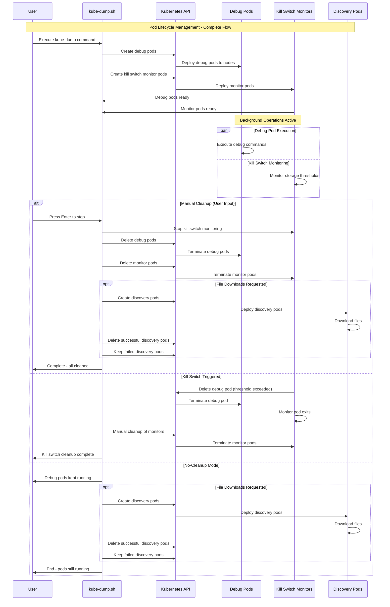
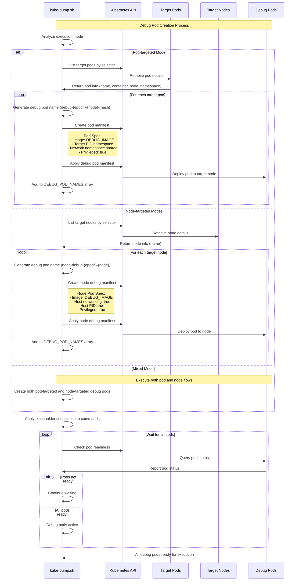
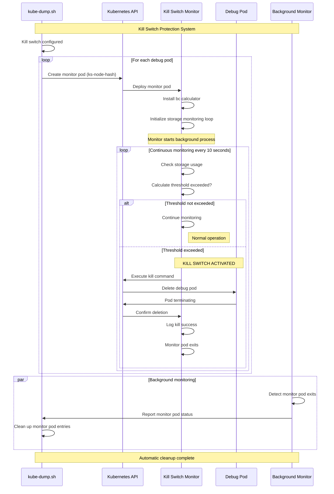
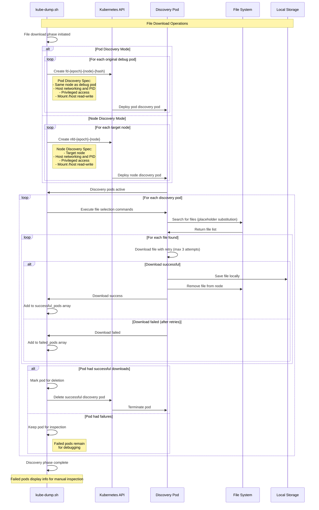
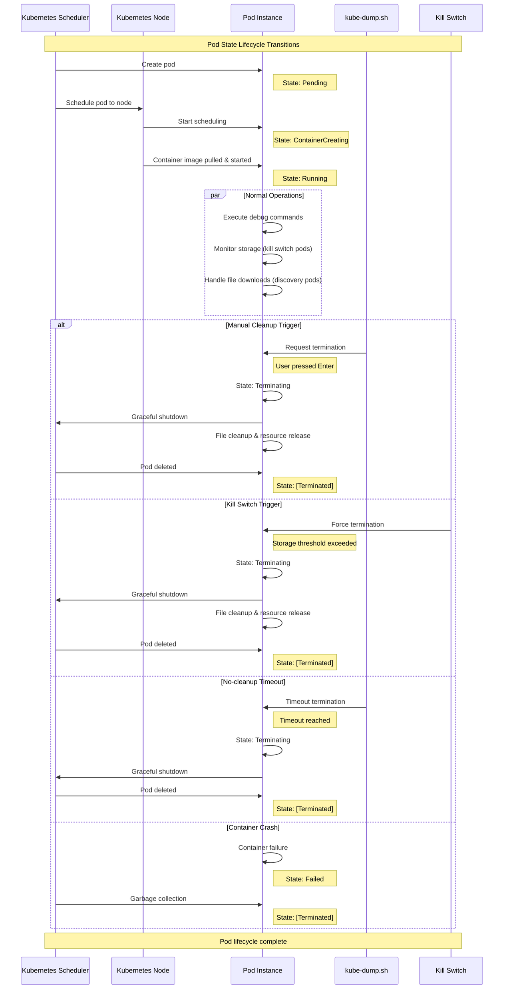
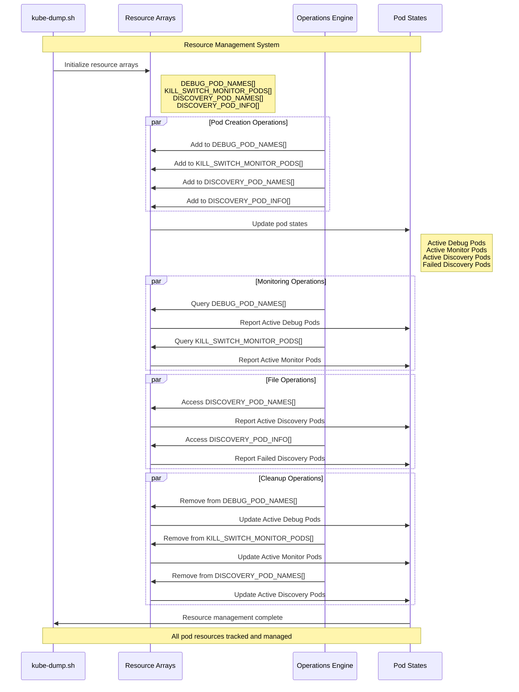
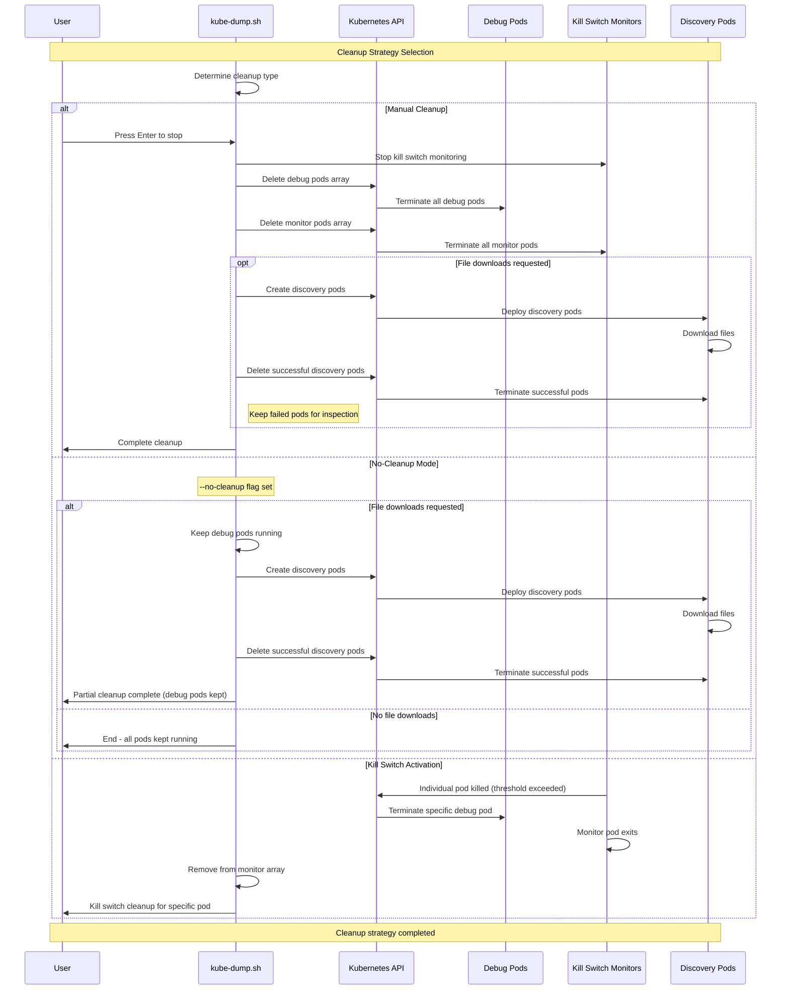

# Pod Lifecycle Management

## Table of Contents

1. [Complete Pod Lifecycle Overview](#complete-pod-lifecycle-overview)
   - [Comprehensive Analysis and Architecture](#comprehensive-analysis-and-architecture)
   - [System Integration Patterns](#system-integration-patterns)
   - [Resource Management Strategy](#resource-management-strategy)
2. [Debug Pod Creation and Management](#debug-pod-creation-and-management)
   - [Pod Creation Architecture](#pod-creation-architecture)
   - [Deployment Strategies](#deployment-strategies)
   - [Resource Allocation Patterns](#resource-allocation-patterns)
3. [Kill Switch Monitor Pod Lifecycle](#kill-switch-monitor-pod-lifecycle)
   - [Protection System Architecture](#protection-system-architecture)
   - [Monitoring Algorithms](#monitoring-algorithms)
   - [Automatic Response Mechanisms](#automatic-response-mechanisms)
4. [Discovery Pod Lifecycle (File Downloads)](#discovery-pod-lifecycle-file-downloads)
   - [File Operation Architecture](#file-operation-architecture)
   - [Download Strategies](#download-strategies)
   - [Error Handling and Recovery](#error-handling-and-recovery)
5. [Pod State Transitions](#pod-state-transitions)
   - [State Management System](#state-management-system)
   - [Transition Triggers](#transition-triggers)
   - [Lifecycle Events](#lifecycle-events)
6. [Pod Resource Management](#pod-resource-management)
   - [Resource Tracking Architecture](#resource-tracking-architecture)
   - [Memory Management](#memory-management)
   - [Cleanup Coordination](#cleanup-coordination)
7. [Pod Cleanup Strategies](#pod-cleanup-strategies)
   - [Cleanup Decision Matrix](#cleanup-decision-matrix)
   - [Strategy Implementation](#strategy-implementation)
   - [Recovery Mechanisms](#recovery-mechanisms)

## Complete Pod Lifecycle Overview

This sequence diagram shows the complete lifecycle of kube-dump operations, from initialization through cleanup. It illustrates the interactions between the user, the kube-dump script, debug pods, kill switch monitors, and discovery pods throughout the entire debugging session.

### Comprehensive Analysis and Architecture

#### **Pod Lifecycle Orchestration Framework**

The complete pod lifecycle management in kube-dump represents a sophisticated orchestration system that coordinates multiple pod types with distinct purposes while maintaining operational safety and resource efficiency. This framework manages three primary pod categories: debug pods, kill switch monitor pods, and discovery pods, each with specialized roles in the debugging ecosystem.

#### **Multi-Pod Coordination Strategy**

**1. Debug Pod Coordination**
- **Primary Function**: Execute debugging commands within target environments
- **Lifecycle Span**: From initialization through manual or automatic cleanup
- **Resource Characteristics**: Privileged access, namespace sharing, volume mounting
- **Coordination Points**: Synchronized with kill switch monitors for protection

**2. Kill Switch Monitor Coordination**
- **Primary Function**: Continuous monitoring and protection against resource exhaustion
- **Lifecycle Span**: Parallel to debug pods with automatic termination capability
- **Resource Characteristics**: Lightweight monitoring containers with kubectl access
- **Coordination Points**: Real-time communication with debug pods for protective actions

**3. Discovery Pod Coordination**
- **Primary Function**: File discovery, selection, and download operations
- **Lifecycle Span**: Post-debug phase or parallel execution in no-cleanup mode
- **Resource Characteristics**: File system access, download capabilities, retry mechanisms
- **Coordination Points**: Sequential execution after debug completion or parallel operation

### System Integration Patterns

#### **Kubernetes API Integration**
- **Resource Creation Patterns**: Batch creation of related pod resources with dependency management
- **State Synchronization**: Real-time monitoring of pod states across all categories
- **Event Handling**: Comprehensive event handling for pod lifecycle events
- **Error Recovery**: Automatic recovery mechanisms for failed pod operations

#### **Container Runtime Integration**
- **CRI Compatibility**: Seamless integration with containerd, CRI-O, and Docker runtimes
- **Namespace Management**: Sophisticated namespace sharing and isolation strategies
- **Volume Coordination**: Complex volume mounting strategies for different pod types
- **Security Context Management**: Dynamic security context configuration based on pod purpose

### Resource Management Strategy

#### **Resource Allocation Patterns**
- **Memory Management**: Intelligent memory allocation based on pod type and expected workload
- **CPU Scheduling**: Optimized CPU resource allocation with priority-based scheduling
- **Storage Coordination**: Efficient storage allocation and cleanup coordination
- **Network Resource Management**: Careful network resource allocation to avoid conflicts

#### **Cleanup Coordination Mechanisms**
- **Dependency-Aware Cleanup**: Ensures proper cleanup order respecting pod dependencies
- **Failure Recovery**: Robust cleanup mechanisms even in failure scenarios
- **Resource Leak Prevention**: Comprehensive tracking and cleanup of all allocated resources
- **Orphan Resource Detection**: Automatic detection and cleanup of orphaned resources

## Debug Pod Creation and Management

This sequence diagram demonstrates how kube-dump creates and manages debug pods based on execution mode (pod-targeted, node-targeted, or mixed). It shows the interaction between the kube-dump script, Kubernetes API, and target resources during debug pod initialization.

## Kill Switch Monitor Pod Lifecycle

This sequence diagram illustrates the kill switch monitoring system that protects against resource exhaustion. It shows how monitor pods continuously check storage thresholds and automatically terminate debug pods when limits are exceeded, ensuring system stability during debugging operations.

### Protection System Architecture

#### **Multi-Layered Defense Mechanism**

The kill switch monitor pod lifecycle represents a sophisticated multi-layered defense system designed to prevent resource exhaustion during intensive debugging operations. This architecture operates independently from debug pods while maintaining constant vigilance over system resources.

#### **Monitor Pod Deployment Strategy**

**1. Parallel Monitor Creation**
- **One-to-One Mapping**: Each debug pod receives a dedicated monitor pod for individualized protection
- **Node-Specific Deployment**: Monitor pods are strategically placed on the same nodes as their target debug pods
- **Resource Isolation**: Monitor pods operate with minimal resource overhead to avoid competing with debug operations
- **Independent Lifecycle**: Monitor pods can terminate debug pods without affecting their own operation

**2. Configuration Intelligence**
- **Volume Path Detection**: Automatically determines appropriate volume paths for monitoring based on debug pod type
- **Threshold Adaptation**: Supports both absolute (GB) and relative (percentage) threshold configurations
- **Runtime Calibration**: Dynamically adjusts monitoring parameters based on node characteristics

#### **Continuous Monitoring Algorithm**

**3. Real-Time Surveillance**
- **10-Second Intervals**: Continuous monitoring with configurable polling intervals for responsive protection
- **Storage Analysis**: Comprehensive storage usage analysis using `df` commands and `bc` calculations
- **Threshold Evaluation**: Real-time comparison of current usage against configured safety thresholds
- **Trend Analysis**: Optional predictive monitoring to detect usage patterns and approaching limits

**4. Decision Engine**
- **Multi-Criteria Assessment**: Evaluates storage usage across multiple dimensions (space, inodes, performance)
- **Safety Margins**: Implements configurable safety margins to prevent last-second resource exhaustion
- **Escalation Logic**: Graduated response from warnings to immediate termination based on severity
- **Audit Trail**: Comprehensive logging of all monitoring decisions and protective actions

#### **Automatic Response Mechanisms**

**5. Kill Switch Activation**
- **Immediate Response**: Sub-second response time from threshold breach detection to pod termination
- **Graceful Termination**: Attempts graceful pod shutdown before forcing termination
- **Resource Recovery**: Ensures proper cleanup of terminated debug pod resources
- **Status Reporting**: Real-time status updates to the main kube-dump process

**6. Background Coordination**
- **Monitor Lifecycle Management**: Automatic cleanup of monitor pods when their targets are terminated
- **State Synchronization**: Maintains consistent state between monitor pods and main script
- **Failure Recovery**: Handles monitor pod failures with automatic restart capabilities
- **Resource Optimization**: Minimizes monitor pod resource consumption while maintaining effectiveness

#### **Operational Characteristics**

**7. System Integration**
- **Kubernetes Native**: Leverages Kubernetes APIs for all pod lifecycle operations
- **Container Runtime Agnostic**: Works seamlessly with containerd, CRI-O, and Docker runtimes
- **Cluster Compatible**: Supports various Kubernetes distributions and versions
- **RBAC Compliant**: Operates within standard Kubernetes security constraints

**8. Performance and Reliability**
- **Low Overhead**: Minimal resource consumption for monitoring operations
- **High Availability**: Resilient operation even under system stress conditions
- **Scalable Architecture**: Supports monitoring of large numbers of debug pods simultaneously
- **Fail-Safe Design**: Defaults to protective behavior when monitoring uncertainties arise

## Discovery Pod Lifecycle (File Downloads)

This sequence diagram shows the file download process using discovery pods. It demonstrates how kube-dump creates specialized pods for file operations, executes file selection commands, downloads files with retry logic, and manages pod cleanup based on operation success.

### File Operation Architecture

#### **Specialized Pod Design for File Operations**

The discovery pod lifecycle represents a sophisticated file management system designed to safely extract files from cluster environments while maintaining operational security and system integrity. This architecture operates as a post-debugging phase or in parallel with ongoing debug operations.

#### **Discovery Pod Deployment Strategy**

**1. Mode-Aware Pod Creation**
- **Pod Discovery Mode**: Creates discovery pods that mirror original debug pod placements for precise file location targeting
- **Node Discovery Mode**: Deploys discovery pods across target nodes for comprehensive node-level file operations
- **Hybrid Deployment**: Supports simultaneous pod and node discovery for complex file extraction scenarios
- **Resource Optimization**: Lightweight pods optimized for file operations rather than interactive debugging

**2. Advanced Pod Configuration**
- **Filesystem Access**: Complete host filesystem access through `/host` mount with read-write capabilities
- **Network Isolation**: Isolated networking to prevent interference with ongoing debug operations
- **Security Context**: Privileged access for comprehensive file system traversal and manipulation
- **Runtime Compatibility**: Seamless integration with all major container runtimes (containerd, CRI-O, Docker)

#### **File Selection and Discovery Engine**

**3. Intelligent File Selection**
- **Placeholder Substitution**: Dynamic hostname and variable replacement in file selection commands for flexible targeting
- **Command Execution**: Secure execution of user-defined file selection commands within discovery pod environments
- **Pattern Matching**: Advanced pattern matching capabilities for complex file discovery scenarios
- **Path Validation**: Automatic validation of discovered file paths for security and accessibility

**4. Discovery Coordination**
- **Parallel Processing**: Simultaneous file discovery across multiple discovery pods for improved performance
- **Result Aggregation**: Systematic collection and organization of discovered files across all target environments
- **Conflict Resolution**: Handles naming conflicts and duplicate files across different discovery sources
- **Progress Tracking**: Real-time progress monitoring and status reporting during discovery operations

#### **Robust File Download System**

**5. Advanced Download Mechanisms**
- **Retry Logic**: Intelligent retry mechanisms with exponential backoff for transient download failures
- **Streaming Downloads**: Efficient streaming download protocols for large file transfers
- **Integrity Verification**: Automatic file integrity checks during and after download operations
- **Bandwidth Management**: Configurable bandwidth throttling to prevent network resource exhaustion

**6. Error Handling and Recovery**
- **Failure Classification**: Detailed classification of download failures (network, permissions, corruption, etc.)
- **Partial Recovery**: Ability to resume interrupted downloads and recover from partial failures
- **Alternative Strategies**: Fallback mechanisms for challenging file extraction scenarios
- **Comprehensive Logging**: Detailed logging of all download operations for troubleshooting and audit purposes

#### **Cleanup and Resource Management**

**7. Intelligent Cleanup Strategy**
- **Success-Based Cleanup**: Automatic removal of successful discovery pods to conserve cluster resources
- **Failure Preservation**: Strategic preservation of failed discovery pods for manual inspection and troubleshooting
- **Resource Optimization**: Efficient cleanup algorithms that minimize cluster resource consumption
- **State Preservation**: Maintains operation state information for post-operation analysis

**8. Source File Management**
- **Safe Deletion**: Automatic removal of source files from target nodes after successful download
- **Backup Verification**: Ensures successful local storage before removing source files
- **Rollback Capabilities**: Ability to maintain source files when download verification fails
- **Storage Monitoring**: Continuous monitoring of storage usage during file operations

#### **Security and Compliance Features**

**9. Security Protocols**
- **Access Control**: Strict access control mechanisms for file operations within cluster environments
- **Audit Trail**: Comprehensive audit trails for all file discovery and download operations
- **Data Protection**: Secure handling of sensitive files with encryption and secure transfer protocols
- **Compliance Support**: Built-in support for regulatory compliance requirements in file handling

**10. Performance and Scalability**
- **Concurrent Operations**: Support for large-scale concurrent file operations across multiple cluster nodes
- **Resource Efficiency**: Optimized resource usage patterns that scale with operation complexity
- **Network Optimization**: Intelligent network usage patterns that minimize impact on cluster networking
- **Progress Visibility**: Real-time visibility into operation progress for large-scale file operations

## Pod State Transitions

This sequence diagram illustrates the various state transitions that pods undergo during their lifecycle in the kube-dump system. It shows how pods progress from creation through execution to termination, including the different triggers for state changes.

### State Management System

#### **Comprehensive Pod State Orchestration**

The pod state transition system represents a sophisticated state management framework that coordinates the lifecycle of multiple pod types across distributed Kubernetes environments. This system manages complex state relationships between debug pods, monitor pods, and discovery pods while maintaining operational consistency and reliability.

#### **State Transition Architecture**

**1. Initial State Management**
- **Pending State**: All pods begin in pending state during Kubernetes scheduling phase
- **Creation Validation**: Systematic validation of pod specifications and resource availability before state progression
- **Dependency Resolution**: Intelligent dependency management ensuring prerequisite pods are ready before dependent pod progression
- **Resource Allocation**: Dynamic resource allocation and reservation during the pending phase

**2. Progressive State Evolution**
- **ContainerCreating Phase**: Managed transition through container image pulling, volume mounting, and security context application
- **Resource Binding**: Dynamic binding of network resources, storage volumes, and security policies during container creation
- **Readiness Coordination**: Sophisticated readiness probe coordination ensuring all pod components are fully operational
- **Health Verification**: Comprehensive health checks before transitioning to running state

#### **Multi-Pod State Coordination**

**3. Debug Pod State Management**
- **Execution State Tracking**: Real-time monitoring of debug pod execution states and operational health
- **Command State Persistence**: Maintaining command execution state across potential pod restarts and failures
- **Network Namespace State**: Managing shared network namespace state with target pods for debugging operations
- **Resource Utilization Monitoring**: Continuous monitoring of resource consumption and performance metrics

**4. Monitor Pod State Synchronization**
- **Monitoring State**: Specialized state management for kill switch monitor pods including threshold monitoring and response readiness
- **Protection State Coordination**: Synchronization between monitor pod state and protected debug pod state for responsive protection
- **Alert State Management**: Managing alert states and escalation levels based on storage threshold proximity
- **Recovery State Handling**: Automatic state recovery mechanisms for monitor pod failures and restarts

#### **State Transition Triggers**

**5. User-Initiated Transitions**
- **Manual Cleanup Triggers**: User-initiated state transitions through interactive cleanup commands
- **Graceful Shutdown Requests**: Managed shutdown processes that respect pod dependencies and cleanup requirements
- **Emergency Stop Procedures**: Immediate state transition mechanisms for emergency situations
- **Configuration Change Triggers**: Dynamic state transitions in response to runtime configuration changes

**6. System-Initiated Transitions**
- **Kill Switch Activation**: Automatic state transitions triggered by storage threshold violations or system protection mechanisms
- **Timeout-Based Transitions**: Scheduled state transitions based on configurable timeout policies
- **Resource Exhaustion Handling**: Protective state transitions in response to cluster resource constraints
- **Failure Recovery Triggers**: Automatic state transitions for error recovery and system resilience

#### **Advanced State Features**

**7. Container-Level State Management**
- **Container Crash Recovery**: Sophisticated handling of individual container failures within multi-container pods
- **Resource Limit Enforcement**: State transitions based on container resource limit violations
- **Security Policy Enforcement**: State transitions triggered by security policy violations or unauthorized access attempts
- **Performance Threshold Management**: State transitions based on performance degradation detection

**8. Cluster Integration State Handling**
- **Node State Coordination**: Managing pod state transitions based on underlying node state changes
- **Network Policy State Management**: Dynamic state transitions based on network policy changes and connectivity requirements
- **Storage State Synchronization**: Coordinating pod state with underlying storage system state and availability
- **Service Discovery State**: Managing pod state in coordination with service discovery and load balancing systems

#### **State Consistency and Reliability**

**9. Distributed State Consistency**
- **State Synchronization**: Maintaining consistent state across distributed pod deployments and multiple cluster nodes
- **Conflict Resolution**: Intelligent conflict resolution mechanisms for competing state transition requests
- **Transaction Management**: Atomic state transition operations that ensure system consistency during complex state changes
- **Rollback Capabilities**: Comprehensive rollback mechanisms for failed state transitions and error recovery

**10. Observability and Monitoring**
- **State Transition Logging**: Comprehensive logging of all state transitions for audit trails and troubleshooting
- **Metrics Collection**: Real-time metrics collection on state transition performance and system health
- **State Visualization**: Advanced state visualization capabilities for operational monitoring and debugging
- **Alerting Integration**: Intelligent alerting systems based on state transition patterns and anomalies

## Pod Resource Management

This sequence diagram demonstrates how kube-dump manages pod resources through internal arrays and data structures. It shows the lifecycle of resource tracking from creation through cleanup, including the interaction between different operation types and pod states.

## Pod Cleanup Strategies

This sequence diagram illustrates the various cleanup strategies available in kube-dump based on different termination scenarios. It shows how the system handles manual cleanup, no-cleanup mode, and kill switch activation, including the conditional file download operations.

### Cleanup Decision Matrix

#### **Comprehensive Cleanup Strategy Framework**

The pod cleanup strategy system represents a sophisticated decision-making framework that determines appropriate cleanup behavior based on operational context, user preferences, and system conditions. This framework balances resource conservation with operational flexibility while maintaining system reliability and user control.

#### **Cleanup Strategy Categories**

**1. Manual Cleanup Strategy**
- **User-Controlled Termination**: Interactive cleanup process initiated by user input (Enter key press) providing complete user control over timing
- **Graceful Shutdown Sequence**: Systematic shutdown that respects pod dependencies and ensures clean termination of all operations
- **Resource State Validation**: Pre-cleanup validation of resource states to ensure safe termination without data loss
- **Confirmation Protocols**: Multi-stage confirmation processes for critical cleanup operations involving data or long-running processes

**2. No-Cleanup Strategy**
- **Persistent Debug Environment**: Maintains active debug pods for extended analysis and investigation beyond initial debugging session
- **Resource Ownership Transfer**: Transfers pod management responsibility to user for manual cleanup at appropriate time
- **State Preservation**: Maintains all debugging state, logs, and configuration for continued analysis
- **Selective Cleanup**: Performs cleanup only on discovery pods while preserving debug pods for continued use

#### **Conditional File Operation Integration**

**3. File Download Coordination**
- **Operation Timing**: Strategic timing of file download operations relative to cleanup decisions
- **Resource Optimization**: Efficient resource usage during combined cleanup and file download operations
- **State Management**: Coordinated state management between cleanup processes and ongoing file operations
- **Error Handling**: Robust error handling for file operations that occur during cleanup transitions

**4. Discovery Pod Management**
- **Success-Based Cleanup**: Automatic removal of successful discovery pods to optimize resource usage
- **Failure Preservation**: Strategic preservation of failed discovery pods for troubleshooting and manual intervention
- **Resource Balancing**: Intelligent resource balancing between cleanup efficiency and operational visibility
- **Status Reporting**: Comprehensive status reporting for all discovery pod operations and cleanup decisions

#### **Kill Switch Integration**

**5. Automatic Protection Cleanup**
- **Threshold-Triggered Cleanup**: Automatic cleanup triggered by storage threshold violations for system protection
- **Individual Pod Targeting**: Precise targeting of specific pods causing threshold violations rather than wholesale cleanup
- **Progressive Response**: Graduated response from warnings to individual pod termination to full cleanup based on severity
- **Recovery Coordination**: Coordinated recovery processes that maintain system stability during automatic cleanup

**6. Monitor Pod Lifecycle Management**
- **Automatic Monitor Cleanup**: Intelligent cleanup of kill switch monitor pods when their targets are terminated
- **State Synchronization**: Synchronized cleanup between monitor pods and their associated debug pods
- **Resource Recovery**: Efficient recovery of monitor pod resources after protective actions
- **Audit Trail Preservation**: Maintenance of audit trails and logs from monitor pods for post-incident analysis

#### **Advanced Cleanup Features**

**7. Dependency-Aware Cleanup**
- **Resource Dependency Mapping**: Intelligent mapping of resource dependencies to ensure proper cleanup order
- **Cascading Cleanup**: Systematic cascading cleanup that respects resource relationships and dependencies
- **Rollback Prevention**: Prevention mechanisms that avoid cleanup operations that could cause system instability
- **Conflict Resolution**: Resolution mechanisms for cleanup conflicts between different cleanup strategies

**8. Resource Optimization Strategies**
- **Cleanup Prioritization**: Intelligent prioritization of cleanup operations based on resource impact and system load
- **Batch Processing**: Efficient batch processing of cleanup operations to minimize API overhead and system impact
- **Resource Recycling**: Strategic resource recycling and reallocation during cleanup operations
- **Performance Monitoring**: Continuous monitoring of cleanup performance and system impact for optimization

#### **User Experience and Control**

**9. Interactive Cleanup Management**
- **User Choice Preservation**: Comprehensive preservation of user choice and control over cleanup decisions
- **Status Visibility**: Real-time visibility into cleanup progress and decision points for informed user interaction
- **Override Capabilities**: User override capabilities for automatic cleanup decisions when manual intervention is needed
- **Guidance Systems**: Intelligent guidance systems that help users make informed cleanup decisions

**10. Operational Continuity**
- **Service Continuity**: Cleanup strategies that maintain service continuity during debugging operations
- **State Transfer**: Seamless state transfer capabilities for continuing operations after cleanup
- **Recovery Procedures**: Comprehensive recovery procedures for resuming operations after cleanup completion
- **Documentation Generation**: Automatic generation of cleanup documentation and operation summaries for future reference

